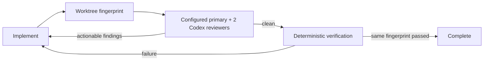

# sd0x Dev Flow for Codex

[](https://github.com/sd0xdev/sd0x-dev-flow-codex/actions/workflows/ci.yml)
[](https://github.com/sd0xdev/sd0x-dev-flow-codex/actions/workflows/release.yml)
[](plugin/sd0x-dev-flow-codex/LICENSE)

一套 Codex-native 的工程品質迴圈。它把 review 與 verification 證據綁定到「產生證據的那一份 worktree」；任何檔案變更都會改變 fingerprint，使舊證據立即失效。

本專案借鏡 [sd0x-dev-flow](https://github.com/sd0xdev/sd0x-dev-flow) 的 Harness Engineering 原則，以 clean-room 方式重新設計成 Codex plugin。它不逐項翻譯 Claude commands，也不把 Claude hook payload 假設帶進 Codex runtime，而是採用 Codex plugins、hooks、skills、project agents，以及可選用的唯讀 Claude review MCP adapter。

## 為什麼需要它

一般的 agent 工作流很容易把「之前跑過 review」誤當成「目前這份程式已通過 review」。sd0x Dev Flow 將完成條件變成可驗證的狀態：

- dirty worktree 必須取得設定檔指定的 primary subagent，以及兩個互相獨立的 Codex implementation/test perspectives；預設 primary 是 Codex。
- code 或 configuration 變更接著必須通過 deterministic repository checks。
- review、verification 與 reviewer evidence 全部綁定同一個 worktree fingerprint。
- 修正任何檔案後，舊 gate 自動失效，必須重新 review。
- auto-loop 沒有固定重試上限；只有同一 fingerprint 的 gates 全數通過才會完成。
- 若 runtime evidence 需要人工清除，可執行 `$sd0x-dev-flow-codex:reset`，明確重啟目前 worktree 的 gate 流程。



## 使用者安裝

### 需求

- 已安裝支援 plugins 的 Codex CLI。
- Node.js 18 或更新版本。
- 只有將 `review.provider` 切換為 `claude` 時，才需要安裝並登入 Claude Code CLI。

選用 Claude provider 時的一次性設定：

```bash
# macOS / Linux / WSL
curl -fsSL https://claude.ai/install.sh | bash

# macOS alternative
brew install --cask claude-code

# Windows alternative
winget install Anthropic.ClaudeCode

claude auth login
claude --version
claude auth status --json
```

Windows reviewer 需要 Anthropic 原生 `claude.exe`；基於參數完整性與安全性，runtime 會拒絕 `.cmd`、`.bat` 與 PowerShell shims。

### 從 GitHub marketplace 安裝

先把這個 repository 加入 Codex marketplace，再安裝 plugin：

```bash
codex plugin marketplace add sd0xdev/sd0x-dev-flow-codex
codex plugin add sd0x-dev-flow-codex@sd0xdev-marketplace
```

也可以在加入 marketplace 後，進入 Codex 執行 `/plugins`，從 `sd0x Dev Flow` marketplace 選擇 `sd0x-dev-flow-codex`。

安裝完成後：

1. 開啟新的 Codex session，讓 skills 與 bundled MCP 被重新探索。
2. 執行 `/hooks`，閱讀目前 hook commands 並信任該版本的 hook hash。安裝或 enable plugin 不會自動信任 hooks。
3. 在要啟用 workflow 的 repository 執行：

   ```text
   $sd0x-dev-flow-codex:setup
   ```

4. 再開一個新的 Codex session，讓 SessionStart 載入 project agents 並正式啟用 gates。

`setup` 會建立 `.codex/sd0x-dev-flow.json`、在 `AGENTS.md` 加入一段受管理內容，並安裝 `.codex/agents/sd0x-codex-primary-reviewer.toml`、`sd0x-claude-primary-reviewer.toml`、`sd0x-reviewer.toml` 與 `sd0x-test-reviewer.toml`。既有的使用者指引與其他 custom agents 都會保留；尚未執行 setup 的 repository 中，hooks 保持 inert。

預設設定不會呼叫 Claude：

```json
{
  "schema_version": 1,
  "enabled": true,
  "review": { "provider": "codex" }
}
```

Codex provider 的三個 review agents 都固定使用 `gpt-5.6-sol`、`xhigh` 與 read-only sandbox。若要明確改用 Claude primary，把 `review.provider` 改為 `claude`，再開新 session；Claude MCP 只會由 `sd0x_claude_primary_reviewer` wrapper subagent 內部呼叫。Provider 切換會使既有 review/verify evidence 失效。只有 agent templates 本身更新時才需 rerun `$sd0x-dev-flow-codex:setup`。

### 更新與移除

```bash
# 更新 Git marketplace snapshot，再透過 /plugins 更新 plugin
codex plugin marketplace upgrade sd0xdev-marketplace

# 移除
codex plugin remove sd0x-dev-flow-codex@sd0xdev-marketplace
```

更新後請開啟新 session；若 hook 定義有變化，也要重新透過 `/hooks` 審閱與信任。Codex plugin 安裝與 marketplace 的完整規格請見 OpenAI 的 [Build plugins](https://learn.chatgpt.com/docs/build-plugins) 文件。

## 日常使用

主要 skills：

- `feature-dev`：從範圍確認、實作、獨立 review 到 deterministic verification 的完整功能流程。
- `bug-fix`：先重現與追查 root cause，再做最小修復與 regression coverage。
- `review`：平行執行設定的 Codex/Claude-wrapper primary、`sd0x_reviewer` 與 `sd0x_test_reviewer`，記錄 provider- and fingerprint-bound gate。
- `verify`：依 repository 類型選擇 deterministic checks，記錄 verification gate。
- `remind`：在中斷或 context compaction 後，恢復下一個尚未完成的 gate。
- `reset`：旋轉 runtime epoch、清除 sd0x gate/reviewer evidence，要求目前 dirty worktree 重新 review。
- `doctor`：檢查安裝、runtime、目前 provider 與 gate 狀態；只有 Claude mode 會要求 Claude CLI/auth/MCP readiness。
- `setup`：為目標 repository 安裝 project guidance 與 reviewer profiles。

典型請求：

```text
$sd0x-dev-flow-codex:feature-dev
實作這項功能並補齊測試。
```

遇到 stale 或需要放棄既有 runtime evidence 時：

```text
$sd0x-dev-flow-codex:reset
```

Reset 不會修改 project files 或停用 active session；它只清除 sd0x runtime gate evidence、旋轉 epoch，並讓 delayed pre-reset review result 無法重新寫回狀態。

## 運作原理

`plugin/sd0x-dev-flow-codex/scripts/runtime/worktree.js` 分別雜湊 HEAD→index、index→worktree 的 raw diffs，以及所有未被忽略的 untracked paths/file bodies，也涵蓋 dirty nested Git repositories。即使 staged file 之後被刪除，或 worktree 又改回 HEAD，fingerprint 仍可辨識 staged state。

`skills/review/scripts/provider.js` 從 project config 解析 primary backend。`scripts/mcp/server.js` 提供 opt-in 的唯讀 Claude review tool，傳入兩層 tracked diff，並拒絕 stale fingerprint、protected changed paths、tracked binary changes、超量/缺漏內容與非結構化結果。`state.js` 原子化保存 provider、gate 與 reviewer evidence；provider 或 fingerprint 改變都會使舊 evidence 失效。`hook.js` 只負責 Codex event adapter 與 workflow routing，並在 Codex mode 直接拒絕 Claude tool call；`verify.js` 執行 native checks，不讓 model 自行宣告通過。

Runtime state 存在 Git metadata 或 `.sd0x/`，不會成為 tracked project artifact。Hooks 是 workflow guardrails，不是 OS security boundary；repository permissions 與 secret management 仍是實際安全邊界。

選用 Claude provider 時，primary reviewer 預設只執行 `claude-opus-4-8`，最多 15 分鐘與 20 agentic turns，不會自動再消耗第二個 model attempt。可用 `SD0X_CLAUDE_REVIEW_MODEL` 更換 primary；需要額外 fallback 時，再明確設定 `SD0X_CLAUDE_REVIEW_FALLBACK_MODEL=claude-fable-5`。另可用 `SD0X_CLAUDE_REVIEW_TIMEOUT_MS` 與 `SD0X_CLAUDE_REVIEW_MAX_TURNS` 調整時間與 turns。

## 發布版本

這個 repository 提供兩條發布路徑：

1. GitHub marketplace + GitHub Release：完全由 repository 與 GitHub Actions 維護，可自動化。
2. OpenAI 官方公開 plugin directory：需由有權限且完成驗證的開發者在 submission portal 人工送審；目前不是 GitHub CI 可直接發布的 API 流程。

### GitHub 自動發布

準備新版本時，只使用同步工具更新版本號：

```bash
npm run version:set -- 0.2.0
npm run check
npm run release:check
```

`version:set` 會同時更新 root `package.json` 與 distributable plugin manifest。`release:check` 會檢查：

- 兩處版本完全一致且符合 SemVer。
- 公開 repository、marketplace name、plugin selector 與相對 payload path 正確。
- manifest 引用的 skills、MCP、hooks 與 license 都存在。
- 唯一 distributable `plugin/sd0x-dev-flow-codex/` 不含 symlink。

把版本變更合併到 `main` 後，[Auto Release workflow](.github/workflows/release.yml) 會：

1. 重新執行完整 tests 與 release contract。
2. 建立 `v<version>` tag。
3. 只封裝 `plugin/sd0x-dev-flow-codex/`，產出 `.tar.gz`、`.zip` 與 `SHA256SUMS`。
4. 使用 GitHub-generated release notes 建立 GitHub Release。

同一 tag 已存在、release 已公開且 assets 完整時，workflow 仍會從 tag 重建 archives、下載全部預期 assets 並逐位元比對，驗證一致後才結束；若 release、draft 的 publish 步驟或個別 assets 遺失，重跑會建立 release、補傳缺少的 assets，並在完整後發布 draft。Archives 直接由同一 Git tree 建立；任何既有 asset 不一致時都會 fail closed。若 tag 已存在但 payload 不同，workflow 也會失敗並要求先 bump version，避免悄悄覆寫已發布版本。SemVer prerelease（例如 `0.2.0-rc.1`）會標成 GitHub prerelease 且不會取代 Latest。建議使用 Conventional Commits，讓自動產生的 release notes 更容易閱讀。

### 提交至 OpenAI 公開目錄

先完成 GitHub release，再依 OpenAI 的 [Submit plugins](https://learn.chatgpt.com/docs/submit-plugins) 流程準備 listing、logo、分類、website、support、privacy policy、terms、release notes，以及 skills 的 positive/negative tests，最後從 [plugin submission portal](https://platform.openai.com/plugins) 送審。送審需要 Apps Management Write 權限與已驗證的 developer/business identity；審核通過後仍由開發者在 portal 決定何時 publish。

## 開發

需要 Node.js 18 或更新版本；`.nvmrc` 使用 Node 22 作為主要開發版本。

```bash
npm run check
npm run release:check
```

### Repository-only 開發安裝

本專案的維護流程應使用 isolated Codex home，避免修改使用者層級的 `~/.codex`：

```bash
npm run dev:local:link
npm run dev:local:status
CODEX_HOME="$PWD/.codex-dev-home" codex
```

這會使用被 git ignore 的 `.codex-dev-home/`。manifest、`SKILL.md` 與 license 保持 regular files，其他 runtime/payload files 使用 file-level symlinks，讓日常程式碼修改可直接生效。

修改 `SKILL.md`、plugin manifest 或 payload path 後，關閉舊 Codex process 並完整 refresh：

```bash
npm run dev:local:unlink
npm run dev:local:link
npm run dev:local:status
```

接著以相同 `CODEX_HOME` 開新 session。修改 `hooks/hooks.json` 還需要新 task 與 `/hooks` re-trust；修改 custom-agent templates 後需重新執行 setup。完整 reload matrix 與 release preflight 請見 [docs/PROJECT-MIGRATION-GUIDE.md](docs/PROJECT-MIGRATION-GUIDE.md)，簡短的 Claude→Codex 邊界對照則在 [docs/MIGRATION.md](docs/MIGRATION.md)。

## 授權與來源

- Plugin 以 [MIT License](plugin/sd0x-dev-flow-codex/LICENSE) 發布。
- 核心工程原則參考 [sd0xdev/sd0x-dev-flow](https://github.com/sd0xdev/sd0x-dev-flow)。
- Codex 實作以本 repository 的 runtime、tests 與 `AGENTS.md` 為準；`plugin/sd0x-dev-flow-codex/` 是唯一 distributable payload。
