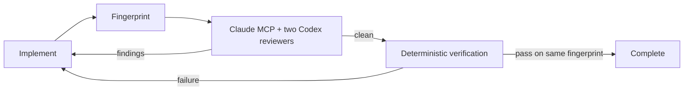

# sd0x Dev Flow for Codex

A Codex-native engineering harness built around one invariant: review and verification evidence is valid only for the exact worktree that produced it.

This repository is a clean-room Codex implementation of the core ideas from `sd0x-dev-flow`. It does not translate Claude commands one by one. It uses Codex plugins, hooks, skills, a bundled Claude review MCP adapter, project-scoped custom agents, and native subagent orchestration.

Start with [docs/PROJECT-MIGRATION-GUIDE.md](docs/PROJECT-MIGRATION-GUIDE.md) when resuming development. See [docs/MIGRATION.md](docs/MIGRATION.md) for the shorter Claude-to-Codex capability map and migration boundary.

## What It Enforces

- A dirty worktree must pass a Claude MCP primary review plus independent native Codex implementation and test perspectives.
- Code or configuration changes must then pass deterministic repository checks.
- Any fingerprinted edit invalidates evidence from the previous fingerprint.
- Stop hooks continue the task toward the next missing gate, with bounded retry limits.
- `apply_patch` attempts against secret-bearing or Git metadata paths are denied.
- Runtime state lives under Git metadata so it does not dirty the worktree.



## Claude Prerequisite

The plugin registers `sd0x_claude_review` from its bundled `.mcp.json`; developers should not run `claude mcp add`. Claude Code installation and account login are one-time, explicit developer actions:

```bash
# macOS, Linux, or WSL — Anthropic native installer
curl -fsSL https://claude.ai/install.sh | bash

# macOS alternative
brew install --cask claude-code

# Windows alternative
winget install Anthropic.ClaudeCode

claude auth login
claude --version
claude auth status --json
```

The setup workflow runs doctor afterward. Doctor verifies the required CLI flags plus the bundled MCP initialize/tool-list handshake, reports only binary/version/provider readiness, and deliberately omits account email and organization fields. See Anthropic's [Claude Code installation guide](https://code.claude.com/docs/en/installation) for platform and enterprise-provider variants.

On Windows the reviewer requires Anthropic's native `claude.exe` (the `winget` installation above). It deliberately rejects `.cmd`, `.bat`, and PowerShell shims so the multiline review contract and JSON schema cannot be altered by shell argument parsing.

## Install Locally

```bash
codex plugin marketplace add /absolute/path/to/sd0x-dev-flow-codex
codex plugin add sd0x-dev-flow-codex@sd0x-dev-flow-local
```

The review MCP requires a working local `claude` CLI login. It gives `claude-fable-5` up to 15 minutes and 12 agentic turns; if that complete attempt fails, it retries once with `claude-opus-4-8` under the same limits. MCP cancellation stops the active process and never starts the fallback. Override the models, lower the per-attempt timeout, or change the turn cap with `SD0X_CLAUDE_REVIEW_MODEL`, `SD0X_CLAUDE_REVIEW_FALLBACK_MODEL`, `SD0X_CLAUDE_REVIEW_TIMEOUT_MS`, and `SD0X_CLAUDE_REVIEW_MAX_TURNS`; timeout values above 15 minutes are clamped so both attempts remain inside the 31-minute MCP contract. Start a new Codex task after installation so the bundled MCP server is discovered. Open `/hooks`, review the commands, and trust the current hook hash. Then configure the target repository with the `setup` skill:

```text
$sd0x-dev-flow-codex:setup
```

The setup skill opts the repository in through `.codex/sd0x-dev-flow.json`, adds one managed block to `AGENTS.md`, and installs two read-only project agents under `.codex/agents/`. Existing user guidance is preserved. Hooks are inert in repositories that have not run setup. A metadata-only, single-use setup-deferral marker uses a one-time nonce from the setup result so only that exact inactive setup task can finish once; active sessions always enforce gates, and enabled inactive sessions otherwise fail closed until SessionStart succeeds.

Start one more new Codex task after the first setup so SessionStart can load the project agents and activate the workflow. Setup intentionally does not gate the task that is installing those agents.

## Core Skills

- `feature-dev`: scoped feature implementation through review and verification.
- `bug-fix`: evidence-first diagnosis and regression repair.
- `review`: parallel Claude MCP primary, `sd0x_reviewer`, and `sd0x_test_reviewer` gate.
- `verify`: deterministic project-aware check runner.
- `remind`: resume the next incomplete gate after interruption or compaction.
- `doctor`: inspect runtime and installation health.
- `setup`: install repo-local guidance and reviewer profiles.

## Runtime Design

`plugin/sd0x-dev-flow-codex/scripts/runtime/worktree.js` separately hashes HEAD→index and index→worktree raw diffs plus every non-ignored untracked path and file body, including dirty nested Git repositories. This keeps staged content visible even when the worktree file matches HEAD or has been deleted after staging. Git-ignored local files are outside the fingerprint contract and must be covered explicitly by native checks when they affect behavior. `scripts/mcp/server.js` exposes the read-only Claude review tool and sends both tracked diff layers; it rejects stale fingerprints, protected changed paths, tracked binary changes, oversized or omitted changed content, and unstructured results. The adjacent `state.js` atomically persists gates and observed reviewer evidence. `hook.js` is the Codex event adapter; it understands canonical `apply_patch` input, structured MCP PostToolUse results, and Stop continuation semantics. `verify.js` selects native checks without asking the model to certify its own work.

Hooks are workflow guardrails, not an OS security boundary. Codex hook interception does not cover every equivalent shell operation, so repository permissions and secret management remain the real security controls.

## Develop

Requires Node.js 18 or newer.

### Live development link

Codex normally installs a snapshot into `~/.codex/plugins/cache/`. To make the installed development version read directly from this checkout, run:

```bash
npm run dev:link
npm run dev:status
```

`dev:link` performs a normal marketplace/plugin install first and moves the generated snapshot into `~/.codex/plugins/dev-backups/`. It keeps the cache version root, manifest, license, and every `SKILL.md` as regular files so the Codex loader still recognizes the installation and discovers the skills. Remaining payload files, including runtime and skill scripts, use file-level symlinks for live development. It refuses to overwrite a development overlay owned by another source.

Runtime hook and bundled-script edits are then read from the checkout. Start a new Codex task after changing a skill, manifest, MCP registration, or hook registration. If `hooks/hooks.json` changes, review and trust the new definition through `/hooks`. Rerun the setup skill after changing custom-agent templates.

Restore normal snapshot installation with:

```bash
npm run dev:unlink
```

This symlink mode is a local development convenience, not the distribution path supported by the public plugin contract.

### Repository-only Codex home

To keep the development install entirely inside this repository instead of changing `~/.codex`, use:

```bash
npm run dev:local:link
npm run dev:local:status
```

This creates an ignored `.codex-dev-home/` and links its plugin cache to the payload in this checkout. Launch a CLI session with the same home:

```bash
CODEX_HOME="$PWD/.codex-dev-home" codex
```

That Codex process has an isolated plugin/config environment. A normally launched Codex Desktop App still uses the regular user-level Codex home; project-local activation alone does not change the app process environment.

```bash
npm run check
```

`npm run check` covers the repository's syntax and automated tests; it is not a standalone skill-schema validator. Follow the install, discovery, and session E2E preflight in [docs/PROJECT-MIGRATION-GUIDE.md](docs/PROJECT-MIGRATION-GUIDE.md) before release.
