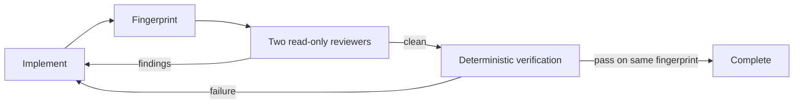

# sd0x Dev Flow for Codex

A Codex-native engineering harness built around one invariant: review and verification evidence is valid only for the exact worktree that produced it.

This repository is a clean-room Codex implementation of the core ideas from `sd0x-dev-flow`. It does not translate Claude commands one by one. It uses Codex plugins, hooks, skills, project-scoped custom agents, and native subagent orchestration.

See [docs/MIGRATION.md](docs/MIGRATION.md) for the Claude-to-Codex capability map and the decisions behind the migration boundary.

## What It Enforces

- A dirty worktree must pass independent implementation and test review.
- Code or configuration changes must then pass deterministic repository checks.
- Any edit invalidates evidence from the previous fingerprint.
- Stop hooks continue the task toward the next missing gate, with bounded retry limits.
- `apply_patch` attempts against secret-bearing or Git metadata paths are denied.
- Runtime state lives under Git metadata so it does not dirty the worktree.



## Install Locally

```bash
codex plugin marketplace add /absolute/path/to/sd0x-dev-flow-codex
codex plugin add sd0x-dev-flow-codex@sd0x-dev-flow-local
```

Start a new Codex task after installation. Open `/hooks`, review the commands, and trust the current hook hash. Then configure the target repository with the `setup` skill:

```text
$sd0x-dev-flow-codex:setup
```

The setup skill opts the repository in through `.codex/sd0x-dev-flow.json`, adds one managed block to `AGENTS.md`, and installs two read-only project agents under `.codex/agents/`. Existing user guidance is preserved. Hooks are inert in repositories that have not run setup.

Start one more new Codex task after the first setup so SessionStart can load the project agents and activate the workflow. Setup intentionally does not gate the task that is installing those agents.

## Core Skills

- `feature-dev`: scoped feature implementation through review and verification.
- `bug-fix`: evidence-first diagnosis and regression repair.
- `review`: parallel `sd0x_reviewer` and `sd0x_test_reviewer` gate.
- `verify`: deterministic project-aware check runner.
- `remind`: resume the next incomplete gate after interruption or compaction.
- `doctor`: inspect runtime and installation health.
- `setup`: install repo-local guidance and reviewer profiles.

## Runtime Design

`plugin/sd0x-dev-flow-codex/scripts/runtime/worktree.js` hashes tracked binary diff plus every untracked path and file body. The adjacent `state.js` atomically persists gates and observed reviewer lifecycle events. `hook.js` is the Codex event adapter; it understands canonical `apply_patch` input and Stop continuation semantics. `verify.js` selects native checks without asking the model to certify its own work.

Hooks are workflow guardrails, not an OS security boundary. Codex hook interception does not cover every equivalent shell operation, so repository permissions and secret management remain the real security controls.

## Develop

Requires Node.js 18 or newer.

### Live development link

Codex normally installs a snapshot into `~/.codex/plugins/cache/`. To make the installed development version read directly from this checkout, run:

```bash
npm run dev:link
npm run dev:status
```

`dev:link` performs a normal marketplace/plugin install first and moves the generated snapshot into `~/.codex/plugins/dev-backups/`. It keeps the cache version root and manifest as regular files so the Codex loader still recognizes the installation, then creates file-level symlinks for hooks, skills, runtime scripts, and templates. It refuses to overwrite a development overlay owned by another source.

Runtime hook and bundled-script edits are then read from the checkout. Start a new Codex task after changing a skill, manifest, or hook registration. If `hooks/hooks.json` changes, review and trust the new definition through `/hooks`. Rerun the setup skill after changing custom-agent templates.

Restore normal snapshot installation with:

```bash
npm run dev:unlink
```

This symlink mode is a local development convenience, not the distribution path supported by the public plugin contract.

### Repository-only Codex home

To keep the development install entirely inside this repository instead of changing `~/.codex`, use:

```bash
npm run dev:local:link
npm run dev:local:status
```

This creates an ignored `.codex-dev-home/` and links its plugin cache to the payload in this checkout. Launch a CLI session with the same home:

```bash
CODEX_HOME="$PWD/.codex-dev-home" codex
```

That Codex process has an isolated plugin/config environment. A normally launched Codex Desktop App still uses the regular user-level Codex home; project-local activation alone does not change the app process environment.

```bash
npm run check
python3 /path/to/plugin-creator/scripts/validate_plugin.py plugin/sd0x-dev-flow-codex
```
