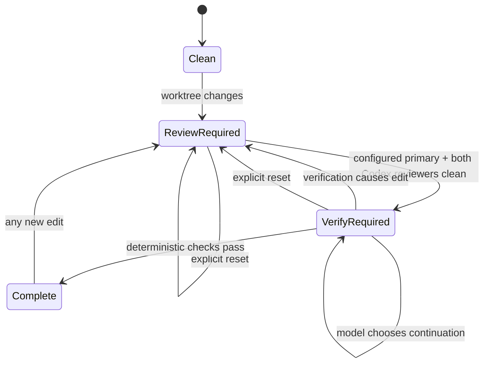

# sd0x Dev Flow Codex 專案遷移與續作指南

<!-- sd0x-skill-migration-boundary:v1 core=bug-fix,create-request,doctor,feature-dev,remind,req-analyze,review,setup,tech-spec,verify non-core=migration/packs staging=migration/staging candidates=migration/candidates -->

> 最後校準日期：2026-07-10  
> 來源版本：Claude plugin `sd0x-dev-flow` `3.0.12`  
> Codex 版本：`sd0x-dev-flow-codex` `0.1.0`

本文件是後續開發的主要上下文入口。目標不是重述所有程式碼，而是保存最容易在跨 task、換開發者或 context compaction 後遺失的設計決策、執行邊界與驗證方式。

## 1. 五分鐘恢復上下文

專案位置：

```text
~/Project/sd0x-dev-flow          # Claude 原版，只作遷移參考
~/Project/sd0x-dev-flow-codex    # Codex 專用實作，目前開發主體
```

前置條件：

- Git checkout；runtime state 依賴 Git metadata path，不支援把 payload 當一般資料夾直接開發。
- Node.js `>=24` 與 npm；目前沒有第三方 package dependency，不需要先 `npm install`。
- 具 `codex plugin` 指令的 Codex CLI。本文最後以 Codex CLI `0.144.1` 校準；若版本不同，先檢查第 14 節的版本邊界。
- `../sd0x-dev-flow` Claude 來源 repo 只在做能力比較或新遷移時需要，不是執行 Codex plugin 的必要條件。

乾淨 clone 與已初始化工作區共用以下 bootstrap：

```bash
cd ~/Project/sd0x-dev-flow-codex
node --version
codex --version
npm run check
npm run dev:local:status
```

若 status 是 `missing` 或 `snapshot`，建立 repository-only 開發安裝：

```bash
npm run dev:local:link
```

接著確認 runtime：

```bash
npm run dev:local:status
CODEX_HOME="$PWD/.codex-dev-home" codex plugin list
npm run doctor
git status --short
```

預期狀態：

- `dev:local:status` 顯示 `state: linked`。
- 隔離 Codex home 顯示 plugin `installed, enabled`。
- `npm run check` 通過全部測試。
- doctor 顯示 `ok: true`、`project_enabled: true`。
- `.codex-dev-home/` 不出現在 Git status，因為它是本機開發環境，不是專案內容。

若 status 已是 `linked`，不要把 `dev:local:link` 當作 refresh；它是 idempotent no-op。新增 payload 路徑或變更 snapshot-only 檔案時，使用第 9 節的 overlay 重建流程。

使用開發版 Codex CLI：

```bash
CODEX_HOME="$PWD/.codex-dev-home" codex
```

第一次啟動隔離環境時，先以 `/hooks` trust plugin hooks，再開一個新 task。只有新 task 的 `SessionStart` 才會正式啟用本專案的 auto-loop。

> Git 交接警告：截至 2026-07-10，這個 repository 的初始 Codex 實作仍有大量 working-tree/untracked 檔案。它們存在於目前機器不代表已存在於 remote；跨機器或交給其他人前，必須確認指南、plugin payload、tests 與 scripts 都已進入可取得的 commit 並 push。

## 2. 遷移目標與非目標

### 目標

保留 Claude 版真正有價值的工程不變量：

1. 實作者不能自行證明自己的變更正確。
2. Review 與 verification 必須綁定同一份實際 worktree。
3. 任何修正都會使舊證據失效並重新進入 review。
4. Fingerprint-bound gates 必須持續保存真實狀態；Stop 只提供 non-blocking advisory，由模型依任務完整度與風險判斷是否繼續，並提供使用者明確操作的 reset 以處理 stale runtime evidence。
5. deterministic checks 的結果優先於模型口頭宣稱。
6. Plugin 安裝後不能自動干預所有 repository，必須由專案 opt in。

### 非目標

- 不逐一複製 Claude 版約 100 個 skills。
- 不保留 Claude-only 的 `allowed-tools`、`Task`、`AskUserQuestion` 或 `.claude/` 假設。
- 不使用 nested Codex MCP 來模擬 Claude 的 agent nesting。
- 不把 hooks 宣稱為 OS security boundary。
- 不要求 Codex Desktop App 支援 per-project `CODEX_HOME`；目前 repo-local 隔離模式以 CLI 為主。

較短的能力對照表見 [MIGRATION.md](MIGRATION.md)。

## 3. 目前完成範圍

以下數量是 2026-07-10 的 inventory snapshot，不是永久常數。Claude 來源當時有：

- 100 個 skill directories。
- 15 個 agent files。
- 10 個 top-level hook files。

Codex core 目前刻意只包含：

- 9 個 skills：`setup`、`review`、`verify`、`feature-dev`、`bug-fix`、`create-request`、`remind`、`reset`、`doctor`。
- 1 個 opt-in bundled MCP server：`sd0x_claude_review`，只在 Claude provider 中透過本機 Claude CLI 提供外部 primary 視角。
- 4 個 project-scoped reviewer profiles：Codex primary、Claude wrapper、implementation 與 test；預設三個實際 reviewer 都使用 Codex。
- Session、prompt、edit、subagent 與 Stop lifecycle hooks。
- Fingerprint state machine、deterministic verification、project setup、doctor 與 dev-link tooling。

這是 curated core，不是遷移未完成的暫時缺漏。新增能力必須符合第 13 節的選擇準則。

## 4. Repository 結構

```text
sd0x-dev-flow-codex/
├── .agents/plugins/marketplace.json   # repo-local marketplace catalog
├── .codex/                            # 本 repo opt-in 與 project agents
├── .codex-dev-home/                   # ignored；隔離 Codex home
├── docs/
│   ├── MIGRATION.md                   # 高階能力對照
│   └── PROJECT-MIGRATION-GUIDE.md     # 本文件，主要交接入口
├── migration/                         # tracked source shadow、candidate 與 pack handoff；永不發布
├── scripts/skill-migration-audit.js   # migration validation 唯一 owner
├── plugin/sd0x-dev-flow-codex/        # 唯一可發布 payload
│   ├── .codex-plugin/plugin.json
│   ├── .mcp.json
│   ├── hooks/hooks.json
│   ├── scripts/mcp/                  # Claude review MCP adapter
│   ├── scripts/runtime/
│   ├── skills/
│   └── templates/agents/
├── scripts/dev-plugin.js              # snapshot/link/overlay 開發工具
├── test/                              # Node built-in test runner
├── AGENTS.md                          # repo 規範與 setup managed block
└── package.json
```

### 關鍵邊界

`plugin/sd0x-dev-flow-codex/` 是唯一 distributable payload。不要把 root tests、Git metadata、開發腳本或 `.codex-dev-home` 搬進 payload。

`../sd0x-dev-flow` 是 Claude 來源參考，不是共享 runtime。除非任務明確要求同步修改 Claude 版，否則 Codex 遷移工作只改目前 repository。

## 5. Runtime 架構

### 5.1 Event adapter

入口：`plugin/sd0x-dev-flow-codex/scripts/runtime/hook.js`

責任：

- 讀取 Codex hook JSON input。
- 檢查 project opt-in 與 SessionStart activation。
- 將事件轉交給 worktree/state functions。
- 回傳 Codex 支援的 hook JSON shape。

不要把 gate business logic 複製進 hook handler。State transition 應留在 `state.js`，worktree 計算應留在 `worktree.js`。

### 5.2 Worktree fingerprint

入口：`scripts/runtime/worktree.js`

Fingerprint 包含：

- HEAD→index 與 index→worktree 兩層 tracked paths/raw Git metadata；即使 staged blob 被 working tree 內容遮住或 staged-new file 隨後刪除，仍保持 dirty fingerprint。
- Git 未忽略的 untracked paths 與檔案內容。
- Dirty submodule／nested Git repository 的 HEAD 與內部 fingerprint。
- File mode、size、symlink target、刪除與 unreadable marker。
- 大檔以固定 chunk 串流 hash，避免整檔載入記憶體。

Git 的 standard ignore rules 適用於 untracked files；此外 fallback walker 只內部忽略 `.git/` 與 state directory `.sd0x/`。不要硬編碼忽略已追蹤的 `dist/`、`vendor/` 或 `target/`，因為它們可能是 repository 刻意追蹤的輸出。若 Git-ignored local input 會影響行為，native check 必須明確驗證它，不能假設 fingerprint 會涵蓋。

分類規則：

- Docs-only：`.adoc`、`.md`、`.mdx`、`.rst`、`.txt`，只要求 review。
- Code/config/other：要求 review，之後要求 verify。
- Clean worktree：不需要 gate。

### 5.3 State 與 gates

入口：`scripts/runtime/state.js`

Git repository 中的 state 預設位於：

```text
$(git rev-parse --git-path sd0x-dev-flow-codex/runtime-state.json)
```

非 Git directory 才 fallback 到 `.sd0x/runtime-state.json`。State 不得成為 tracked artifact。

核心規則：

- Review pass 必須和目前 fingerprint 相同。
- Verify 只能在目前 review pass 後由 deterministic runner 記錄，且 runner 前後 fingerprint 必須相同。
- Fingerprint 改變會清除兩個 gates 與 reviewer observations。
- Review pass 必須實際觀察到同 fingerprint 的 configured primary、implementation 與 test reviewer `SubagentStart`，以及 terminal `last_assistant_message` 精確回報 `No actionable findings remain.` 的相符 `SubagentStop`；review evidence 同時必須包含目前 provider、`reviewers: 3`、必要 reviewer identities 與 `findings: 0`。Codex mode 的 primary 是 `sd0x_codex_primary_reviewer`；Claude mode 是 `sd0x_claude_primary_reviewer`，並額外要求 nested Claude MCP structured clean evidence。
- Provider 從 `codex` 切換為 `claude` 或反向切換時，runtime 會清除 gates 與 reviewer evidence。Claude MCP 的輸入 fingerprint、structured output fingerprint 與 hook 當下 snapshot 必須完全相同；PreToolUse 會以 session、tool use、fingerprint 與 runtime epoch 登記 invocation，PostToolUse 必須消耗同一筆 start，reset 後才完成的舊 result 因 start ledger 已清除而被拒絕。失敗、無 structured output、stale fingerprint 或 pre-reset result 都不記 evidence。
- 任一 reviewer 對目前 fingerprint 記過 findings 後會保持 blocking；後續同 fingerprint 的 clean result 不得覆蓋。只有 worktree edit 產生新 fingerprint，或使用者明確執行 `$sd0x-dev-flow-codex:reset`，才能清除。
- Review pass 要求目前 fingerprint 的 Claude/Codex start ledgers 都已終局；pass 或 verify pass 後才到達的同 fingerprint finding 會原子撤銷 review、清除 verify，讓 workflow 回到 review-findings-remain。
- Review/verify pass 後若又啟動同 fingerprint reviewer，`nextAction` 會在 start ledger 清空前回到 review-in-progress；Stop advisory 會揭露此狀態，clean terminal result 會恢復既有 pass eligibility。
- Reviewer 在舊 fingerprint 啟動、期間 worktree 被修改，其 Stop 不可計入新 fingerprint。
- Runtime 同時追蹤多個 activated session；既有 session 的 resume／compact 不會停用其他 session。
- Session activity 會更新 `updated_at`；超過 30 天未觀察到 hook activity 的 session 會從 runtime state pruning，之後仍可由新的 SessionStart 重新啟用。
- Enabled 但 inactive 的 session 預設 fail closed。Setup 只有在 opt-in config 或 managed reviewer agents 實際建立／更新時，才於 Git metadata／`.sd0x` 寫入正向 setup-deferral marker，並在 setup JSON result 回傳一次性 nonce；只有攜帶匹配 nonce 的該次 `exec_command` PostToolUse 能把 marker 綁到自己的 session，再由同一 session 的 Stop 原子消耗一次。其他 inactive/active session 都不能認領或使用它，active session 仍照常 gate。SessionStart lock/runtime error 另有 0600、session-hash activation-failure marker，primary metadata 失敗時 fallback 至 `.sd0x`；即使兩處都失敗，inactive default 仍會阻擋。
- Auto-loop 沒有固定 round 或 continuation 上限；Stop 不再強制 continuation，而是回傳 `continue: true` advisory。模型可依使用者意圖與風險結束互動，但未通過的 gate 仍保持 pending/failed，且不得宣稱通過。
- `reason: reviewer-unavailable` 同樣使用 `continue: true`；failed gate 與 stale ledger 會保留到 user-authorized reset 或真正 fingerprint change。
- 使用者明確執行 `$sd0x-dev-flow-codex:reset` 時，runtime 會保留可信 state 的 active sessions 與 worktree、rotate runtime epoch、清除 review／verify gates 及 reviewer evidence，並讓 dirty worktree 立即回到 review-required；reset 前啟動而在 reset 後完成的 reviewer evidence 不得寫回，reset 也不能繞過 gate。若 state 已損壞，reset 會先把原始 bytes 移到同目錄的 `.corrupt.*` quarantine；不可信的 sessions 不會保留，必須重新 SessionStart。
- Claude invocation 的 start ledger 在每個 terminal PostToolUse（成功、失敗或 malformed）都會消耗對應 identity；其 MCP runtime 有 31 分鐘 contract，因此完全沒有 terminal event 的 Claude starts 保留最多 35 分鐘且總數上限 64，超出只會使舊 result fail closed。Native Codex reviewer 沒有 authoritative runtime 上限，start 必須一直 blocking 到 exact terminal result；review-in-progress 會要求等待，只有使用者明確要求時才可 reset stale ledger。



### 5.4 Deterministic verification

入口：`scripts/runtime/verify.js`

Runner 先執行 staged + unstaged whitespace check：

```bash
git diff --check HEAD --
```

Unborn repository 使用 cached diff。之後按 project type 選擇：

- Node：優先 aggregate `check` script；否則依序找 `typecheck`、`lint`、`test`，最後才 fallback `build`。
- Python：`python3 -m pytest`。
- Go：`go test ./...`。
- Rust：`cargo test`。

Evidence 記錄 command、exit code、duration、截斷後 output，以及 runner 前後 fingerprint。Generic gate CLI 不能寫入 verify pass；只有 deterministic runner 可以。Verify command 若修改 worktree，runner 會記錄 fail、原 review fingerprint 失效，下一步必須回到 review。

Verifier 會同時執行 cached 與 HEAD/worktree whitespace checks。若同一路徑在 index 與 working tree 版本分歧，tests 只能執行 working copy、無法證明 staged blob，因此先留下 deterministic fail evidence，要求先統一兩層內容再驗證。

## 6. Hook lifecycle 與 activation boundary

Project opt-in 檔案：

```text
.codex/sd0x-dev-flow.json
```

Setup 預設寫入 Codex-first provider：

```json
{
  "schema_version": 1,
  "enabled": true,
  "review": { "provider": "codex" }
}
```

只接受 `codex` 或 `claude`。Codex mode pin `gpt-5.6-sol`/`xhigh` 且不檢查、不呼叫 Claude；切換為 `claude` 後要開新 task，primary wrapper 才會在 subagent 內呼叫預設 Opus 4.8 的 MCP adapter。Provider change 會清除 runtime gate evidence；invalid provider 會 fail closed。

必須同時符合以下條件，hooks 才正式接管：

1. Config `enabled: true`。
2. 目前 task 的 SessionStart 已看到這份 config。
3. Plugin hook 已經由使用者 trust。

這個邊界是刻意設計：setup 在當前 task 才建立 custom agents 時，不應立刻要求尚未被 session discovery 載入的 reviewers。Setup task 會放行；下一個 task 才啟用。

| Event | 目前行為 |
| --- | --- |
| `SessionStart` | 消耗 setup-deferral marker、記錄 session、refresh snapshot、注入目前 gate 狀態；失敗時留下 activation marker，且 inactive default 維持 fail closed。 |
| `UserPromptSubmit` | 若 gate 未完成，提醒下一個 action。 |
| `PreToolUse` | 在 session activation 判斷前解析 Codex `apply_patch` command，讓 inactive/setup-deferred session 也一律阻擋 protected paths；Codex provider 直接拒絕 Claude tool，Claude provider 才登記 reset-sensitive invocation identity。 |
| `PostToolUse` | Edit tool 會 refresh fingerprint；Claude MCP tool 只在成功 structured result、目前 fingerprint 與同 runtime epoch 的 matching PreToolUse start 全部相符時記 external review evidence。 |
| `SubagentStart` | 記錄 reviewer id/type/fingerprint，注入 reviewer focus。 |
| `SubagentStop` | 同 fingerprint、有 matching start 且有非空 terminal assistant message 才記錄 outcome；第一次無輸出會要求 continuation，續跑後的 terminal result 仍可記錄。 |
| `Stop` | 缺 review/verify 時回傳 `continue: true` 的 non-blocking advisory，由模型依使用者意圖、任務完整度、風險與 evidence reliability 判斷是否繼續；runtime 仍保留 exact-fingerprint gate 狀態，未記錄的 gate 不得宣稱通過。Session activation/runtime-state failure仍 hard-block。 |

Protected paths 目前包含 `.env*`、`.git/`、SSH private-key names、credentials/secrets config 與 private-key formats；`.env.example`、`.env.sample`、`.env.template` 允許修改。

Hook interception 只是 workflow guardrail。Shell 或其他等價路徑可能繞過它，真正安全邊界仍是 filesystem permissions、secret management 與 repository policy。

## 7. Review workflow

Review skill 必須平行啟動：

- `sd0x_codex_primary_reviewer`（預設）：blocking primary；profile 固定 `gpt-5.6-sol`、`xhigh`、read-only，同時檢查 implementation 與 test/AC。
- `sd0x_claude_primary_reviewer`（`review.provider: "claude"`）：blocking wrapper subagent；在 subagent 內呼叫 `mcp__sd0x_claude_review__review_worktree`，parent task 不直接呼叫 Claude。
- `sd0x_reviewer`：native Codex implementation perspective；correctness、security、regression、concurrency、error handling。
- `sd0x_test_reviewer`：native Codex test perspective；acceptance criteria、regression coverage、flakiness、verification gaps。

三者必須：

- Read-only。
- 不共享彼此結論後再開始審查。
- 針對目前 dirty worktree。
- 只回報具 file/line evidence 與 fix recommendation 的 P0/P1/P2 actionable findings。

共同理論由 `skills/review/references/review-theory.md` 定義：reviewer 必須從 guidance、contracts/schema、request/spec/AC 推導 intended behavior，並獨立研究完整 changed files、callers/callees/dependencies、config、tests 與 docs；每個 finding 都要通過 evidence、context、false-positive、severity、adjacent-gap 五項 deliberate checks，且輸出 root cause、minimal fix 與 regression protection。Implementation rubric 明確涵蓋 correctness、security、performance/reliability、maintainability/testability；test rubric 明確涵蓋 AC traceability、coverage、boundary/error、concurrency/state、mock/assertion quality、正確 test layer 與 flakiness。

`review-theory.md` 的 Source Alignment 逐項保留來源 `rules/codex-invocation.md`、`rules/auto-loop.md`、`rules/fix-all-issues.md`、`skills/codex-code-review/` 與 `skills/test-review/` 的核心：metadata-only dispatch、reviewer 自行讀 actual diff/context、禁止餵結論造成 anchoring、每輪平行正交視角、五項 deliberate checks、AC/test adequacy、canonical dedup/source attribution，以及 fix 不等於 verify。Codex 版的刻意差異是更嚴格的三方 blocking、P0/P1/P2 全阻擋、排除 Nit、provider/fingerprint evidence binding、無 degraded pass 與每個新 fingerprint fresh scan。

相較來源 `sd0x-dev-flow`，這裡刻意採更嚴格的收斂規則：不收 Nit，任何 P0/P1/P2 都阻擋；configured primary 與兩個 Codex perspectives 全部是 blocking evidence，不允許 degraded pass；任何 edit 或 provider change 都要求 fresh full scan。為保留 root-cause revalidation，fix round 可把同一 reviewer 自己上一輪的 finding identities 當作非權威 hypotheses 傳回，但不可跨 reviewer 分享，也不能當 gate evidence。

預設 Codex profiles 使用 `gpt-5.6-sol`、`xhigh` 與 read-only sandbox。Claude adapter 只有在 project config 明確選擇 `claude` 時可用；它不開放 Bash、Edit、Web 或 project customizations，接收由 built-in Git 命令建立的 bounded diff/untracked bundle，並只開放 Read/Glob/Grep 研究 surrounding code。預設只給 `claude-opus-4-8` 15 分鐘與 20 agentic turns，不自動啟動第二個 model attempt。Turn cap 透過 Claude 官方 `CLAUDE_CODE_MAX_TURNS` 環境變數設定，避免某些版本支援但未在頂層 `--help` 顯示 `--max-turns` 所造成的 preflight false negative。需要額外 fallback 時，可明確設定 `SD0X_CLAUDE_REVIEW_FALLBACK_MODEL=claude-fable-5`；MCP client 取消或 transport 關閉會終止 active child，不會啟動 fallback。外層 MCP timeout 保留 31 分鐘，以容納 opt-in 的兩次嘗試及清理時間。可用 `SD0X_CLAUDE_REVIEW_MODEL`、`SD0X_CLAUDE_REVIEW_FALLBACK_MODEL`、`SD0X_CLAUDE_REVIEW_TIMEOUT_MS` 與 `SD0X_CLAUDE_REVIEW_MAX_TURNS` 覆寫；timeout override 只能降低，超過 15 分鐘會 clamp。Protected changed paths、tracked binary changes、nested repository/submodule changes、oversized或無法完整納入的 changed content、Claude CLI/auth failure、所有已配置 model attempts 都失敗、invalid structured output 與 review 期間 fingerprint 改變全部 fail closed。

Windows adapter 只接受 Anthropic native installer/`winget` 提供的 `claude.exe`，不透過 shell 執行 `.cmd`、`.bat` 或 PowerShell shim；這能保證 multiline system contract 與 JSON schema 維持原始 argv 邊界。Doctor 會把只有 shim 的安裝回報為 `native-windows-cli-required`。

若有 finding：記錄 fail、修正 root cause、取得新 fingerprint，並重新啟動三個 perspectives。若任一 reviewer unavailable：以 `findings: 0`、`reviewer_failure: true` 記錄 fail，同 fingerprint 不得直接替換或重跑 reviewer；必須先取得使用者授權執行 reset，或由真正的 worktree edit 產生新 fingerprint。恢復 custom reviewer identity 可能另外需要啟動新 Codex task，但 process restart 本身不會清除 failed gate 或 stale ledger。不可把任何舊 reviewer output 當成新 fingerprint 的 gate evidence。

## 8. 開發安裝模式

### 8.1 推薦：repository-only Codex home

這是目前本 repository 使用的模式。乾淨 clone 可直接以 `link` bootstrap；已有 overlay 時重跑 `link` 不會 refresh：

```bash
npm run dev:local:link
npm run dev:local:status
CODEX_HOME="$PWD/.codex-dev-home" codex
```

特性：

- Marketplace、plugin config、cache 與 backups 全部位於 ignored `.codex-dev-home/`。
- 不修改一般 `~/.codex/config.toml`。
- 一般方式啟動的 Codex Desktop App 不會自動使用這個隔離 home。
- CLI 必須每次以同一 `CODEX_HOME` 啟動。

### 8.2 User-level live development

需要一般 Codex Desktop/CLI 都看到 plugin 時：

```bash
npm run dev:link
npm run dev:status
```

這會修改一般 Codex home。只有明確需要 user-level 測試時才使用。

### 8.3 Loader-safe symlink overlay

Codex loader 不接受整個 cache version root 是 symlink，會把它視為 `not installed`。目前 `scripts/dev-plugin.js` 採以下策略：

1. 先正常註冊 marketplace 並安裝 snapshot。
2. 將 snapshot 搬到 `plugins/dev-backups/`。
3. 保留 cache version root 為真實 directory。
4. 保留 `.codex-plugin/plugin.json`、`LICENSE` 與每個 `SKILL.md` 為 snapshot regular files。
5. 將其餘 hooks、skill scripts/resources、runtime scripts、templates 的既有檔案做 file-level symlink。
6. 寫入 `.sd0x-dev-link.json` marker，記錄 owner、backup 與 linked file count。

這讓 Codex 仍顯示 `installed, enabled`，skill loader 也能 discovery regular-file entrypoints；其餘 symlinked payload 修改會直接讀 source。

實測 Codex CLI `0.144.1` 會忽略 symlink `SKILL.md`。因此 skill entrypoint 不能 live-link；修改任何 `SKILL.md` 後必須重建 overlay 並開新 task。Skill 內 bundled scripts/resources 仍可維持 symlink live update。

重要邊界：overlay 只包含建立當下已存在的檔案。`link` 在 status 已是 `linked` 時會直接返回，所以它不能單獨納入後來新增的檔案；必須先恢復 snapshot，再重建 overlay。

恢復一般 snapshot：

```bash
npm run dev:local:unlink  # isolated home
npm run dev:unlink        # user home
```

## 9. Reload matrix

| 修改內容 | 即時生效 | 需要重建 overlay | 需要新 task | 需要 `/hooks` re-trust | 需要 rerun setup |
| --- | --- | --- | --- | --- | --- |
| 既有 runtime `.js` | 下一次 script/hook 執行 | 否 | 通常否 | 否 | 否 |
| 既有 `SKILL.md` | 否 | 是 | 是 | 否 | 否 |
| 新增 skill/resource file | 否 | 是 | 是 | 否 | 視情況 |
| `hooks/hooks.json` | 否 | 否 | 是 | 是 | 否 |
| 新增 hook script file | 否 | 是 | 是 | 若 definition 改變則是 | 否 |
| `.mcp.json` | 否 | 新增或路徑變更時是 | 是 | 否 | 否 |
| 既有 MCP server `.js` | 下一個 MCP process | 否 | 是 | 否 | 否 |
| 新增 MCP server file | 否 | 是 | 是 | 否 | 否 |
| `.codex-plugin/plugin.json` | 否 | 是 | 是 | 視 hooks 是否改變 | 否 |
| 既有 Agent template | 否 | 否 | 是 | 否 | 是 |
| 新增 Agent template file | 否 | 是 | 是 | 否 | 是 |
| `.codex/sd0x-dev-flow.json` | 下一次 hook read | 否 | 啟用或 provider change 需要 | 否 | 否 |

原因：overlay 只處理建立當下已存在的檔案，而且 `SKILL.md` 與 manifest 必須是 regular files；新檔與後續 entrypoint 變更不會自動出現在 cache。MCP process 與 tool registry 也綁 task lifecycle，所以 adapter 或 `.mcp.json` 更新後要開新 task。

Repository-only overlay 的正確重建命令是：

```bash
npm run dev:local:unlink
npm run dev:local:link
npm run dev:local:status
```

User-level 模式則使用同名的 `dev:unlink`、`dev:link`、`dev:status`。不要只重跑 `link`。

`.codex-plugin/plugin.json` 是刻意保留的 snapshot regular file。若要改 manifest version，應在修改前先 `unlink` 舊版本，再修改 source manifest 並 `link` 新版本；否則舊版本 overlay 可能留在舊 cache path，需先確認 marker ownership 再清理。

## 10. 修改指南

### 新增或修改 hook behavior

1. 先確認 Codex event input/output schema，不要沿用 Claude payload assumption。
2. Event parsing 放 `hook.js`，business state 放 `state.js` 或 `worktree.js`。
3. 更新 `test/hook.test.js`；若涉及 gate transition，同時更新 `test/state.test.js`。
4. 執行 `npm run check`。
5. 若改 `hooks.json`，開新 task 並 re-trust。

### 新增 skill

1. 在 `plugin/sd0x-dev-flow-codex/skills/<name>/SKILL.md` 建立精簡 frontmatter 與 workflow。
2. Fragile/repeated operations 放 bundled deterministic script，不要讓模型重寫同一段 shell。
3. 不使用 Claude-only `allowed-tools`。
4. 新檔建立後，依第 9 節先 `dev:local:unlink`、再 `dev:local:link`；只跑 `link` 不會 refresh 已存在的 overlay。
5. 執行 `npm run check`，確認 `codex plugin list` 仍為 installed/enabled，再開新 task 驗證 skill 可被 discovery 與明確呼叫。
6. 確認它是否真的值得增加 discovery/context 成本。

目前 repository 沒有綁定 standalone skill-schema validator，`npm run check` 也不宣稱涵蓋 schema。最小 E2E validator 是「重建 overlay 後，Codex 能安裝 plugin，並在新 task discovery/呼叫該 skill」；若加入官方 validator，必須把穩定且可執行的命令納入 `package.json`，不可在文件留下 `/path/to/...` placeholder。

### 新增 custom agent

先決定它是一般 specialist，還是 review gate 的必要 reviewer；兩者不可混為一談。

1. 在 `plugin/sd0x-dev-flow-codex/templates/agents/` 新增 TOML，保留 `# Managed by sd0x-dev-flow-codex.` ownership marker。
2. 將檔名加入 `skills/setup/scripts/setup.js` 的 `agentPlans`，並新增 setup ownership/idempotency test。
3. 一般 specialist 到此即可；不要把它加入 review gate matcher 或 required types。
4. 若它是必要 reviewer，同步更新 `hooks/hooks.json` 的 `SubagentStart`/`SubagentStop` matcher、`scripts/runtime/state.js` 的 required types、`skills/review/SKILL.md`、setup 產生的 `AGENTS.md` managed block，以及 hook/state/review tests。
5. 重建 overlay，對目標 repository rerun `$sd0x-dev-flow-codex:setup`，檢查 `.codex/agents/` 產物，再開新 task。

只新增 TOML template 不會自動被 setup 安裝；只新增 agent 檔也不會自動成為強制 gate reviewer。

### 修改 state schema

1. 評估是否提升 `SCHEMA_VERSION`；目前 runtime state schema 是 v6。
2. 說明舊 state 是 migrate 還是安全 reset；v1–v5 會保留可辨識的 activated sessions、清除 pre-provider gates／reviewer evidence；缺失或不支援的 schema 會 fail closed，只有 user-authorized reset 能 quarantine 原始 bytes 並建立乾淨 state。
3. 保持 atomic write、state lock 與 Git metadata path。
4. 新增 fingerprint invalidation、concurrency 與 stale-state tests。

### 修改 verifier

1. Project detection 必須 deterministic，不能讓模型選擇自己偏好的命令。
2. 不要因 generated directory 名稱就忽略 tracked changes。
3. Failed command 必須留下 evidence；pass 不得包含非零 exit code。
4. 更新 `test/verify.test.js`。

### 修改 dev-link tooling

1. Cache destination 必須先做 containment check。
2. 不覆蓋 foreign symlink/overlay。
3. 建立 overlay 前先保留 snapshot backup。
4. 安裝失敗時恢復原 snapshot。
5. Cache root 與 manifest 不可改為 directory symlink。
6. Codex installer 回傳的 `installedPath` 必須和 metadata 推導出的預期 cache path 完全相同。
6. `SKILL.md` 必須保留為 regular file，不能和一般 resource 一樣 symlink。
7. 同時測試 `link`、skill discovery entrypoint、idempotent link、foreign owner、missing path、local home 與 unlink。

## 11. 測試與 release preflight

主要命令：

```bash
npm run check
```

目前 suite 會先遞迴 syntax-check 所有 shipped JavaScript entrypoints，再執行下列測試群組；案例數以 `npm run check` 的即時輸出為準，不在文件寫死：

- `dev-plugin.test.js`：loader-safe overlay、regular-file skill entrypoint、idempotency、foreign owner、missing／mismatched cache path、isolated home 的 link/unlink。
- `claude-review-mcp.test.js`：MCP wire format、Claude CLI read-only flags、structured output、protected paths、bundle/fingerprint binding。
- `hook.test.js`：opt-in、SessionStart boundary、multi-session enforcement、protected patch、Claude MCP PostToolUse evidence、Stop、terminal subagent lifecycle。
- `setup.test.js`：idempotency、AGENTS preservation、unowned agents、invalid config preflight。
- `state.test.js`：Claude + dual-Codex clean outcomes、schema migration、fingerprint binding、session retention、no-ceiling loop、explicit reset 與 obsolete-counter migration。
- `verify.test.js`：project command detection、review precondition、CLI spoof rejection、start/end fingerprint 與 mutating checks。
- `worktree.test.js`：tracked/non-ignored-untracked hashing、nested repositories、`ignore=all` submodules、generated paths、patch parsing、protected paths。

Release 前至少完成：

```bash
npm run check
npm run dev:local:unlink
CODEX_HOME="$PWD/.codex-dev-home" codex plugin add sd0x-dev-flow-codex@sd0xdev-marketplace --json
CODEX_HOME="$PWD/.codex-dev-home" codex plugin list
npm run dev:local:link
CODEX_HOME="$PWD/.codex-dev-home" codex plugin list
```

`npm run check` 是 syntax/unit/integration baseline，不等於完整 plugin release E2E。接著用 disposable Git repository 驗證 setup 與 session lifecycle：

```bash
PLUGIN_REPO="$HOME/Project/sd0x-dev-flow-codex"
E2E_REPO="$(mktemp -d)"
git -C "$E2E_REPO" init
cd "$E2E_REPO"
CODEX_HOME="$PLUGIN_REPO/.codex-dev-home" codex
```

在第一個 task 依序執行：

1. 確認 `/hooks` 已 trust。
2. 呼叫 `$sd0x-dev-flow-codex:setup`，確認產生預設 `review.provider: "codex"`、四個 `.codex/agents/*.toml` 與 `AGENTS.md` managed block。只有測試 Claude mode 時才需確認 bundled MCP 與 Claude CLI login。
3. 確認 setup 所在 task 不會因尚未觀察到該 task 的 SessionStart opt-in 而被 Stop gate 卡住。
4. 開新 task，建立一個可測試的小變更，分別驗證 code/config 需要 review + verify，docs-only 只需要 review。
5. 讓 Codex primary 與兩個 Codex reviewers 完成後記錄 review pass，再執行 verify；確認三者 fingerprint 相同且 final Stop 放行。
6. 把 provider 切換成 `claude`，開新 task，確認 Claude wrapper 內部 MCP evidence 與兩個 Codex reviewers 可完成同一流程；再切回 `codex`，確認不會呼叫 Claude。
7. 修改 worktree 或切換 provider，確認舊 review/verify evidence 失效。

並記錄以下結果：

- Plugin 可安裝，新增 skill 可在新 task discovery/明確呼叫；若 repository 已加入 validator，也需通過該 validator。
- 安裝後 cache 不含 repo `.git`、tests 或 root 開發檔案。
- Setup task 放行，下一個 SessionStart 才啟用。
- Codex-default primary + dual Codex reviewers → review pass → verify pass → final Stop 放行；Claude opt-in wrapper 另有對稱 E2E。

## 12. 常見問題排查

### Plugin list 顯示 `not installed`

先執行：

```bash
npm run dev:local:status
```

若 cache version root 本身是 symlink，這是舊的錯誤開發模式。執行 `dev:local:unlink` 恢復 snapshot，再用目前的 `dev:local:link` 建立 file-level overlay。

若 status 是 `missing`，通常只是乾淨 clone 尚未 bootstrap；執行 `npm run dev:local:link`，再以同一個 `CODEX_HOME` 檢查 plugin list。

### Hooks 不執行

依序檢查：

1. 使用的是正確 `CODEX_HOME`。
2. `codex plugin list` 顯示 `installed, enabled`。
3. `/hooks` 已 trust 當前 definition。
4. `.codex/sd0x-dev-flow.json` 的 `enabled` 為 `true`。
5. Trust/setup 後已開新 task，讓 SessionStart 記錄 session。
6. `$sd0x-dev-flow-codex:doctor` 顯示正確 plugin root、project config 與 state path。

### Review pass 被拒絕

先用 review provider script/doctor 確認目前 provider，再檢查 configured primary、implementation 與 test agent type 的 start/stop 期間 worktree 是否未改變。Claude mode 另需確認 wrapper 內 MCP 成功回傳 structured result、PostToolUse hook 已 trust 並記錄同一 fingerprint。直接填 `reviewers: 3` 不足以通過 runtime gate。

### Claude MCP reviewer 不可用

先確認 `.codex/sd0x-dev-flow.json` 的 `review.provider` 確實是 `claude`。Codex mode 不要求 Claude readiness，也會拒絕誤呼叫 Claude tool。

依序檢查：

1. `claude --version` 可執行，`claude --help` 含 adapter 所需 flags，且 Claude CLI 已完成登入。
   Windows 必須解析到 native `claude.exe`；若 Doctor 回報 `native-windows-cli-required`，以 `winget install Anthropic.ClaudeCode` 安裝官方 native build，並移除 PATH 中遮蔽它的舊 shim。
2. 變更 `.mcp.json`、manifest 或新增 adapter 後，已先 `dev:local:unlink` 再 `dev:local:link` 並開新 task。
3. Doctor 的 MCP initialize/tool-list handshake 通過，且目前 task 的 tool registry 含 `mcp__sd0x_claude_review__review_worktree`。
4. Changed paths 不含 protected file 或 nested repository/submodule，review bundle 未超過預設 4 MiB。
5. `SD0X_CLAUDE_BIN`、`SD0X_CLAUDE_REVIEW_MODEL`、`SD0X_CLAUDE_REVIEW_TIMEOUT_MS` 或 bundle limit overrides 沒有錯誤值。

MCP failure 不會降級成 pass。修復環境後必須重跑完整三方 review；若不需要跨模型 primary，可明確切回 `codex` 並開新 task，provider change 會清除舊 evidence。

### Verify 後又要求 review

Verifier 或修正動作改變了 worktree fingerprint。這是預期行為，不是 loop bug；必須重新 review 新 fingerprint。

### State 看似過期

使用 doctor 或 status 查看實際 Git metadata state path。不要手動修改 state 來繞過 gate；確認沒有需要保留的 evidence 後，明確執行：

```text
$sd0x-dev-flow-codex:reset
```

Reset 會保留可信 state 的 active sessions 與目前 worktree snapshot、rotate runtime epoch，只清除目前 Git worktree 的 sd0x review／verify gates 及 reviewer evidence；dirty worktree 會立即重新要求 review。reset 前啟動但較晚完成的 reviewer result 會因 matching start ledger 已清除而被拒絕。若 runtime state 已損壞，reset 會保留 `.corrupt.*` quarantine、捨棄不可信 session ledger，並要求新的 SessionStart。它不是用來繞過應完成的 review/verify。

## 13. 未來遷移能力的選擇準則

不要因 Claude 版存在某個 skill 就直接移植。加入 Codex core 前必須同時回答：

1. 是否跨 repository 普遍可用？
2. 是否明顯改善執行品質，而非只是 prompt alias？
3. 是否無法由現有九個 skills 組合完成？
4. 是否值得永久增加 skill discovery metadata？
5. 是否需要 Codex-native hook/subagent/tool，而不是 Claude compatibility shim？
6. 是否有 deterministic resource 或測試可以保護其核心行為？

不符合 core 條件的能力應放到未來 domain plugin pack，而不是讓核心重新膨脹成 100-skill catalog。

### 單一能力的遷移流程

1. 在 Claude 來源找到真正的 user intent、state 與 safety invariant。
2. 刪除 Claude-only tool choreography。
3. 決定 Codex surface：skill、hook、custom agent、deterministic script，或不遷移。
4. 定義最小 acceptance criteria 與失敗模式。
5. 實作 Codex event adapter，不共享 Claude payload parser。
6. 加入 unit/integration tests。
7. 在隔離 `CODEX_HOME` 做 install/cache/session E2E。
8. 更新本文件的完成範圍、reload matrix 或已知限制。

## 14. 已知限制與刻意取捨

- Codex `0.144.1` 沒有正式 per-project plugin install；repository-only 模式是隔離 `CODEX_HOME`，主要服務 CLI。
- Codex Desktop App 正常啟動仍使用一般 user home。
- Claude provider 依賴本機 Claude CLI 與其有效登入；Codex provider 不需要 Claude。選用 Claude 後若未安裝、未登入或 managed policy 禁止，review gate 會 fail closed。
- Claude review bundle 預設上限 4 MiB、單一 untracked inline content 上限 256 KiB；超限時不會自動截斷後宣稱 clean。
- Dirty nested repositories 與 submodules 目前無法安全映射內部 changed lines 到 parent fingerprint，因此 Claude primary 會明確 fail closed，需先拆開 review 或增加 nested bundle support。
- Hook trust 以 definition hash 為邊界；`hooks.json` 改變後必須重新確認。
- Existing symlinked payload files 可 live update；`SKILL.md`、新檔與 manifest 必須先 unlink，再重建 overlay。
- Custom agents 是 setup 到 project `.codex/agents/` 的副本，template 修改後要 rerun setup。
- PreToolUse 無法攔截所有等價 shell 寫入方式。
- Verify detector 目前只涵蓋 Node、Python、Go、Rust 的基本策略。
- Plugin core 尚未覆蓋 Claude 版大多數 domain-specific skills，這是刻意範圍控制。
- `create-request` 已可安全建立、更新與掃描 tickets；在 promotion evidence ledger 尚未完成前，沒有 durable request-closure operation 的 repository 會停在 `Candidate Complete`，不會直接寫入 `Completed`。

## 15. Decision log

### 2026-07-10：建立獨立 Codex repository

不在 Claude repo 內維護雙 runtime，避免事件 schema、發行版本與 legacy assumptions 互相污染。

### 2026-07-10：Curated core，不做一對一移植

保留 auto-loop、review、verify、setup 與安全不變量；domain workflows 延後按需求拆 pack。

### 2026-07-10：Gate 綁 worktree fingerprint

解決 review 通過後又修改程式碼仍沿用舊證據的根本問題。

### 2026-07-10：Project opt-in + SessionStart activation

避免 ambient plugin 干預所有 dirty repositories，也避免 setup 當前 session 尚未載入 agents 就被 Stop gate 卡住。

### 2026-07-10：Git metadata state

Auto-loop state 不污染 worktree，並自然支援不同 worktree 的獨立 Git metadata path。

### 2026-07-10：Loader-safe file overlay

整個 cache root symlink 會被 Codex 視為未安裝，symlink `SKILL.md` 也不會被 discovery；因此保留真實 root、manifest 與 skill entrypoints，只 link 非 discovery payload files。

### 2026-07-10：Claude MCP primary + native Codex dual perspectives

對稱採用來源專案的跨模型 review 邊界：Codex host 透過 bundled local MCP adapter 呼叫 Claude primary reviewer，同時保留 implementation 與 test 兩個 native Codex subagents。Claude primary 預設使用 Opus 4.8；Fable 5 只在 `SD0X_CLAUDE_REVIEW_FALLBACK_MODEL` 明確設定時作為額外 attempt。三個 reviewer perspectives 仍都必須對同 fingerprint clean，不允許缺少任一 perspective 的 degraded pass。

### 2026-07-11：Codex-first configurable primary subagent

Primary orchestration 統一為 subagent。`review.provider` 預設 `codex`，由 pinned `gpt-5.6-sol`/`xhigh`/read-only primary 執行；`claude` 是明確 opt-in，改由 Claude wrapper subagent 內部呼叫既有 MCP，adapter 預設仍為 Opus 4.8。Implementation/test Codex perspectives 保留。Provider 成為 runtime gate policy 的一部分，切換時清除既有 review/verify evidence；Codex mode 的 PreToolUse 會拒絕 Claude review tool，避免意外消耗 Claude 額度。

## 16. 下一個開發 task 的交接清單

開始前：

- [ ] 閱讀本文件與 `AGENTS.md`。
- [ ] 確認 Claude source 與 Codex target，不要改錯 repo。
- [ ] 執行 `npm run dev:local:status`；若是 `missing`/`snapshot`，完成 bootstrap。
- [ ] 使用 `.codex-dev-home` 啟動 Codex CLI。
- [ ] 確認 hooks trusted、project enabled、SessionStart 已發生。
- [ ] 執行 `npm run check` 建立 baseline。

修改時：

- [ ] 維持 event adapter / state / worktree 責任分離。
- [ ] 任何 gate 或 fingerprint 變更都有測試。
- [ ] 新增 payload 檔案後先 unlink，再重建 overlay。
- [ ] Agent template 改動後 rerun setup。
- [ ] Hooks definition 改動後 re-trust。

完成前：

- [ ] `npm run check` 全通過。
- [ ] Configured primary 與兩個 Codex reviewers 對目前 fingerprint 無 actionable findings；Claude mode 另確認 nested MCP structured evidence。
- [ ] Deterministic verify 對同一 fingerprint 通過。
- [ ] 安裝後 plugin list 仍為 `installed, enabled`。
- [ ] 若設計決策或 reload 規則改變，更新本文件。
- [ ] 跨機器/跨開發者交接前，確認所有必要檔案已 commit 並 push；不要把本機 untracked worktree 當成 remote baseline。

## 17. 官方 Codex 參考

- [Build plugins](https://learn.chatgpt.com/docs/build-plugins)
- [Hooks](https://learn.chatgpt.com/docs/hooks)
- [Build skills](https://learn.chatgpt.com/docs/build-skills)
- [Subagents](https://learn.chatgpt.com/docs/agent-configuration/subagents)
- [AGENTS.md](https://learn.chatgpt.com/docs/agent-configuration/agents-md)
