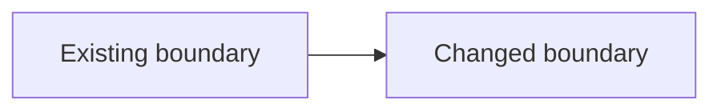
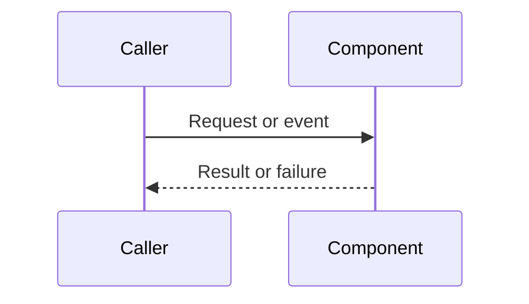

# Architecture Document Template

# {Feature Name} Architecture

> **Technical specification**: rendered relative Markdown link to the canonical technical specification

## 1. Scope and Evidence

### 1.1 Architecture scope
### 1.2 Repository evidence and assumptions

| Claim | Evidence | Classification |
|---|---|---|

## 2. Component Architecture

| Component | Responsibility | Ownership boundary | Key files |
|---|---|---|---|

## 3. Primary Data or Control Flow

## 4. Integration Points

| Integration | Direction | Interface or event | Failure behavior | Evidence |
|---|---|---|---|---|

## 5. Data, Security, and Operations

### 5.1 Data ownership and lifecycle
### 5.2 Trust and security boundaries
### 5.3 Observability, deployment, scaling, and rollback

## 6. Architecture Decisions

### AD-1: {Decision title}

- **Context**:
- **Options**:
- **Decision**:
- **Rationale and evidence**:
- **Consequences**:

## 7. Risks and Verification

| Risk or challenge | Impact | Mitigation | Validation signal |
|---|---|---|---|

## 8. Open Questions

## 9. Cross-References

- Technical specification: rendered relative Markdown link
- Active request: rendered relative Markdown link when present

Omit inapplicable optional subsections explicitly rather than inventing detail. Keep implementation tasks and progress state in their owning documents.
