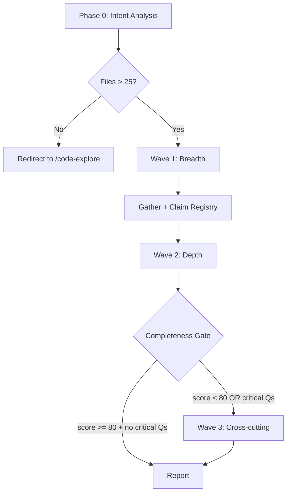

# Deep Explore Skill

## Trigger

- Keywords: deep explore, large-scale research, multi-agent explore, codebase survey, parallel investigation, comprehensive research, deep dive multiple areas

## When NOT to Use

| Scenario | Alternative |
|----------|------------|
| Quick single-area lookup | `/code-explore` |
| Dual Claude+Codex confirmation | `/code-investigate` |
| Git history tracking | `/git-investigate` |
| Code review | `/codex-review-fast` |

## Workflow Overview



## Phase 0: Intent Analysis

1. Parse user's research question
2. Estimate scope: `Grep` for related keywords → count unique files
3. Routing guard: if estimated files <= 25, redirect to `/code-explore`
4. Plan shards: identify 2-3 non-overlapping exploration areas

### Shard Planning Strategy

| Priority | Method | When |
|----------|--------|------|
| 1 | User-specified areas (`--areas`) | User knows what to split |
| 2 | Domain-based clustering | Auto-detect service/provider/hooks/rules boundaries |
| 3 | Directory-based fallback | When domain boundaries unclear |

Output: ownership matrix (shard → files).

## Wave 1: Breadth (Mandatory)

Fan-out 2-3 Explore agents in parallel. Each agent explores one shard.

```
Agent({
  description: "Wave 1 Shard A: <area description>",
  subagent_type: "Explore",
  run_in_background: true,
  prompt: <agent-prompt template from references/agent-prompt.md>
});
```

All agents dispatched in a **single message** (parallel). Wait for all to complete.

### Agent Contract (80/20)

| Allocation | Scope | Limit |
|-----------|-------|-------|
| 80% | Primary assigned shard | Unlimited findings |
| 20% | Peripheral vision (security, edge cases, cross-cutting) | Max 2 peripheral findings |

Peripheral findings must be evidence-backed (file:line) and tagged: `cross-cutting | security | reliability | operability`.

## Inter-Wave: Gather + Plan

After each wave, the orchestrator:

1. **Collect** all agent results
2. **Build claim registry** (see `references/synthesis.md`)
3. **Rank open questions** by `impact × uncertainty`
4. **Build context packet** for next wave

### Context Packet (what to pass forward)

| Pass | Don't Pass |
|------|-----------|
| Evidence-backed facts (file:line) | Prior wave conclusions as truth |
| Open Qs ranked by impact × uncertainty | Narrative interpretations |
| Do-not-repeat ledger (explored files, executed queries) | Full raw findings dump |
| Contradiction list | Agent opinions without evidence |

## Wave 2: Depth (Mandatory)

Focus on top hotspots from Wave 1, ranked by `impact × uncertainty × blast_radius`.

- 2-3 agents, each assigned one hotspot for deep dive
- Context packet from Wave 1 provided (facts + questions, not conclusions)
- Agents verify Wave 1 hypotheses independently

## Completeness Gate

After Wave 2 (and Wave 3 if run), compute completeness score.

### 2-Signal Completeness Score

```
score = round(100 × (0.7 × (1 - novelty_rate) + 0.3 × is_zero(critical_open)))

Where:
  novelty_rate = unique_new_findings / max(1, total_valid_findings)
  critical_open = count(questions where impact=high AND uncertainty=high)
  is_zero(x) = 1 if x == 0, else 0
```

Zero findings → `novelty_rate = 0` → `score = 70` (below threshold → continue).

### Stop Conditions

| Condition | Action |
|-----------|--------|
| `score >= 80` AND `critical_open == 0` | Stop, output report |
| `score >= 80` AND `critical_open > 0` | Wave 3 (if not yet run) |
| Wave 3 done AND `score < 80` | Stop with `Inconclusive` + next actions |

### Hard-Fail Overrides (force continue)

- Unanswered critical user question
- High-severity contradiction unresolved
- Evidence missing for high-impact claim

### Precedence (`--waves` is hard ceiling)

| User `--waves` | Hard-fail active | Behavior |
|----------------|-----------------|----------|
| `--waves 2` | No | Stop after Wave 2 |
| `--waves 2` | Yes | Stop after Wave 2 with `Inconclusive` |
| `--waves 3` | No | Adaptive (stop early if score met) |
| `--waves 3` | Yes | Force Wave 3 |

User `--waves` never exceeded. Hard-fail emits `Inconclusive` with explanation.

## Wave 3: Cross-cutting (Optional)

Triggered only when:
- Unresolved critical open questions are cross-cutting, OR
- Findings >70% concentrated in 1 subsystem, OR
- High-risk domain flags (auth/security/migration)

If no trigger conditions met, skip Wave 3 even if `score < 80`.

Agents in Wave 3 follow 80/20 contract. If trigger is cross-cutting, one agent may operate as conditional scout with broader mandate.

## Agent Dispatch Contract

```typescript
// Primary: Agent tool with subagent_type=Explore
Agent({
  description: "Wave N Shard X: <description>",
  subagent_type: "Explore",
  run_in_background: true,
  prompt: `<from references/agent-prompt.md>`
});
```

**Fallback** (if Explore dispatch fails):
1. Retry with `subagent_type: "general-purpose"`
2. If still fails → degrade to single-agent inline exploration
3. Mark coverage gap in report

## Claim Registry (Synthesis)

See `references/synthesis.md` for full algorithm.

| Step | Action |
|------|--------|
| 1. Normalize | `{claim, evidence(file:line), shard, wave, confidence}` |
| 2. Dedup | Key = `canonical_file_path + canonical_claim_text` (±5 line tolerance) |
| 3. Consensus | Same claim from 2+ shards → `[consensus]` |
| 4. Conflict | Contradicting claims → evidence-weight resolution |
| 5. Divergence | Unresolvable → explicit divergence section |

Evidence redaction: follow `@rules/logging.md` — no secrets, file:line refs only.

## Arguments

| Argument | Description | Default |
|----------|-------------|---------|
| `<query>` | Research topic/question | Required |
| `--agents N` | Agents per wave (1-3) | 3 |
| `--waves N` | Max waves (2-3) | 3 (adaptive) |
| `--areas "a, b, c"` | Manual shard specification | Auto-detect |
| `--quick` | Redirect to `/code-explore` | Off |

## Output

See `references/synthesis.md` for report template.

```markdown
## Deep Exploration Report: <query>

### Completeness
- Score: <N>/100
- Waves executed: <N>
- Agents dispatched: <N>

### Executive Summary
<2-3 sentence answer to user's question>

### Per-Wave Findings
| Wave | Focus | Key Findings | Open Qs |
|------|-------|-------------|---------|

### Claim Registry
| # | Claim | Evidence | Source | Confidence | Consensus |
|---|-------|----------|--------|------------|-----------|

### Coverage Matrix
| Shard | Files Explored | Ownership |
|-------|---------------|-----------|

### Proactive Discoveries (from 20% peripheral)
| # | Finding | Tag | Evidence |
|---|---------|-----|----------|

### Divergence (if any)
| # | Claim A | Claim B | Source Agents | Status |
|---|---------|---------|--------------|--------|

### Residual Risks
- <remaining unknowns and suggested follow-up commands>
```

## Verification Checklist

- [ ] Phase 0 correctly estimated scope and planned shards
- [ ] Wave 1 dispatched agents in parallel (single message)
- [ ] Wave 2 focused on highest-impact hotspots
- [ ] Completeness score computed and displayed
- [ ] Claim registry built with dedup and conflict resolution
- [ ] Inter-wave context did not pass conclusions as truth
- [ ] Report includes coverage matrix and residual risks
- [ ] No `git add/commit/push` executed

## References

- Agent prompt template: `references/agent-prompt.md`
- Synthesis algorithm + report template: `references/synthesis.md`
- Standards: @rules/docs-writing.md

## Examples

```
Input: /deep-explore "How does the review pipeline work end-to-end?"
Action: Phase 0 → Wave 1 (hooks, skills/review, rules/auto-loop) → Wave 2 (state machine, gate logic) → Report

Input: /deep-explore --areas "hooks, skills/codex-code-review, rules" "Review system architecture"
Action: Phase 0 (user shards) → Wave 1 (3 agents) → Wave 2 (hotspots) → Report

Input: /deep-explore --quick "How does emit-review-gate work?"
Action: Redirect to /code-explore (small scope)

Input: /deep-explore --agents 2 --waves 2 "Plugin install flow"
Action: Phase 0 → Wave 1 (2 agents) → Wave 2 (2 agents) → Report (max 2 waves)
```
