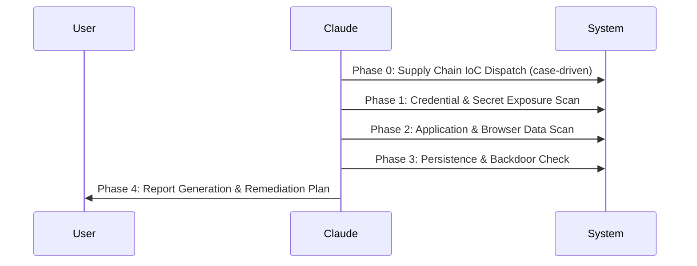

# Developer Workstation Security Audit

A systematic, multi-phase security audit for developer workstations. Checks for supply chain compromise indicators (via case-based IoC library at `references/cases/`), scans for exposed credentials across 20+ categories, and generates a prioritized remediation plan.

## When to Use

- User suspects their machine was compromised
- User wants to check for exposed secrets/credentials
- User heard about a supply chain attack and wants to check if affected
- User wants a general security audit of their dev environment
- Post-incident response: credential rotation planning

## When NOT to Use

- Code-level security review (use `/codex-security` or `/security-review`)
- Dependency vulnerability audit (use `/dep-audit`)
- OWASP Top 10 web app audit (use `/codex-security`)
- Runtime application security testing

## Workflow Overview



Run phases sequentially. Each phase produces findings that feed into the final report. Use the reference files for detailed scan targets and IoC lists.

**Evidence preservation**: Before any cleanup or deletion, always copy/archive artifacts for forensic analysis. Never destroy evidence before the report is generated.

## Phase 0: Supply Chain IoC Dispatch

Check for known supply chain compromises using the case library (`references/cases/`). This phase is conditional — it runs only when matching cases are found.

### Dispatch Algorithm

1. **Detect platform**: macOS / Linux / Windows
2. **Load case catalog**: Read `references/cases/README.md` for active cases
3. **Scan product presence**: For each active case, check if the product is installed on the system
4. **Execute matching cases**: Load the case file and run its Detection Commands section

### Dispatch Rules

| Condition | Action |
|-----------|--------|
| No matching case (product not installed) | Skip Phase 0, proceed to Phase 1 |
| Single match | Load case file, run detection + interpretation |
| Multiple matches | Iterate: execute each case sequentially |

### Output Contract

For each matched case, report:

| Field | Description |
|-------|-------------|
| `case_id` | From case frontmatter (e.g., `PRODUCT-YYYY-MM`) |
| `status` | `COMPROMISED` / `INCONCLUSIVE` / `CLEAN` / `NOT_INSTALLED` |
| `confidence` | From case frontmatter + detection result |

If any case returns `COMPROMISED`, execute evidence preservation per case file instructions before proceeding.

## Phase 1: Credential & Secret Exposure Scan

Scan for ALL sensitive files an attacker with user-space read access could have exfiltrated. This scan reveals credential hygiene issues regardless of supply chain compromise status.

Read `references/scan-targets.md` for the complete list. Below is the execution strategy.

### Scan Strategy

Run scans in parallel where possible (use subagents for independent categories). Group into 3 parallel tracks:

**Track A — Cloud & Infrastructure Credentials:**
- AWS (`~/.aws/credentials`, `~/.aws/config`)
- GCP (`~/.config/gcloud/` — credentials.db, access_tokens.db, application_default_credentials.json)
- Azure (`~/.azure/`)
- Kubernetes (`~/.kube/config`, `~/.kube/custom-contexts/`)
- Terraform (`~/.terraform.d/credentials.tfrc.json`)
- Docker (`~/.docker/config.json`)

**Track B — Development Tool Tokens:**
- SSH keys (`~/.ssh/`)
- Git credentials (`~/.git-credentials`, `~/.gitconfig`)
- GitHub CLI (`~/.config/gh/`)
- GitLab CLI (`~/.config/glab-cli/`)
- npm (`~/.npmrc`)
- GPG keys (`~/.gnupg/private-keys-v1.d/`)

**Track C — Application Secrets & History:**
- Shell history token scan (grep for patterns below)
- `.env` files (`find ~ -maxdepth 5 \( -name ".env" -o -name ".env.*" \) 2>/dev/null | grep -v node_modules | grep -v .git`)
- Crypto wallets (Solana, Electrum, etc.)
- VPN configs (`*.ovpn`, WireGuard)

### Parallel Scan Merge Rules

| # | Rule | Description |
|---|------|-------------|
| 1 | Subagent parallel | Tracks A/B/C may run via subagents in parallel for speed |
| 2 | Unified output schema | All tracks emit: `Category \| Path \| Severity \| Redacted Sample \| Action` |
| 3 | Dedup by key | Merge results using `(Path + Indicator Type + Token Prefix)` as dedup key |
| 4 | Critical bubble-up | Critical/Critical+ findings surface immediately — do not wait for full scan |

### Token Pattern Reference

Use these regex patterns to extract tokens from shell history and .env files:

```
OpenAI:           sk-[a-zA-Z0-9_-]{20,}
Anthropic:        sk-ant-[a-zA-Z0-9_-]{20,}
GitHub Classic:   gh[posur]_[a-zA-Z0-9]{20,}
GitHub Fine-grain: github_pat_[a-zA-Z0-9_]{20,}
GitLab PAT:       glpat-[a-zA-Z0-9_-]{20,}
AWS Access:       AKIA[A-Z0-9]{16}
AWS Temp:         ASIA[A-Z0-9]{16}
HuggingFace:      hf_[a-zA-Z0-9]{20,}
npm:              npm_[a-zA-Z0-9]{20,}
Docker Hub:       dckr_pat_[a-zA-Z0-9_-]{20,}
Slack:            xox[bsrp]-[a-zA-Z0-9-]{20,}
Stripe:           [rs]k_live_[a-zA-Z0-9]{20,}
Firebase:         AIza[a-zA-Z0-9_-]{30,}
JWT:              eyJ[a-zA-Z0-9_-]+\.eyJ[a-zA-Z0-9_-]+\.[a-zA-Z0-9_-]+
Vercel:           vercel_[a-zA-Z0-9_-]{20,}
Supabase:         sbp_[a-zA-Z0-9]{20,}
```

When displaying found tokens to the user, always partially redact them (show first 8 and last 4 chars) so they can identify which token it is without fully exposing it in conversation history.

### Crypto Wallet Check

Crypto wallets deserve special urgency — asset theft is irreversible:

| Wallet | Path | Key Storage |
|--------|------|-------------|
| Solana CLI | `~/.config/solana/id.json` | Plaintext 64-byte keypair |
| Electrum | `~/.electrum/wallets/` | Encrypted (but copyable for offline brute force) |
| OneKey | `~/Library/Application Support/@onekeyhq/desktop/` | Encrypted in LevelDB |
| Ledger Live | `~/Library/Application Support/Ledger Live/` | Hardware key (safe), but addresses exposed |
| Tonkeeper | `~/Library/Application Support/@tonkeeper/desktop/` | Check LevelDB |

For plaintext keys (Solana), immediately check balance via RPC. For encrypted wallets (Electrum), the wallet files could have been copied for offline cracking — advise transferring funds to a new wallet.

## Phase 2: Application & Browser Data Scan

User-space RCE can read any application's local data. Electron apps are especially vulnerable because they store data in unencrypted LevelDB.

### Electron App Scan

List all Electron apps by checking for LevelDB in Local Storage:

```bash
find ~/Library/Application\ Support/*/Local\ Storage/leveldb -maxdepth 0 2>/dev/null
```

High-priority Electron apps to check:
- **Communication**: Slack, Discord, Telegram, LINE, WhatsApp Desktop
- **Dev tools**: VS Code, GitKraken, Postman, MongoDB Compass
- **Crypto**: OneKey, Ledger Live, Tonkeeper
- **AI**: Claude Desktop, ChatGPT Desktop

For each, run `strings` on the LevelDB files and grep for `token`, `secret`, `password`, `auth`, `session`. **Always pipe through redaction before output**: `sed -E 's/(.{8}).{4,}(.{4})/\1****\2/g'`. Never print raw secrets to conversation or report — redact at the pipeline level, not as an afterthought.

### Browser Data

Browsers store Login Data, Cookies, and Local Storage accessible to user-space processes:

```bash
# Chrome profiles
ls ~/Library/Application\ Support/Google/Chrome/*/Login\ Data 2>/dev/null
# Firefox
ls ~/Library/Application\ Support/Firefox/Profiles/*/logins.json 2>/dev/null
# Arc
ls ~/Library/Application\ Support/Arc/*/Login\ Data 2>/dev/null
```

Note: Chrome's Login Data is encrypted via macOS Keychain. Under RCE, the attacker could potentially decrypt it during an active user session via the `security` CLI or Chrome DevTools Protocol.

### macOS Keychain

```bash
ls ~/Library/Keychains/ 2>/dev/null
```

Keychain files are encrypted, but during an active session with RCE, the attacker could use `security dump-keychain` or `security find-generic-password` to extract individual items. This is a **medium** risk — it requires the keychain to be unlocked (which it usually is during a user session).

## Phase 3: Persistence & Backdoor Check

Check whether the attacker established any persistence mechanisms to survive application removal. Case-specific persistence indicators (e.g., known backdoor binaries) are checked in Phase 0 via case files.

### macOS

```bash
# User LaunchAgents (most common persistence vector)
ls ~/Library/LaunchAgents/

# System LaunchDaemons (requires root, less likely for user-space attack)
ls /Library/LaunchDaemons/

# Non-Apple launchctl services
launchctl list | grep -v com.apple

# Cron jobs
crontab -l

# Login items
osascript -e 'tell application "System Events" to get the name of every login item' 2>/dev/null
```

### Linux

```bash
crontab -l
ls /etc/cron.d/
systemctl list-unit-files --type=service | grep -v disabled
```

### Windows (instruct user to run)

```
schtasks /query /fo LIST /v
sc query type=service state=all | findstr /v /i "Microsoft Windows"
reg query "HKCU\Software\Microsoft\Windows\CurrentVersion\Run"
```

### Suspicious Binary Check

Scan common binary locations for unsigned or unexpected executables:

```bash
ls -la /usr/local/bin/ | head -30
# List executables modified within a suspected attack window
# Use dates from Phase 0 case match (attack_window.start/end) or user-provided window
WINDOW_START="${ATTACK_WINDOW_START:?Set ATTACK_WINDOW_START from Phase 0 case match}"
WINDOW_END="${ATTACK_WINDOW_END:?Set ATTACK_WINDOW_END from Phase 0 case match}"
find /usr/local/bin -type f -newermt "$WINDOW_START" ! -newermt "$WINDOW_END" 2>/dev/null | while read f; do
  file "$f" 2>/dev/null | grep -q "executable" && echo "SUSPECT: $f ($(stat -f '%Sm' "$f" 2>/dev/null || stat -c '%y' "$f" 2>/dev/null))"
done
```

## Phase 4: Report Generation

After all scans complete, generate a prioritized report and save to `/tmp/`.

### Report Output

Write the report to a secure temp file via `mktemp`. This keeps the report outside the repo (no accidental commit of sensitive findings) and accessible for the user to review, copy, or forward.

```bash
umask 077
REPORT_PATH="${TMPDIR:-/tmp}/security-audit-$(hostname -s)-$(date +%Y%m%d-%H%M%S).md"
touch "$REPORT_PATH" && chmod 600 "$REPORT_PATH"
# Write report content to $REPORT_PATH
echo "Report saved to: $REPORT_PATH"
```

Example output: `/tmp/security-audit-macbook-pro-20260325-143052.md`

### Severity Classification

| Severity | Criteria | Examples |
|----------|----------|---------|
| Critical+ | Immediate asset loss risk | Crypto wallet private keys, plaintext |
| Critical | Full account/infrastructure takeover | AWS keys, GCP refresh tokens, K8s admin tokens |
| High | Account access or data theft | Git tokens, npm tokens, API keys, VPN configs |
| Medium | Encrypted/protected but potentially exposed | Keychain, encrypted wallets, browser Login Data |
| Low | Information disclosure only | known_hosts, directory structure, git config |

### Report Template

```markdown
# Security Audit Report

## Summary
- Scan date: YYYY-MM-DD
- Platform: macOS/Linux/Windows
- Supply Chain IoC: [per-case status from Phase 0, or "No active cases matched"]
- Total findings: N (N critical, N high, N medium, N low)

## Supply Chain Status
[Per-case results table: case_id | status | confidence]

## Critical Findings (Immediate Action Required)
| # | Category | Item | Path | Action |

## High Findings (Action Within 24h)
| # | Category | Item | Path | Action |

## Medium Findings (Evaluate & Monitor)
| # | Category | Item | Path | Action |

## Recommended Action Plan
### Tier 0 — Immediately (minutes)
### Tier 1 — Today (hours)
### Tier 2 — This Week
### Tier 3 — Contingency Triggers

## What Was NOT Found (Good News)
[List of categories that came back clean]
```

### Remediation Priority Rules

1. **Crypto wallets with plaintext keys** — Check balance first, transfer if needed, then delete key
2. **Cloud provider credentials (AWS/GCP/Azure)** — Revoke immediately (can re-mint access)
3. **Git platform tokens (GitHub/GitLab)** — Revoke (can push malicious code)
4. **npm/PyPI/registry tokens** — Revoke (supply chain risk)
5. **SSH keys** — Generate new keys, update all services, then delete old
6. **Shell history** — Clear after extracting token list for revocation
7. **VPN configs** — Notify IT team
8. **.env.production files** — Audit and rotate all contained secrets
9. **Communication app tokens** — Re-login to invalidate sessions
10. **Browser passwords** — Evaluate scope, consider full password rotation

## Verification Checklist

- [ ] Supply chain IoC cases checked (Phase 0 dispatch)
- [ ] All cloud provider credential paths checked
- [ ] Shell history scanned for token patterns
- [ ] .env files enumerated
- [ ] Crypto wallet paths checked
- [ ] SSH directory fully inventoried
- [ ] Electron app LevelDB scanned
- [ ] Browser Login Data enumerated
- [ ] Persistence mechanisms checked
- [ ] Report generated with severity classification
- [ ] Remediation plan prioritized by risk

## References

| File | Purpose |
|------|---------|
| `references/scan-targets.md` | Complete list of file paths to scan per platform |
| `references/remediation.md` | Detailed remediation procedures per category |
| `references/cases/` | Supply chain incident case library (IoC + detection + cleanup per case) |
