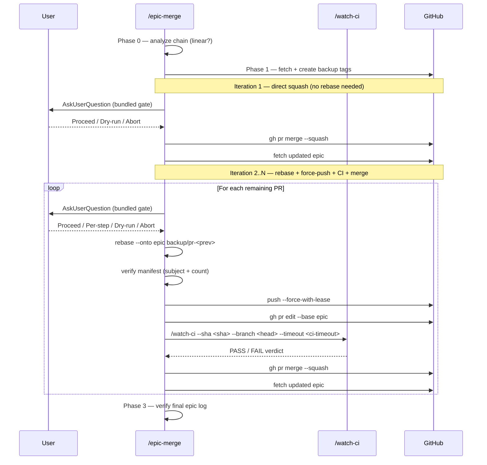

# Epic Merge — Stacked PR Chain Squash-Merge

Sequentially squash-merge a chain of stacked PRs into an epic branch, producing one squash commit per PR for clean per-PR review on the epic. Every destructive iteration is gated by `AskUserQuestion` to keep the operator in control.

## When NOT to Use

- Single PR merge — use `/create-pr` + GitHub UI
- Simple rebase without stacked dependencies — use `/smart-rebase`
- Pre-merge conflict / impact analysis only — use `/merge-prep`
- Diamond / parallel merge chains — this skill handles **linear chains only**
- Repos that use merge-commit or rebase-merge — this skill assumes squash-merge only

## Permissions

This skill is one of the explicit exceptions in `@rules/git-workflow.md` allowed to execute `git rebase --onto`, `git push --force-with-lease`, and `gh pr merge --squash`. Every destructive step is gated by `AskUserQuestion`.

| Phase | Operation | Mutates | Approval |
|-------|-----------|---------|----------|
| Phase 1 backup | `git fetch`, `git tag -f` | local refs only | No (no remote / non-recoverable mutation) |
| Phase 2 iteration | rebase + force-push + `gh pr merge` | local + remote | **Yes** — single bundled gate per iteration (or per-step with `--per-step`) |
| Phase 3 verify | `git log` | none | No (read-only) |

`--dry-run` skips all destructive steps and outputs the plan only.

## Core Concept

After squash-merging PR N, the original commits are replaced by a single squash commit on epic. PR N+1 still contains N's original commits as its base — these must be cut via `git rebase --onto` before merging N+1. The cut point is the original tip of PR N's branch, captured in Phase 1 as a backup tag.

```
epic:    E ─── S_N (squash of PR N)
PR N+1:  E ─ A1 ─ A2 ─ ... ─ B1 ─ B2
              └── drop (in S_N) ──┘ └─ keep ─┘

After: git rebase --onto epic backup/pr-<N> PR_N+1
epic:    E ─── S_N ─── B1' ─ B2'
```

## Workflow



### Phase 0: Analyze PR Chain

```bash
# For each PR, get head/base branch and unique commit count
gh pr view <N> --json number,headRefName,baseRefName,title,state
git log origin/<base>..origin/<head> --oneline | wc -l
```

Output a chain table:

| Order | PR | Head Branch | Base Branch | Unique Commits | State |
|-------|-----|-------------|-------------|----------------|-------|
| 1 | #100 | `feat/A` | `epic/xxx` | N | OPEN |
| 2 | #101 | `feat/B` | `feat/A` | N | OPEN |
| ... | ... | ... | ... | ... | ... |

**Validation gate** — abort if any of:
- A PR's base is not the previous PR's head (chain not linear)
- Any PR is not OPEN
- Any PR has uncommitted local changes on its head branch
- Working tree is dirty (`git status --porcelain` non-empty)

### Phase 1: Pre-flight Backup

Creates safety nets. Original branch tips and PR-level commit fingerprints persist as git tags + manifest files so they survive shell session loss.

```bash
git fetch origin

# Collision-safe backup tags keyed by PR number (NOT branch basename)
for pr in <PR-numbers>; do
  head_branch=$(gh pr view "$pr" --json headRefName -q .headRefName)
  git tag -f "backup/pr-${pr}" "origin/${head_branch}"
done

# Stable manifest per PR (subject-only — survives SHA rewrite during rebase)
for pr in <PR-numbers>; do
  head=$(gh pr view "$pr" --json headRefName -q .headRefName)
  base=$(gh pr view "$pr" --json baseRefName -q .baseRefName)
  git log "origin/${base}..origin/${head}" --pretty=format:'%s' > ".epic-merge-pr-${pr}.manifest"
done
```

**Why `backup/pr-<N>`**: branch basenames collide (`feat/foo` vs `fix/foo` both become `foo`). PR numbers are globally unique within the repo.
**Why subject-only manifest**: rebase rewrites SHAs; commit subjects are stable across rebases (assuming no `--squash`/`--fixup` mid-rebase). Subject + count is the right invariant to verify.
**Why origin refs**: local branches drift; `origin/*` is SSOT.
**Why tags**: shell variables die on session interruption; tags persist in `.git/refs/tags/`.

### Phase 2: Sequential Merge Loop (gated)

#### Iteration 1 (First PR) — direct squash, no rebase

```bash
# AskUserQuestion gate (see Iteration Gate Design below)
# On Proceed:
gh pr merge <first-PR> --squash
git fetch origin <epic-branch>
```

#### Iteration 2..N — gate first, then rebase + force-push + CI + merge

For each subsequent PR (PR `<N>` with head branch `<head>`, previous PR was `<prev>`):

```bash
# Step 1: AskUserQuestion BEFORE any destructive op (see Gate Design)
#   On Proceed: continue Steps 2-8 atomically
#   On Per-step: re-prompt before push (Step 5) and merge (Step 7)
#   On Dry-run: print Steps 2-8 commands, do not execute
#   On Abort: stop, leave backup tags in place

# Step 2: Checkout fresh from remote
git switch -C "<head>" "origin/<head>"

# Step 3: Rebase — cut already-squashed commits, replay unique ones onto epic
git rebase --onto "origin/<epic>" "backup/pr-<prev>" "<head>"

# Step 4: Verify manifest (subject + count, NOT SHA)
git log "origin/<epic>..<head>" --pretty=format:'%s' > ".epic-merge-actual.manifest"
diff ".epic-merge-pr-<N>.manifest" ".epic-merge-actual.manifest"
# Mismatch → STOP, restore: git switch -C "<head>" "backup/pr-<N>"

# Step 5: Force-push (--force-with-lease, NEVER --force)
git push --force-with-lease "origin" "<head>"

# Step 6: Update PR base so CI runs against correct diff
gh pr edit "<N>" --base "<epic>"

# Step 7: Wait for CI — delegate to /watch-ci with proper args
sha=$(git rev-parse "<head>")
# Skill: /watch-ci --sha "$sha" --branch "<head>" --timeout <--ci-timeout value (default 15)>
# Re-enter loop only on PASS verdict; FAIL → STOP and restore from backup

# Step 8: Squash merge
gh pr merge "<N>" --squash

# Step 9: Refresh epic
git fetch "origin" "<epic>"
```

### Iteration Gate Design

Default: **one bundled gate per iteration**. Operator can opt into finer control with `--per-step`.

| Mode | Gate count per iteration | Gate moments | When to use |
|------|--------------------------|--------------|-------------|
| Bundled (default) | 1 | Before Step 2 (covers Steps 2-8) | Trusted chain, fast iteration |
| `--per-step` | 3 | Before Step 3 (rebase), Step 5 (push), Step 7 (merge) | First-time use, untrusted diff, recovery from prior failure |

**AskUserQuestion fields (bundled mode):**

| Field | Value |
|-------|-------|
| `question` | `"Proceed with PR #<N> ('<title>')? Will rebase onto epic, force-push, wait for CI, then squash-merge."` |
| `options` | `Proceed`, `Per-step approval`, `Dry-run only`, `Abort and rollback` |
| `description` per option | Show diff stats (`+X -Y across F files`), backup tag SHA, expected unique-commit count from manifest |

**AskUserQuestion fields (per-step mode):**

| Step | question (short) |
|------|------------------|
| Before rebase | `"Run: git rebase --onto origin/<epic> backup/pr-<prev> <head> ?"` |
| Before push | `"Manifest verified (N commits). Force-push <head>?"` |
| Before merge | `"CI passed for #<N>. Squash-merge into <epic>?"` |

### Cut Point Reference

Each iteration uses the **previous PR's backup tag** as the rebase cut point:

| Iteration | PR | Branch | Cut Point (--base of rebase) |
|-----------|-----|--------|------------------------------|
| 2 | #101 | `feat/B` | `backup/pr-100` |
| 3 | #102 | `feat/C` | `backup/pr-101` |
| ... | ... | ... | ... |

### Phase 3: Verification

```bash
git log origin/<epic-branch> --oneline -<N+5>
```

Expect N squash commits (newest first), each with PR number suffix `(#NNN)`:

```
<sha> feat: ... (#103)
<sha> feat: ... (#102)
<sha> feat: ... (#101)
<sha> feat: ... (#100)
<sha> <previous epic commits>
```

Final report:

| Item | Value |
|------|-------|
| Epic branch | `epic/xxx` |
| PRs merged | 4 (#100, #101, #102, #103) |
| Backup tags | `backup/pr-100`, `backup/pr-101`, ... (kept for safety) |
| CI status | All PASS (verdicts via `/watch-ci`) |
| Manifests | `.epic-merge-pr-*.manifest` (kept until --cleanup) |
| Gate transcripts | All AskUserQuestion answers logged in conversation |

## Safety Rules

| Rule | Rationale |
|------|-----------|
| `--force-with-lease` only | Prevents overwriting concurrent remote pushes |
| Backup tags from `origin/*` | Remote is SSOT; local refs may be stale |
| Tags keyed by PR number | Avoids namespace collisions across branch prefixes |
| Manifest = subject + count (not SHA) | Survives SHA rewrite during rebase |
| Mismatch → STOP + restore | Backup tags enable instant rollback |
| CI must PASS before merge | Rebase can introduce conflicts; CI catches them |
| Update PR base before CI | CI must run against the correct epic diff |
| AskUserQuestion before destructive ops | Per `@rules/git-workflow.md` exception model |
| `/watch-ci` for CI delegation | Reuses tested timeout/verdict logic; avoids inline `gh run watch` divergence |

## Rollback

If any step fails or user aborts:

```bash
# 1. Working tree must be clean
git status --porcelain  # must be empty

# 2. Restore branch from backup tag
git switch -C "<head>" "backup/pr-<N>"
git push --force-with-lease "origin" "<head>"

# 3. If a merge already happened, manually revert via GitHub UI
#    (no scripted revert — too dangerous for stacked chain)
```

## Conflict Handling

If `git rebase --onto` encounters conflicts:

1. Resolve conflicts manually
2. `git rebase --continue` — **never** `--skip` (commits must not be lost)
3. Re-verify manifest after resolution (subject set must match)
4. If unresolvable → `git rebase --abort` + restore from backup tag

## Resume / Checkpoint (long chains)

For chains of 10+ PRs, mid-failure recovery without restart:

1. Determine where the chain stopped: `git tag -l 'backup/pr-*'` + `git log origin/<epic> --oneline | grep -E '\(#[0-9]+\)'`
2. Re-invoke `/epic-merge <epic> <remaining-PRs>` — Phase 0 will detect already-merged PRs from epic log and skip them
3. Backup tags from prior session remain valid as long as the corresponding branches have not been re-pushed

## Post-Merge Cleanup (--cleanup flag)

```bash
# Remove local merged branches
git branch -D <branch1> <branch2> ...

# Inspect backup tags (kept by default)
git tag -l 'backup/pr-*'

# Remove backup tags only after confirming nothing went wrong
git tag -d backup/pr-100 backup/pr-101 ...

# Remove manifest files
rm .epic-merge-pr-*.manifest
```

## Arguments

| Argument | Description | Default |
|----------|-------------|---------|
| `<epic-branch>` | Target epic branch name | Required |
| `<PR-list>` | Comma-separated PR numbers | Auto-detect from chain |
| `--dry-run` | Show plan + commands, skip all destructive ops | off |
| `--per-step` | Three gates per iteration (rebase / push / merge) | off (single bundled gate) |
| `--cleanup` | Delete local branches + manifests after success | off |
| `--keep-backup-tags` | Keep backup tags even with --cleanup | off |
| `--ci-timeout <min>` | Timeout passed to `/watch-ci` | 15 |

## Examples

```bash
# Auto-detect chain into epic branch (single gate per iteration)
/epic-merge epic/gas-account-OK-49808

# Dry-run to see plan first
/epic-merge epic/feature-xxx --dry-run

# Explicit PR list with finer per-step gates (first-time use)
/epic-merge epic/feature-xxx 100,101,102,103 --per-step

# Full cleanup after success
/epic-merge epic/feature-xxx --cleanup
```

## Prerequisites

- `gh` CLI authenticated (`gh auth status`)
- Repository uses squash-merge only (GitHub repo setting)
- All PRs in the chain are OPEN and CI passing on their current base
- Working tree clean (`git status --porcelain` empty)
- Backup tag namespace `backup/pr-*` not already in use for unrelated purposes

## Limitations

- Linear chains only (no diamond / parallel merges)
- Squash-merge repos only
- One epic branch per invocation
- CI delegation requires `/watch-ci` to be available

## Verification

- [ ] Phase 0: Chain validated as linear, all PRs OPEN, working tree clean
- [ ] Phase 1: Backup tags created from `origin/*` refs, keyed by PR number
- [ ] Phase 1: Per-PR subject-only manifests written
- [ ] Phase 2: AskUserQuestion answer recorded BEFORE the first destructive op of each iteration
- [ ] Phase 2: every push uses `--force-with-lease`; no push command contains the bare `--force` flag (token-level check, not substring — `--force-with-lease` is allowed)
- [ ] Phase 2: `/watch-ci` invoked with `--sha <sha> --branch <head>`; PASS verdict received before `gh pr merge`
- [ ] Phase 2: Manifest `diff` exits 0 after each rebase
- [ ] Phase 3: Final epic log shows N squash commits with `(#NNN)` suffix in expected order
- [ ] No commit/push performed without an AskUserQuestion answer in the conversation transcript

## References

| File | Purpose | When to Read |
|------|---------|--------------|
| `@rules/git-workflow.md` | Push/rebase exception model (this skill is one of three exceptions) | Before any destructive op |
| `skills/smart-rebase/SKILL.md` | Single-PR squash-merge rebase pattern | Phase 2 rebase logic |
| `skills/merge-prep/SKILL.md` | Pre-merge analysis primitives | Phase 0 chain analysis |
| `skills/watch-ci/SKILL.md` | CI verdict polling — argument contract | Phase 2 Step 7 delegation |
| `skills/push-ci/SKILL.md` | AskUserQuestion gate pattern for git push | Iteration Gate Design |
