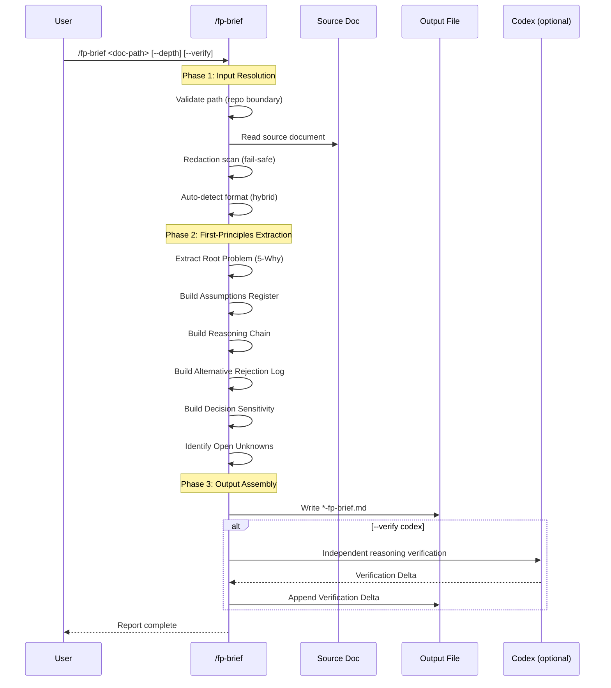

# First-Principles Briefing Skill

## Trigger

- Keywords: first principles, fp brief, why was this decided, reasoning chain, decision sensitivity, explain decisions, assumption analysis, onboarding brief

## When NOT to Use

| Scenario | Alternative |
|----------|------------|
| PM/CTO executive summary (strip technical details) | `/project-brief` |
| Pre-doc feasibility analysis (before writing spec) | `/feasibility-study` |
| Code explanation at function/file level | `/codex-explain` |
| Code architecture overview | `/code-explore` |
| Simple document summary | Ask Claude directly |

## Command Signature

```
/fp-brief <doc-path> [--depth brief|normal|deep] [--verify off|codex] [--output <path>] [--no-save]
```

| Flag | Default | Description |
|------|---------|-------------|
| `<doc-path>` | Required | Source markdown document path |
| `--depth` | `normal` | Output detail level |
| `--verify` | `off` | Independent Codex reasoning verification |
| `--output` | Same dir, `-fp-brief.md` suffix | Custom output path |
| `--no-save` | false | Print to stdout instead of file |

## Workflow



### Phase 1: Input Resolution

1. **Path validation**: Normalize, reject `..` traversal, enforce repo boundary
2. **Read source document**
3. **Redaction scan**: High-confidence secret patterns → abort; medium → mask `[REDACTED]`
4. **Format auto-detection**: See `references/detection-rules.md`
5. **Select extraction template** based on detected format

### Phase 2: First-Principles Extraction

See `references/extraction-guide.md` for section-by-section heuristics.

| Section | Core Question |
|---------|--------------|
| Root Problem | What fundamental truth makes this problem unavoidable? |
| Assumptions Register | What are we taking for granted, and why? |
| Reasoning Chain | How does each decision trace back to a principle? |
| Alternative Rejection Log | Why do other approaches violate our principles? |
| Decision Sensitivity | If assumption X breaks, which decisions collapse? |
| Open Unknowns | What don't we know, and what should we find out? |

For long documents (>500 lines): split by `##` headings, extract per-section, merge + dedup.

### Phase 3: Output Assembly

1. Apply depth filter (section inclusion matrix)
2. Apply source citations (reference source doc section headings)
3. Apply Evidence Insufficient Rule — never fabricate content for thin sections
4. Write output file (or stdout if `--no-save`)
5. If `--verify codex`: dispatch verification per `references/codex-verify-prompt.md`

## Depth Levels

| Level | Description | Sections Included |
|-------|-------------|-------------------|
| brief | Core reasoning only (~500 words max) | Root Problem (full), Assumptions (top 3), Reasoning Chain (key decisions), Sensitivity (top 3) |
| normal | Full reasoning chain (~1500 words max) | All 6 sections with citations |
| deep | Full chain + analysis (~2500 words max) | All 6 sections + challenge questions, evidence ratings, counterfactual analysis, risk-weighted unknowns |

Verification Delta (section 7) appears only when `--verify codex` is used, at any depth level.

**Length policy**: These are upper bounds, not targets. If source doc is thin, output will be shorter. The Evidence Insufficient Rule applies: `[Evidence insufficient — source doc lacks data for this section]`.

## Output

See `references/output-template.md` for full template.

```markdown
# First-Principles Briefing: <title>

> Source: <path> | Depth: <level> | Format: <type> | Generated: <timestamp>

## 1. Root Problem
## 2. Assumptions Register
## 3. Reasoning Chain
## 4. Alternative Rejection Log
## 5. Decision Sensitivity
## 6. Open Unknowns
## 7. Verification Delta (optional)
```

### Save Behavior

| Condition | Output Path |
|-----------|------------|
| Default | Same directory as source, `-fp-brief.md` suffix |
| `--output <path>` | Specified path |
| `--no-save` | stdout only, no file written |

Example: `docs/features/auth/2-tech-spec.md` → `docs/features/auth/2-tech-spec-fp-brief.md`

## Verification

- [ ] Input path validated (repo boundary enforced)
- [ ] Secret redaction scan executed
- [ ] Format auto-detection result shown in output header
- [ ] Each Reasoning Chain decision cites source section (`Source: §<ref>`)
- [ ] Each Assumptions Register entry has confidence level
- [ ] Decision Sensitivity maps assumptions to affected decisions
- [ ] Evidence Insufficient markers used where source data is thin
- [ ] Output length within depth-level upper bound
- [ ] If `--verify codex`: Codex researched independently (per codex-invocation rules)

## References

- Output template: `references/output-template.md`
- Detection rules: `references/detection-rules.md`
- Extraction guide: `references/extraction-guide.md`
- Codex verification: `references/codex-verify-prompt.md`

## Examples

```
Input: /fp-brief docs/features/seek-verdict/2-tech-spec.md
Action: Read spec → detect tech-spec → extract 6 sections → write 2-tech-spec-fp-brief.md

Input: /fp-brief docs/features/auth/2-tech-spec.md --depth brief
Action: Read spec → extract Root Problem + top assumptions + key decisions + top sensitivity → brief output

Input: /fp-brief docs/features/auth/2-tech-spec.md --depth deep --verify codex
Action: Read spec → full extraction → Codex independent verification → write with Verification Delta

Input: /fp-brief notes/design-decisions.md --no-save
Action: Read doc → detect unknown format → generic extraction → print to stdout
```
