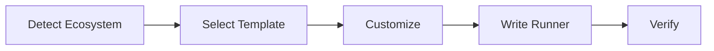

# Generate Runner

## Trigger

- Keywords: generate runner, create runner, custom runner, eject runner, runner for python, runner for rust, runner for go

## When NOT to Use

| Need | Use Instead |
|------|-------------|
| Run precommit checks | `/precommit` or `/precommit-fast` |
| Install existing runner | `/project-setup` (auto-installs) |
| Configure lint globs | Edit `.claude/runner-config.json` |

## Workflow



### Step 1: Detect Ecosystem

Scan project root for manifest files:

| Manifest | Ecosystem | Template ID |
|----------|-----------|-------------|
| `pnpm-lock.yaml` | Node.js (pnpm) | `node-pnpm` |
| `yarn.lock` | Node.js (yarn) | `node-yarn` |
| `package-lock.json` or `package.json` | Node.js (npm) | `node-npm` |
| `pyproject.toml` | Python | `python` |
| `Cargo.toml` | Rust | `rust` |
| `go.mod` | Go | `go` |

If multiple detected, prefer Node.js > Python > Rust > Go. If none detected, ask user.

### Step 2: Select Template

Load template from `references/templates.md` for the detected ecosystem.

### Step 3: Customize

Read project-specific configuration:

| Source | What |
|--------|------|
| `package.json` scripts | Lint command, test command, build command |
| `.claude/runner-config.json` | Custom lint globs (if exists) |
| Lock file | Package manager selection |

### Step 4: Write Runner

Write to `.claude/scripts/precommit-runner.js` (Node) or `.claude/scripts/precommit-runner.sh` (non-Node).

Include eject header:

```
@generated_at <ISO 8601>
@plugin_version <current version>
@template <template-id>
@ecosystem <ecosystem>
```

**Conflict handling**: If target file exists, AskUserQuestion with diff preview.

### Step 5: Verify

- File written successfully
- Script is executable (non-Node: `chmod +x`)
- Basic syntax check

## Arguments

| Argument | Description | Default |
|----------|-------------|---------|
| `--ecosystem <name>` | Force ecosystem (skip detection) | auto-detect |
| `--output <path>` | Custom output path | `.claude/scripts/precommit-runner.js` |
| `--force` | Overwrite existing without asking | off |

## Output

```markdown
## Generated Runner

- Ecosystem: <detected>
- Template: <template-id>
- Output: <path>
- Package manager: <pm>

The generated runner is **user-owned** — plugin updates will not overwrite it.
Edit freely to customize for your project.
```

## Verification

- [ ] Ecosystem correctly detected
- [ ] Template matches ecosystem
- [ ] Eject header present with correct metadata
- [ ] Runner script is valid (no syntax errors)
- [ ] Existing file conflict handled (ask or --force)

## References

- Per-ecosystem templates: `references/templates.md`

## Examples

```
Input: /generate-runner
Action: Detect Node.js (yarn) → load node-yarn template → customize → write .claude/scripts/precommit-runner.js

Input: /generate-runner --ecosystem python
Action: Load python template → customize → write .claude/scripts/precommit-runner.sh

Input: /generate-runner --force
Action: Detect ecosystem → overwrite existing runner without asking
```
