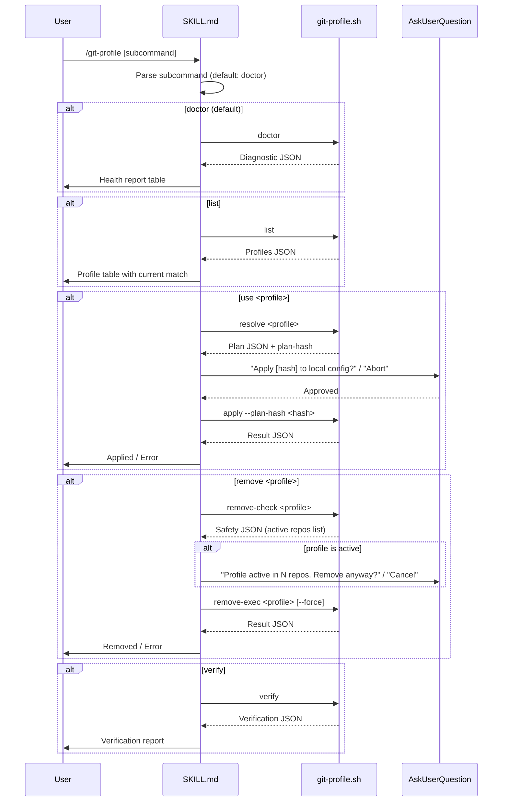

# Git Profile Manager

Manage git identity and GPG signing profiles per-repository.

## Workflow



## Subcommands

### `doctor` (default)

Run diagnostics on current repository's git identity and GPG signing config.

**Steps:**
1. Run: `bash scripts/run-skill.sh git-profile git-profile.sh doctor`
2. Parse the JSON output
3. Render a health report table:

```
## Git Profile Health

| Item | Value | Source | Status |
|------|-------|--------|--------|
| Name | ... | ... | ... |
| Email | ... | ... | ... |
| Signing | ... | ... | ... |
| GPG Key | ... | ... | ... |
| Env Override | ... | ... | ... |
| Worktree | ... | ... | ... |
| Profile Match | ... | ... | ... |

Status: [overall status]
```

1. If `status` is `halt`: show the issue and stop
2. If `status` is `warn`: show warnings, continue
3. If registry is missing AND this is the first run: trigger auto-discovery (see below)

### `list`

List all registered profiles.

**Steps:**
1. Run: `bash scripts/run-skill.sh git-profile git-profile.sh list`
2. Parse the JSON output
3. Render a profile table with a marker on the currently matched profile

### `use <profile>`

Switch the current repository to use a named profile.

**Steps:**
1. Run: `bash scripts/run-skill.sh git-profile git-profile.sh resolve <profile>`
2. Parse the plan JSON — contains profile data, planned commands, and plan-hash
3. Show the user what will be written:

```
## Apply Profile: <profile-id>

| Config Key | Current | New |
|------------|---------|-----|
| user.name | ... | ... |
| user.email | ... | ... |
| user.signingkey | ... | ... / (unset) |
| commit.gpgsign | ... | true / (unset) |

Note: Keyless profiles unset signing-related keys instead of setting them.
```

1. Use `AskUserQuestion` with options:
   - `"Apply [<plan-hash>] to local config (Recommended)"`
   - `"Abort"`
2. On approval: `bash scripts/run-skill.sh git-profile git-profile.sh apply --plan-hash <hash>`
3. Parse result; if error (hash mismatch, write failure) report and stop
4. On success: report applied config

### `remove <profile>`

Remove a profile from the registry.

**Steps:**
1. Run: `bash scripts/run-skill.sh git-profile git-profile.sh remove-check <profile>`
2. If profile is active in any repo, use `AskUserQuestion`:
   - `"Profile is active in N repos. Remove with --force?"`
   - `"Cancel"`
3. On approval: `bash scripts/run-skill.sh git-profile git-profile.sh remove-exec <profile> [--force]`
4. Report result

### `verify`

Deep verification of current identity setup.

**Steps:**
1. Run: `bash scripts/run-skill.sh git-profile git-profile.sh verify`
2. Parse the verification JSON
3. Render verification report with checks:
   - Key expiry (90-day warning threshold)
   - Email match between git config and GPG key UID
   - Registry consistency

## Auto-Discovery

Triggered when: registry file is missing on first `doctor` run.

**Steps:**
1. Run: `bash scripts/run-skill.sh git-profile git-profile.sh discover`
2. Parse candidates JSON
3. Present candidates to user via `AskUserQuestion`:
   - `"Save N discovered profiles to registry (Recommended)"`
   - `"Skip — I'll configure manually"`
4. If approved, the discover command already persisted them; confirm to user
5. If skipped, create an empty registry to avoid re-prompting

## Safety Rules

| Rule | Description |
|------|-------------|
| v1 NEVER writes `~/.gitconfig` | Only `--local` scope writes |
| v1 NEVER enables `extensions.worktreeConfig` | Linked worktree: detect + warn only |
| NEVER auto-fix without confirmation | All writes gated by AskUserQuestion |
| NEVER store key material | Registry stores fingerprints only |
| Plan-hash verification | Re-compute hash before apply; reject if stale |
| Atomic registry writes | temp file + `chmod 0600` + `mv` |

## Diagnostic Integration

The `doctor --json` output follows the Shared Diagnostic Contract (see tech spec section 3.2).
Other skills (e.g., `/smart-commit` Step 1c) can call:

```
bash scripts/run-skill.sh git-profile git-profile.sh doctor --json
```

**Degradation policy**: If the script is not found or fails, the calling skill falls back to its own inline diagnostics. Infrastructure failure = warn-only; identity/signing missing = halt (unchanged).
