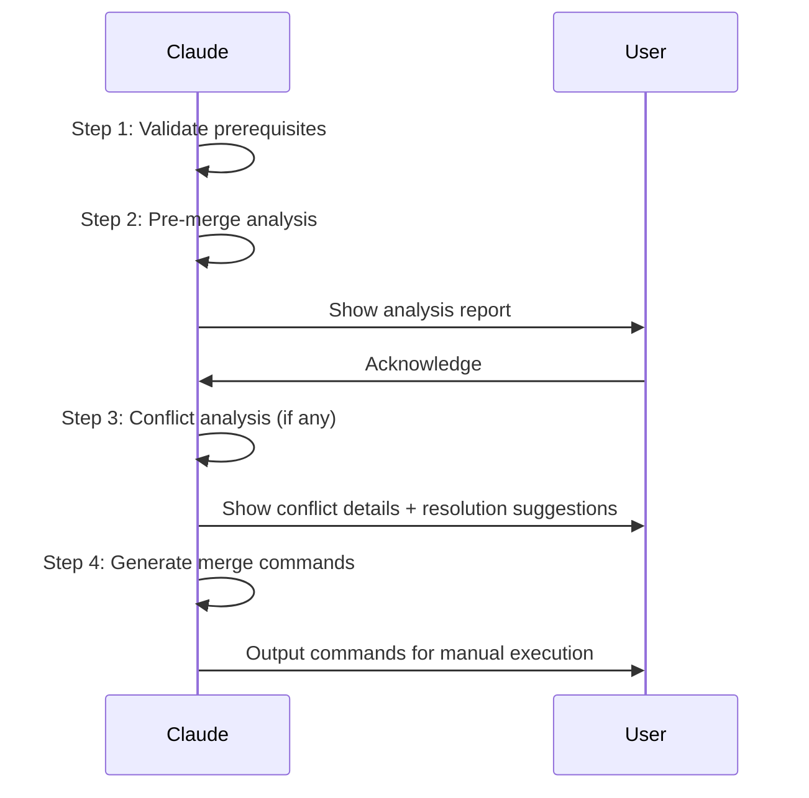

# Merge Prep — Pre-merge Analysis and Preparation

Analyze source branch vs target branch, detect conflicts, output analysis report with suggested commands. **v1 is analysis-only** — does not execute merge/commit/push.

## When NOT to Use

| Scenario | Use Instead |
|----------|-------------|
| Commit code (not merge) | `/smart-commit` |
| Merge to main (production) | Manual PR flow |
| Just view diff | `git diff <target>..<branch>` |
| Rebase or squash | Manual operation |

## Input

`/merge-prep <source-branch> [--target <branch>]`

- `<source-branch>`: Branch to merge (required)
- `--target`: Target branch (default: `{TARGET_BRANCH}` or `main`)

## Workflow



### Step 1: Validate Prerequisites

```bash
# 1a. Verify source branch exists
git rev-parse --verify <branch>

# 1b. Verify target branch exists
git rev-parse --verify <target>

# 1c. Verify working tree is clean
git status --porcelain
```

| Check | Failure Action |
|-------|---------------|
| Branch doesn't exist | Halt, list available branches |
| Target not found | Halt, suggest creating it |
| Uncommitted changes | Halt, suggest `/smart-commit` first |

### Step 2: Pre-merge Analysis

Run the analysis script:

```bash
bash skills/merge-prep/scripts/pre-merge-check.sh <branch> [target]
```

Script outputs JSON containing:

- `merge_base`: Common ancestor
- `source_commits`: New commits on source branch
- `target_commits`: Commits on target that source doesn't have
- `has_conflicts`: Whether conflicts exist
- `conflict_files`: List of conflict files
- `file_stats`: Affected file statistics

Display analysis report:

```markdown
## Pre-merge Analysis

| Item | Value |
|------|-------|
| Source branch | feat/new-feature |
| Target branch | main |
| Common ancestor | b03ad72a |
| New commits | 12 |
| Affected files | 46 |
| Predicted conflicts | 9 files |

### Recent Commits

| Hash | Message |
|------|---------|
| abc1234 | feat: Add new API endpoint |
| def5678 | test: Add integration tests |
```

### Step 3: Conflict Analysis (if conflicts detected)

For each conflict file, analyze commit history to determine conflict pattern:

| Pattern | Detection | Suggested Strategy |
|---------|-----------|-------------------|
| Iterative (v1→v3) | Both sides changed, source is superset | Take source |
| Parallel modification | Different people changed different logic | Per-hunk selection |
| Hotfix conflict | Target has hotfix merge, source doesn't | Take target |
| Doc add/add | Both sides added same-name file | Take source |

Display resolution suggestions:

```markdown
### Conflict Files

| # | File | Pattern | Suggestion | Reason |
|---|------|---------|------------|--------|
| 1 | src/xxx.ts | Iterative | Take source | v3 includes all v1 changes |
| 2 | src/yyy.ts | Parallel | Per-hunk | Two sides changed different functions |
| 3 | docs/zzz.md | add/add | Take source | Target version is outdated |
```

### Step 4: Generate Merge Commands

Output commands for manual execution:

```markdown
## Suggested Merge Commands

### Option A: Merge commit (recommended)

```bash
git checkout <target>
git pull --ff-only origin <target>
git merge <source> --no-ff
# Resolve conflicts if any
# git add <resolved-files>
# git commit
git push origin <target>
```

### Option B: Squash merge

```bash
git checkout <target>
git pull --ff-only origin <target>
git merge --squash <source>
git commit -m "merge: Merge <source> into <target>"
git push origin <target>
```

```

### Step 5: Summary

```markdown
## Merge Summary

| Item | Value |
|------|-------|
| Source | feat/new-feature |
| Target | main |
| Commits | 12 |
| Files | 46 |
| Conflicts | 9 (resolution suggestions provided) |
| Tickets | PROJ-520, PROJ-123 |

⚠️ This is an analysis-only report. Execute the commands manually.
```

## Multi-branch Mode

Supports `/merge-prep branch1 branch2 branch3 --target develop`:

1. Analyze each branch sequentially
2. Output combined summary
3. Suggest merge order (fewest conflicts first)

## Prohibited (v1)

- **No auto-merge**: Only output commands, never execute `git merge`
- **No auto-push**: Never execute `git push`
- **No auto-commit**: Never execute `git commit`
- **No rebase**: Never suggest or execute rebase operations

## References

| File | Purpose | When to Read |
|------|---------|-------------|
| [pre-merge-check.sh](scripts/pre-merge-check.sh) | Pre-merge analysis script | Step 2 |

## Verification

- [ ] Source branch exists and working tree is clean
- [ ] Pre-merge analysis displayed with user acknowledgment
- [ ] Conflicts analyzed with resolution suggestions
- [ ] Merge commands are output-only (not executed)
- [ ] No secrets in output, no force push suggested
