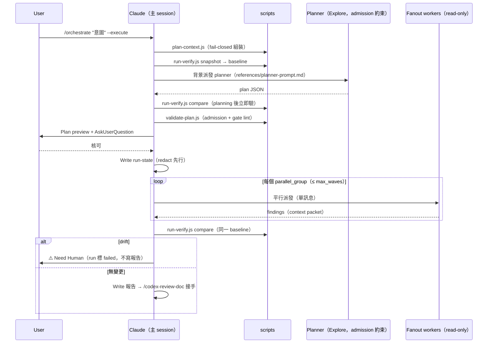

# Orchestrate Skill（v1 report-only）

宣告式意圖 → planner agent 推導隨 repo 狀態變動的 workflow 計畫 → 預覽人核 → read-only fanout → pre/post 無變更驗證 → 報告走既有 doc review loop。Control plane（`.claude_workflows/`）與 hook 獨佔的 safety plane（`.claude_review_state.json`）完全分離：**orchestrator 對 safety plane 只讀，永不寫**。

## Trigger

- Keywords: orchestrate, workflow orchestration, 編排, plan this workflow, audit the repo for, 自動編排

## When NOT to Use

- 執行會改檔的步驟（v1 一律輸出為 `proposed-manual`，交人走正常流程）
- 單一 skill 就能完成的任務（直接呼叫該 skill）
- Code review（`/codex-review-fast`）、doc review（`/codex-review-doc`）
- 既有固定形狀的深度探索（`/deep-explore`）或研究（`/deep-research`）——orchestrate 是跨 skill 的編排層，不取代它們

## Flags

| Flag | 行為 |
|------|------|
| （無）/ `--dry-run` | 規劃 + 預覽即止（plan preview = 預設交付物） |
| `--execute` | 預覽 + **AskUserQuestion 核可後**執行 read-only fanout → verify → 報告 |
| `--budget S\|M\|L` | Budget tier（default M）；超量 fail-closed，見 `scripts/plan-context.js` |
| `--resume <run-id>` | 以**原 baseline** compare：無 drift → 續跑 pending 步驟；**有 drift → run 標 `needs_human` 並停**（不得重拍 baseline 洗白；要繼續只能開新 run = 新 baseline + 新核可） |
| `--backend dw\|agent` | 強制 fanout 後端；預設 auto（`Workflow` 工具可用則用，否則 background `Agent` ≤3 並行）——admission 同一套 |

## Workflow



### Baseline 時序不變量（hard rule）

`run-verify.js snapshot` 必須**先於任何 agent 派發**（含 planner）——否則 planner 期間的 mutation 會被併入 baseline，report-only 證明失效。planner 與 fanout worker 受**同一** admission allowlist 約束（planner = `Explore`，名單內唯一具研究能力者）。planning 結束、preview 之前先 compare 一次（早期攔截）；execute 結束後以**同一 baseline** 再 compare 一次（最終攔截）。

### Admission（deny-by-default）

Fanout 候選一律比對 `references/admission-allowlist.json`（v1 僅 `Explore` + `performance-optimizer`；`coverage-analyst` / `git-investigator` 為明確排除，理由見檔內）。不在名單 = 拒絕，不論其 `allowed-tools` 宣告——`allowed-tools` 不可信任為 read-only 判據。名單變更必過 review + 重審 `run-verify.js` 驗證面涵蓋性。

### Run-state 管理

| 規則 | 內容 |
|------|------|
| 路徑 | `.claude_workflows/<run-id>.json`（gitignored；`run-id` = `<UTC yyyymmdd-HHMMSS>-<intent-slug>`） |
| 寫入工具 | 主 session `Write`（`.json` 不觸發 change flag——control plane 對 safety plane 惰性） |
| Redaction | 落盤前過 `scripts/security-redact.js` 完整 contract：`scanHighConfidence` truthy → **abort fail-closed**（不落盤、run 標 `needs_human`、提示改寫意圖）；medium → mask 後落盤 |
| FIFO | 保留最近 10 個 run 檔，超過刪最舊 |
| 終態 | `done` 的**唯一路徑** = 報告之 doc review 回 Mergeable gate；回 blocked / degraded / 無法判定 → `needs_human`（不得呈現為完成） |

### 輸出隔離契約

`/orchestrate` 自身輸出**禁止**出現 hook-parsed gate sentinels（gate 標頭行、bare Ready / Mergeable / Blocked / All-Pass 記號）——run 總結使用 `## Orchestrate Run Summary` + `[ORCHESTRATE_RUN] run_id=… status=…` 結構行（純行為層標記，無 hook 解析）。報告寫入後的 doc gate sentinel 由 `/codex-review-doc` 自己輸出（合法路徑）。

## Verification Checklist

- [ ] snapshot 先於任何 agent 派發；planning 後 + execute 後各 compare 一次（同一 baseline）
- [ ] 計畫經 `validate-plan.js` 全規則通過（A1-A4 / G1-G2 / O1 / B1 / S1 / SCHEMA）
- [ ] 執行前經 AskUserQuestion 人核
- [ ] run 終態正確：drift → `failed`；doc gate 未過 → `needs_human`；Mergeable → `done`
- [ ] 無任何 git 狀態變更操作（add / commit / push / stash / tag / config / checkout / reset 等——`allowed-tools` 僅開放唯讀 git 指令，mutation 由 `run-verify.js` compare 兜底）；safety plane 零寫入

## Bundled References

| File | Purpose |
|------|---------|
| [planner-prompt.md](references/planner-prompt.md) | Planner 獨立推導契約（不餵 Claude 預擬步驟） |
| [plan-schema.md](references/plan-schema.md) | Plan JSON schema 正典（含 lint 規則對照） |
| [execution-policy.md](references/execution-policy.md) | Backend 選擇、波次、fail-closed 矩陣 |
| [admission-allowlist.json](references/admission-allowlist.json) | Fanout allowlist（curated + 排除記錄） |

## Examples

```
Input: /orchestrate "audit 全 repo hook 的 fail-open 路徑" --execute
Action: context → snapshot → planner → lint → preview → 核可 → 3× Explore fanout → compare → 報告 → doc review
```

```
Input: /orchestrate "完成 feature X 並確保品質"
Action: 規劃 + 預覽即止——mutating 步驟以 proposed-manual 列出（含 code-review + precommit gate），交人走正常流程
```
