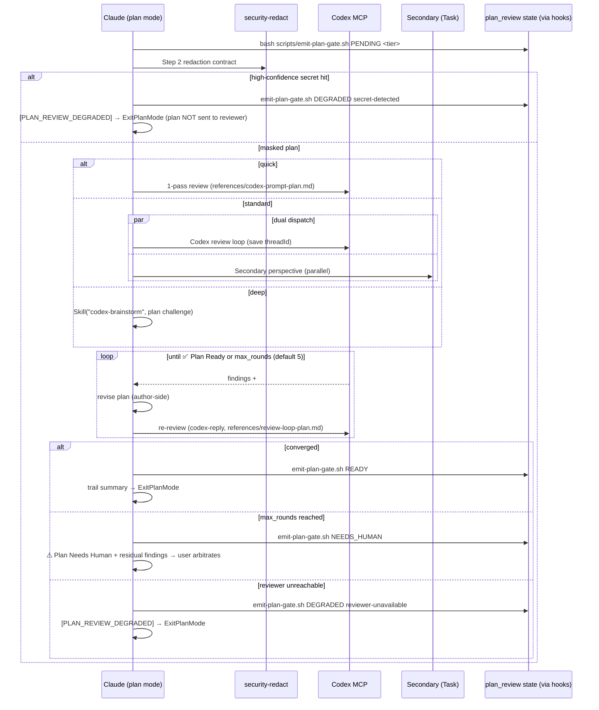

# Plan Review Skill

Adversarial review gate for plan-mode drafts: the plan is challenged by an independent reviewer and revised until convergence **before** `ExitPlanMode` presents it to the user.

## Trigger

- Keywords: plan review, review plan, plan-review, pre-ExitPlanMode review
- Self-invoke: in plan mode, before calling `ExitPlanMode`, when the project opts in via `auto-loop-project.md ## Plan Review: enabled` or the user asks for plan review

## When NOT to Use

- Reviewing `.md` files on disk (use `/codex-review-doc` — different artifact: filesystem path vs in-context plan text)
- Reviewing lifecycle specs `1-requirements.md` / `2-tech-spec.md` (use `/review-spec`)
- Code review (use `/codex-review-fast`)
- Not in plan mode / no plan draft exists

## Boundary Contract (v1 Acceptance Scope)

- Review gate applies **only when this skill is actually invoked** (A1 skill-driven; enabled-but-unexecuted detection is v2).
- Analysis-only: the reviewer surfaces findings; **Claude revises the plan** — the skill never rewrites or deletes plan content itself.
- Review pass ≠ execution approval: the user still arbitrates the final plan after `ExitPlanMode` (FR-14 Won't).
- Plan-review state lives in `plan_review.*` and is **fully isolated** from `code_review` / `doc_review` / `aggregate_gate` (NFR-7). Stop-guard treats a pending plan review as warn-only.

## Arguments

| Arg | Behavior |
|-----|----------|
| (none) | tier = `standard` (dual-dispatch: Codex + secondary) |
| `--quick` | Single Codex pass, no loop, no dual |
| `--deep` | Delegate to `/codex-brainstorm` (Nash equilibrium debate; attack/defense dual built-in) |
| `--skip-review` | Immediate bypass: emit `[PLAN_REVIEW_SKIPPED]` + gate `SKIPPED`, present raw plan |
| `--verbose` | Round-by-round trail (default: summary only) |

User escape (NFR-5): any explicit "skip review" / "直接看 plan" instruction — detected at skill entry **and** before each re-review round — exits within ≤1 round, emits `[PLAN_REVIEW_SKIPPED]`, runs `bash scripts/emit-plan-gate.sh SKIPPED`, and presents the current plan.

## Workflow



### Step 1: Gate open + tier

Determine tier (`standard` default; `--quick` / `--deep` explicit), then open the cycle:

```bash
bash scripts/emit-plan-gate.sh PENDING <tier>
```

This resets the per-plan cycle (`plan_review.iteration_history` round 0, flags cleared) via the PostToolUse hook. Never edit `.claude_review_state.json` directly — all state flows through the hook.

### Step 2: Secret redaction (NFR-8, fail-closed)

Apply the contract from `scripts/security-redact.js` (verified API — `scanHighConfidence` returns `{name, fingerprint} | null`, it does NOT throw):

```js
const { scanHighConfidence, maskMediumConfidence } = require('./scripts/security-redact.js');
const high = scanHighConfidence(planText);   // {name, fingerprint} | null
if (high) {
  // fail-closed: plan is NOT sent to any reviewer
  // → bash scripts/emit-plan-gate.sh DEGRADED secret-detected
  // → output [PLAN_REVIEW_DEGRADED]; plan still delivered to user via ExitPlanMode
} else {
  send(maskMediumConfidence(planText));      // medium-confidence → [REDACTED] before send
}
```

Run via `node -e` against the plan text, feeding the text through **stdin with a quoted heredoc — never as an argv literal**:

```bash
node -e '...' <<'PLAN_EOF'
<plan text>
PLAN_EOF
```

Rationale: argv leaks the un-redacted plan into system-wide process listings (`ps`); heredoc stdin never appears in argv. The quoted delimiter (`'PLAN_EOF'`) prevents shell interpolation of plan content. The plan draft already exists in the session transcript (it is in-context text), so the heredoc adds no new exposure surface — and a temp-file path is not viable here because `Write` is unavailable in plan mode. Forbidden anti-pattern: judging high-confidence via `redact(text, {abortOnHigh: false})` return value (high is already masked, indistinguishable from medium).

### Step 3: Review dispatch (tier ladder)

| Tier | Reviewer | Dual? | Loop |
|------|----------|-------|------|
| quick | Codex MCP ×1 | ❌ | 1-pass |
| **standard** (default) | Codex MCP + Secondary (Task agent) parallel | ✅ | fix → re-review (`codex-reply`) |
| deep | `Skill("codex-brainstorm", ...)` | ✅ (Nash attack/defense) | brainstorm termination |

- First Codex call: `mcp__codex__codex` with `references/codex-prompt-plan.md`. Config: `sandbox: 'read-only'`, `approval-policy: 'never'`. **Save the threadId.**
- Re-review rounds: `mcp__codex__codex-reply` with `references/review-loop-plan.md`.
- Secondary (standard tier): Task agent (`Explore` or `strict-reviewer`), prompt follows the same independent-research mandate; runs in background, does not block the Codex gate; a late secondary P0/P1 re-opens the loop.
- The plan text is handed over as a **candidate artifact to attack** — never as "Claude's conclusion to confirm" (per `rules/codex-invocation.md`).

### Step 4: Convergence (independent budget)

Decision table applied to `plan_review.iteration_history` (never the root code/doc budget):

| # | Condition | Action |
|---|-----------|--------|
| 1 | `current_round >= max_rounds` (default 5; `auto-loop-project.md ## Plan Review Max Rounds`) | `bash scripts/emit-plan-gate.sh NEEDS_HUMAN` → `⚠️ Plan Needs Human` + residual findings (never silently pass) |
| 2 | No P0/P1 findings this round | `bash scripts/emit-plan-gate.sh READY` → `✅ Plan Ready` → trail summary → ExitPlanMode |
| 3 | Findings remain | Revise plan → re-review (continue loop) |

Plateau/fingerprint detection is V2 (OQ-9); v1 relies on the hard cap only.

### Step 5: Trail summary (FR-9 / NFR-4)

Default output before ExitPlanMode (3 columns minimum):

```markdown
## Plan Review

| Rounds | Findings | Modified sections |
|--------|----------|-------------------|
| 2      | 3 (1 P1, 2 P2) | §Approach, §Risks |

✅ Plan Ready
```

`--verbose`: append round-by-round findings. Degraded/skipped runs include the `[PLAN_REVIEW_DEGRADED]` / `[PLAN_REVIEW_SKIPPED]` token in this block.

## Graceful Degradation (NFR-3)

| Source | Action |
|--------|--------|
| Reviewer unreachable (connection error / 401 / timeout) | Max 1 retry → `bash scripts/emit-plan-gate.sh DEGRADED reviewer-unavailable` → output `[PLAN_REVIEW_DEGRADED]` → proceed to ExitPlanMode |
| High-confidence secret in plan (Step 2) | NO reviewer send → `bash scripts/emit-plan-gate.sh DEGRADED secret-detected` → output `[PLAN_REVIEW_DEGRADED]` → proceed to ExitPlanMode |

Degradation never blocks plan mode: the plan is always delivered to the user in the same turn, with a grep-able degradation marker.

## Sentinel Namespace (hard constraints)

| Sentinel | Meaning |
|----------|---------|
| `## Plan Review` | Section discriminator — MUST precede every plan verdict |
| `✅ Plan Ready` | Converged, no P0/P1 |
| `⛔ Plan Blocked` | P0/P1 present, loop continues |
| `⚠️ Plan Needs Human` | max_rounds reached without convergence |
| `[PLAN_REVIEW_DEGRADED]` | Reviewer unavailable or secret-detected (fail-closed) |
| `[PLAN_REVIEW_SKIPPED]` | User-intent bypass (≠ degraded) |

**Forbidden**: plan-review output must NEVER contain bare `✅ Ready` / `✅ Mergeable` / `## Gate: ✅` / bare `⛔ Blocked` — these collide with code/doc/aggregate routing in `hooks/post-tool-review-state.sh` and `hooks/stop-guard.sh`. The prompt templates repeat this constraint to the reviewer.

**Fail-closed parsing**: MCP routing checks machine tokens (`[PLAN_REVIEW_DEGRADED]` / `[PLAN_REVIEW_SKIPPED]`) before verdict markers — degraded/skipped output quoting a verdict in prose must not lose its flags; then `⛔ Plan Blocked` before `✅ Plan Ready`, so output containing both verdict markers routes to blocked. Terminal `history[]` entries are owned by the `emit-plan-gate.sh` Bash path — all MCP writes skip history (verdict routing records verdict + iteration counts only; token routing uses no-history mode), so the later `emit-plan-gate.sh` snapshot carries fresh round/finding totals without double-writing. `NEEDS_HUMAN` stamps `status_reason: "needs-human"` so stop-guard treats it as terminal (user arbitrating), not as a pending review.

## Verification

- [ ] `emit-plan-gate.sh PENDING <tier>` ran before first dispatch
- [ ] Plan text passed redaction contract before any reviewer send
- [ ] Codex prompt used `references/codex-prompt-plan.md` (independent research mandate, candidate-artifact framing)
- [ ] Terminal gate emitted exactly once (READY / NEEDS_HUMAN / DEGRADED / SKIPPED)
- [ ] Trail summary present in final plan output
- [ ] No bare code/doc sentinels emitted

## References

- Codex first-pass prompt: `references/codex-prompt-plan.md`
- Re-review loop prompt: `references/review-loop-plan.md`
- Rules: @rules/codex-invocation.md, @rules/auto-loop.md (Standard Gate Sentinels)
- Spec: `docs/features/plan-review-loop/2-tech-spec.md`

## Examples

```
Input: /plan-review
Action: PENDING standard → redact → Codex + secondary parallel → loop → ✅ Plan Ready → trail summary → ExitPlanMode

Input: /plan-review --quick
Action: PENDING quick → redact → single Codex pass → gate → ExitPlanMode

Input: /plan-review --deep
Action: PENDING deep → redact → Skill("codex-brainstorm", plan challenge) → equilibrium → gate

Input: user says "skip review, show me the plan"
Action: emit-plan-gate.sh SKIPPED → [PLAN_REVIEW_SKIPPED] → raw plan → ExitPlanMode
```
