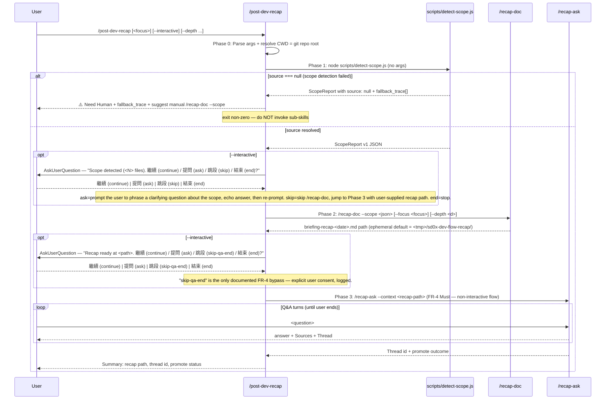

# `/post-dev-recap` — Guided Post-Development Recap

## Trigger

- Keywords: post-dev-recap, 開發後導覽, walkthrough after dev, recap workflow, 本輪回顧

## When NOT to Use

| Scenario | Alternative |
|----------|------------|
| Only need a doc (no Q&A) | `/recap-doc` — emits the recap markdown and stops |
| Have an existing recap, want to ask questions | `/recap-ask --context <path>` |
| Share-out for other developers (not the author) | `/tech-brief` — focuses on knowledge transfer to strangers |
| First-principles reasoning of an existing doc | `/fp-brief` — explains *why* decisions hold |
| General project Q&A, no recent change | `/ask` — reopens the whole repo as context |
| Deep code tracing across modules | `/code-explore` — execution-path walker |

### Positioning vs `/ask`, `/tech-brief`, `/fp-brief`, `/code-explore` (AS-5)

| Dimension | `/post-dev-recap` | `/ask` | `/tech-brief` | `/fp-brief` | `/code-explore` |
|-----------|-------------------|--------|----------------|-------------|-----------------|
| **Trigger** | Right after AI/Codex finishes a feature | Any quick question | Share-out for teammates | Explain an existing doc | Diagnose unknown code |
| **Input** | ScopeReport (detected live) | Free-form question | A finished feature | A document | A code question |
| **Output** | Recap doc + Q&A session | Answer | Brief artifact | First-principles chain | Execution-path report |
| **Bounded?** | Yes — scope of the just-done change | No — whole repo | No — whole feature | Document-scoped | Free search |

## Command Signature

```
/post-dev-recap [<focus>] [--interactive] [--depth brief|normal|deep]
```

| Flag | Default | Description |
|------|---------|-------------|
| `<focus>` | `""` | Natural-language keyword to bias section emphasis, passed to `/recap-doc --focus` |
| `--interactive` | false | Enable per-step `AskUserQuestion` — user can choose one of 4 actions between phases: **繼續 (continue)** / **提問 (ask)** / **跳段 (skip)** / **結束 (end)** |
| `--depth` | `normal` | Recap depth — `brief` / `normal` / `deep`, passed to `/recap-doc --depth` |

> **FR-4 Must — Q&A is mandatory.** This wrapper has **no** `--no-qa` flag. Callers that only want the markdown must invoke `/recap-doc` directly. See the Q&A Gate (FR-4 Must) section below for the design rationale.

## Prohibited Actions (AS-6)

```
❌ git add | git commit | git push | git stash | git reset — all git mutations are forbidden
```

This wrapper reads git state (`git status`, `git diff`, `git log`) for scope detection only. It never creates commits, pushes, or alters the working tree. See `@rules/git-workflow.md`.

## Workflow



### Phase 0 — Arg Parsing

1. Treat the first positional non-flag argument as `<focus>`; subsequent positional args are a warning (extra args ignored with stderr note).
2. Resolve CWD to the git repo root via `git rev-parse --show-toplevel`. If the command is not run inside a git repo, emit `⚠️ Need Human — /post-dev-recap must run inside a git repository.` and stop.
3. Validate `--depth` ∈ {brief, normal, deep}. Reject unknown values.

### Phase 1 — Scope Detection (T1 reuse)

1. Invoke `node scripts/detect-scope.js` with no additional args (it auto-detects source: uncommitted → branch → session → null).
2. Parse stdout as JSON (ScopeReport v1). Validate `version === 1`.
3. **Scope-fail path (AS-6 exit)**: if `source === null` OR `files.length === 0`, emit:
   - `⚠️ Need Human — scope detection inconclusive`
   - The full `fallback_trace` array (why each heuristic failed)
   - Suggested manual command: `/recap-doc --scope <explicit-json>`
   - Exit before invoking Phase 2.
4. **Interactive hook (opt-in)**: when `--interactive` is set and scope resolved, call `AskUserQuestion` with the scope summary (`<N> files, source=<s>, confidence=<c>`) and the 4-option set `{繼續 (continue), 提問 (ask), 跳段 (skip), 結束 (end)}`. **ask** = prompt the user for a clarifying question about the detected scope, echo the answer, then re-prompt the 4-option set. **skip** = skip /recap-doc and jump to Phase 3 (requires the user to supply an existing recap path). **end** = stop cleanly without invoking sub-skills.

### Phase 2 — Recap Doc (T2 reuse)

1. Serialise the ScopeReport to a temp file (or pipe via stdin) and invoke `/recap-doc --scope <path> [--focus <focus>] [--depth <depth>]` via the Skill tool.
2. Capture the output recap path. The default is ephemeral under `<tmp>/sd0x-dev-flow-recap/briefing-recap-<YYYY-MM-DD>.md` (see `@skills/recap-doc/SKILL.md ## Save Behavior`).
3. On `/recap-doc` failure, surface its stderr verbatim and exit — do not silently fall through.
4. **Interactive hook**: when `--interactive`, call `AskUserQuestion` with the recap path and the 4-option set `{繼續 (continue), 提問 (ask), 跳段 (skip-qa-end), 結束 (end)}`. **ask** = prompt the user for a clarifying question about the recap doc itself (not a Q&A turn — that belongs in Phase 3), echo the answer, re-prompt. **skip-qa-end** is the only documented FR-4 bypass — explicit user consent, flagged in session log. **end** closes the session immediately after the doc is written.

### Phase 3 — Q&A Gate (FR-4 Must)

1. Unless the user already chose `skip-qa-end` in Phase 2's interactive prompt (the only documented FR-4 bypass), collect the user's first question before invoking `/recap-ask` — the sub-skill's command signature requires `<question>` as a positional argument (see `@skills/recap-ask/SKILL.md ## Command Signature`). Use `AskUserQuestion` with a free-text prompt: **「針對本輪 recap 想問的第一個問題？」**. This is a **required data-collection step** (not a bypass mechanism): a non-empty answer is mandatory. If the user submits an empty answer, re-prompt once with clarification; if they still decline, emit the canonical bypass reminder — **「依 FR-4，非互動模式無法跳過 Q&A；若需跳過請改用 `--interactive` + 選 `skip-qa-end`。」** — and re-prompt. Phase 3 does not proceed without a question. The "No bypass" cell at line 133 below remains authoritative for non-interactive runs.
2. Invoke `/recap-ask "<first-question>" --context <recap-path>` via the Skill tool using the collected question.
3. The Q&A session continues with `/recap-ask --continue <threadId>` turns until the user types `結束` / `done` or invokes `/recap-ask --end` (see `@skills/recap-ask/SKILL.md` Phase 4). The wrapper does not add extra termination signals — it forwards them as-is.
4. On session end, relay the thread id + promote outcome back to the caller so `--continue` is reusable in future sessions.

### Q&A Gate (FR-4 Must)

**Design rationale**: a "recap" without follow-up Q&A is just a doc. The feature's value is the interactive exploration. Callers who truly only want the markdown must use `/recap-doc` directly. The wrapper intentionally has **no** `--no-qa` flag.

| Mode | Bypass path |
|------|-------------|
| Non-interactive (default) | **No bypass** — Phase 3 always runs |
| `--interactive` | `skip-qa-end` option in Phase 2 AskUserQuestion (explicit consent, logged) |

## Performance

Target: **NFR-2 applies to Phase 2 (/recap-doc ≤ 30s)**; Phase 1 scope detection and Phase 3 per-turn Q&A inherit from the respective sub-skills' targets. Wrapper overhead itself must be negligible (≤ 1s parsing + dispatch).

## Path Security

| Rule | Implementation |
|------|----------------|
| Repo boundary | CWD is resolved via `git rev-parse --show-toplevel`; wrapper refuses to run outside a repo |
| Sub-skill pass-through | `/recap-doc` and `/recap-ask` enforce their own path-security rules (see those files) |
| No project writes | Wrapper never writes inside the user's project tree. Phase 2 may serialise the ScopeReport to a short-lived temp file under the OS temp dir (`$TMPDIR` / `os.tmpdir()` / `/tmp`) purely as input to `/recap-doc`; the recap markdown itself is owned by `/recap-doc` (ephemeral default under `<tmp>/sd0x-dev-flow-recap/`). |
| Secret redaction | Inherited from `/recap-doc` Phase 5 (`scripts/security-redact.js`) and `/recap-ask` Phase 3 (same script) |
| Git write operations | Forbidden — see `## Prohibited Actions` |

## Output Format

```markdown
## Post-Dev Recap

**Scope**: <N> files, source=<source>, confidence=<high|medium|low>
**Recap**: `<path>` (ephemeral | committed)
**Q&A**: <N> turns | thread=<codex-threadId> | promote=<yes|no|n/a>

### Summary

- Key file: `<path>:<line>` — <one-line intent>
- Design decision: <one-liner>
- Blind spot flagged: <heuristic name>

### Next steps

- Resume Q&A: `/recap-ask "<follow-up>" --context <path> --continue <threadId>`
- Promote to ticket: already done | `/recap-ask --end` + confirm
```

### Scope-fail output (⚠️ Need Human)

```markdown
## ⚠️ Need Human — scope detection inconclusive

**Fallback trace**:
- uncommitted: <N> changes (if <0 or >threshold, fail reason)
- branch: <ahead-of-base>, <reason>
- session: <transcript-entries>, <reason>

**Suggested manual path**:
- Inspect `git status` and pick a scope manually
- Invoke `/recap-doc --scope '{ version: 1, source: ..., files: [...] }'` with explicit JSON
```

## Verification

- [ ] First positional arg captured as `<focus>`; extras ignored with warning
- [ ] `--depth` rejected for unknown values (only brief/normal/deep accepted)
- [ ] CWD enforced via `git rev-parse --show-toplevel`; refuses outside repo
- [ ] Phase 1 emits ⚠️ Need Human + fallback_trace when `source === null` OR `files.length === 0`
- [ ] Phase 2 passes `--focus` and `--depth` through to `/recap-doc` unchanged
- [ ] Phase 3 always runs in non-interactive mode (FR-4 Must); only interactive `skip-qa-end` can bypass
- [ ] `--interactive` triggers `AskUserQuestion` between Phase 1↔2 and Phase 2↔3
- [ ] No git mutations (`git add/commit/push/stash/reset`) are invoked (AS-6)
- [ ] `When NOT to Use` contrasts `/ask` / `/tech-brief` / `/fp-brief` / `/code-explore` (AS-5)
- [ ] Pass `/codex-review-fast`

## References

- `@skills/recap-doc/SKILL.md` — Phase 2 sub-skill (T2)
- `@skills/recap-ask/SKILL.md` — Phase 3 sub-skill (T3)
- `scripts/detect-scope.js` — Phase 1 ScopeReport producer (T1)
- `@skills/ask/SKILL.md` — Pattern comparison only (not reused here; `/recap-ask` reuses its Phase 2)
- `@rules/git-workflow.md` — Git mutation ban (AS-6)
- `@rules/auto-loop.md` — Post-execution review loop
- Tech Spec §3.3.1 Signature; §3.4.4 Interactive Mode
- Requirements FR-4 (Must), FR-5, FR-6, AS-1, AS-2, AS-4, AS-6, AS-7

## Examples

```
Input: /post-dev-recap
Action: Phase 0 parse → Phase 1 detect-scope → source=uncommitted, 12 files → Phase 2 /recap-doc → ephemeral recap at <tmp>/sd0x-dev-flow-recap/briefing-recap-2026-04-17.md → Phase 3 /recap-ask --context <path> → interactive Q&A loop until user ends

Input: /post-dev-recap "auth middleware" --depth deep
Action: pass `--focus "auth middleware" --depth deep` to /recap-doc → deep recap with inline snippets → mandatory Q&A

Input: /post-dev-recap --interactive
Action: AskUserQuestion after scope detection (繼續/提問/跳段/結束) → after doc (繼續/提問/跳段-skip-qa-end/結束) → Q&A unless user chose skip-qa-end

Input: /post-dev-recap when no uncommitted/branch/session scope available
Action: Phase 1 returns source=null + fallback_trace → emit ⚠️ Need Human + trace → exit non-zero, no sub-skill invocation
```
