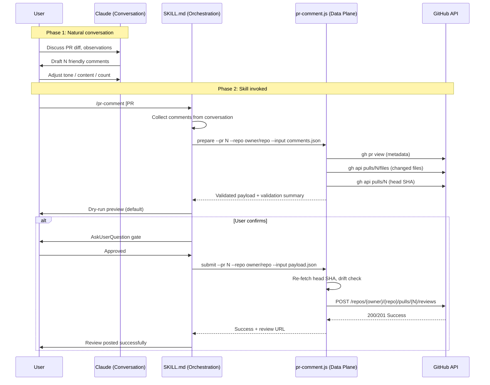

# PR Comment

## Trigger Keywords

`pr comment`, `review comment`, `post comment`, `send review`, `pr feedback`, `inline comment`

## When NOT to Use

| Need | Use Instead |
|------|-------------|
| Read existing PR review comments | `/load-pr-review` |
| Create a code review (automated) | `/codex-review-fast` or `/codex-review` |
| Create a PR | `/create-pr` |
| PR status overview | `/pr-summary` |

## Core Principle

```
Discuss locally → prepare friendly comments → dry-run preview → user confirms → atomic submit
Control plane (this SKILL.md) handles conversation, tone, orchestration.
Data plane (JS script) handles validation, API calls, safety.
```

## Tone Guidelines

Claude prepares comments following these rules:

| Rule | Description | Example |
| ---- | ----------- | ------- |
| Questions over commands | Use "would it make sense to" instead of "change this to" | "Would it make sense to extract this to a shared utility?" |
| Code, not person | Subject is the code, not "you" | "This logic seems to..." not "You wrote..." |
| Explain why | Give the reason, not just the what | "If one copy gets a bug fix but the other doesn't..." |
| Assume good intent | Confirm rather than accuse | "Just want to confirm this trade-off is intentional" |
| Praise first | Acknowledge before suggesting | "This async design is great. One thought though..." |
| No emoji | Unless user explicitly requests | -- |
| Follow PR language | Match the language used in the PR | -- |

**Internal classification** (Conventional Comments, not shown in output):

| Label | Purpose | Blocking |
| ----- | ------- | -------- |
| `suggestion` | Improvement proposal | Configurable |
| `question` | Clarification | No |
| `issue` | Points out a problem | Yes |
| `nitpick` | Stylistic preference | No |
| `praise` | Positive feedback | No |

## Workflow



## Step-by-Step

### Step 0: Collect Comments

From the conversation context, gather the user's review comments. Each comment needs:

| Field | Required | Default | Description |
| ----- | -------- | ------- | ----------- |
| `path` | Yes | -- | File path (repo-relative) |
| `line` | Yes | -- | Line number (positive integer) |
| `side` | No | `RIGHT` | `RIGHT` (new) or `LEFT` (deleted) |
| `body` | Yes | -- | Comment content |

### Step 1: Prepare (Dry-run)

Write the comments to a temp JSON file, then run:

```bash
bash scripts/run-skill.sh pr-comment pr-comment.js \
  prepare --pr <N> --repo <owner/repo> --input <comments.json>
```

Parse the JSON output. Display to user:

```markdown
## PR #<N>: <title>
**Target**: <owner/repo> | **Head**: <branch> | **State**: <state>

### Comments to Post (<valid>/<total> valid)

| # | File | Line | Side | Preview |
|---|------|------|------|---------|
| 1 | path/to/file.go | 136 | RIGHT | First 80 chars of body... |

### Validation
- Valid: N | Invalid: M (excluded) | Warnings: K
```

If invalid comments exist, show them with reasons.
If warnings exist, note them but include in payload.

### Step 2: Confirm

Use AskUserQuestion to get user approval before submitting.

### Step 3: Submit

Save the prepare output (including payload) to a temp file, then run:

```bash
bash scripts/run-skill.sh pr-comment pr-comment.js \
  submit --pr <N> --repo <owner/repo> --input <payload.json>
```

### Step 4: Handle Results

| Exit Code | Meaning | Action |
|-----------|---------|--------|
| 0 | Success | Report review URL |
| 2 | Error (including 422) | Report error details |
| 3 | SHA drift | Warn user, offer to re-prepare |

### SHA Drift Handling

If submit returns exit 3:

1. Inform user: "PR head has changed since prepare"
2. Re-run prepare with new SHA
3. Show updated dry-run preview
4. AskUserQuestion for re-confirmation
5. Re-submit

## Verification Checklist

- [ ] Comments collected from conversation context
- [ ] prepare validates paths against changed files
- [ ] prepare validates line numbers (positive integer)
- [ ] prepare validates body (non-empty)
- [ ] Dry-run preview shown to user before submit
- [ ] AskUserQuestion gate before submit
- [ ] SHA drift detected and handled
- [ ] Review URL reported on success
- [ ] jq + temp file pattern used (no shell interpolation)

## References

- `references/api-and-guardrails.md` -- API contract + safety rules + exit codes
