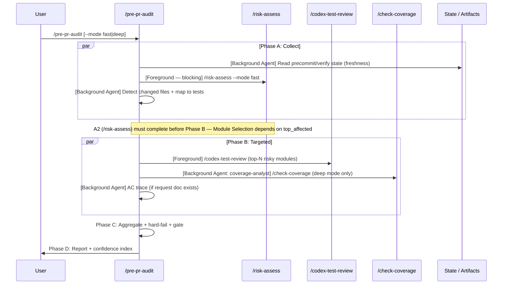

# Pre-PR Audit

Pre-deploy ultimate verification. Aggregates test quality, coverage, risk, and AC traceability into a single confidence index (0-100).

## When NOT to Use

| Need | Use Instead |
|------|-------------|
| Code review | `/codex-review-fast` |
| Post-deploy runtime verification | `/feature-verify` |
| Periodic project health | `/project-audit` |
| Just run tests | `/verify` |
| Just check risk | `/risk-assess` |

## Positioning

```
auto-loop done → [user invokes] /pre-pr-audit → /smart-commit → /push-ci → /create-pr
                                     ↑
                        Pre-deploy ultimate verification
```

## Prohibited

```
❌ git add | git commit | git push — per @rules/git-workflow.md
```

This skill audits and reports. It does not modify code or commit.

## Arguments

| Arg | Description | Default |
|-----|-------------|---------|
| `--mode fast\|deep` | Execution depth | `fast` |
| `--strict` | Non-zero exit on ⛔ PR-Blocked | off |
| `--json` | Machine-readable JSON output | off |
| `--base <ref>` | Compare against ref | HEAD |

## Workflow



### Phase A: Collect (parallel with dispatch annotations)

| Step | Dispatch | Action | Source |
|------|----------|--------|--------|
| A1 | Background Agent | Read precommit/verify state file | `.claude_review_state.json` — check `precommit.passed` + freshness (HEAD match) |
| A2 | **Foreground** (blocking) | Invoke `/risk-assess --mode fast` | Skill tool — get risk_level, top_affected, overall_score |
| A3 | Background Agent | Detect changed files + map to test files | `git diff --name-only HEAD` → match against `test/` patterns |

**A2 MUST stay foreground**: Phase B Module Selection depends on `top_affected` from `/risk-assess` output. A1 and A3 dispatch as background Agents and run in parallel with A2.

### Phase B: Targeted (parallel, mode-dependent, with dispatch annotations)

| Step | Dispatch | fast | deep | Action |
|------|----------|------|------|--------|
| B1 | Foreground | top-3 | top-10 + supplement | `/codex-test-review` on selected modules (see Module Selection) |
| B2 | Background Agent (`coverage-analyst`) | skip | ✅ | `/check-coverage` for pyramid balance |
| B3 | Background Agent | skip | ✅ (if request doc) | AC trace: parse `## Acceptance Criteria` → map to test evidence |

**B2 uses `coverage-analyst` agent** (`agents/coverage-analyst.md`) for background execution. B3 dispatches as a background Agent for AC parsing. B1 stays foreground as the primary assessment.

### Module Selection (deterministic)

1. Source: `/risk-assess` JSON `top_affected` array (each: `file` + `dependent_count`)
2. Sort: `dependent_count` descending, tie-break `file` ascending (stable sort)
3. Select: N=3 (`fast`) or N=10 (`deep`)
4. Deep supplement: `git diff --name-only` for files beyond top_affected cap
5. Fallback: if `/risk-assess` unavailable, `git diff --stat` sorted by lines-changed descending

### Phase C: Aggregate

1. Score each dimension per `references/scoring-model.md`
2. Apply evidence confidence cap
3. Check hard-fail overrides
4. Compute final index

### Phase D: Output

Output report per `references/output-template.md`. Include:
- Confidence index (0-100) + gate sentinel
- Per-dimension score table
- Hard-fail check results
- Findings (prioritized)
- Next actions

## 5 Dimensions

| # | Dimension | Weight | Checks |
|---|-----------|--------|--------|
| 1 | Execution Integrity | 25% | All tests pass, precommit passed, HEAD freshness, no flaky indicators |
| 2 | Coverage Adequacy | 25% | Unit/Integration/E2E pyramid balance, per-module gap analysis |
| 3 | Test Quality | 20% | AAA compliance, naming, assertion depth, edge cases (per `@rules/testing.md`) |
| 4 | Risk-to-Test Alignment | 20% | High-risk files have tests, risk level ↔ test depth proportional |
| 5 | Evidence Governance | 10% | AC traceability, exception policy compliance, expiry check |

## Gate

### User-Facing (3-tier)

| Gate | Score | Sentinel |
|------|-------|----------|
| ✅ Ready | >=85 | `✅ PR-Ready` |
| ⚠️ Needs attention | 60-84 | `⚠️ PR-Caution` |
| ⛔ Not ready | <60 | `⛔ PR-Blocked` |

### Hard-Fail Overrides (force ⛔ regardless of score)

| Override | Condition | Source |
|----------|-----------|--------|
| Precommit stale | Not passed after latest edit | Auto-loop state |
| Prohibited domain exception | Security/data-integrity/regression AC uses manual exception | `@rules/testing.md` |
| Exception cap exceeded | Exception count > AC-count-based cap | `@rules/testing.md` |
| Expired exception | Past ISO 8601 expiry date | `@rules/testing.md` |
| Invalid reason class | Non-enum reason in exception | `@rules/testing.md` |
| Unverified exception | No Codex `VALID_EXCEPTION` verdict | `@rules/testing.md` |
| Evidence stale | Artifacts HEAD SHA ≠ current HEAD | Freshness check |
| Critical untested | `/risk-assess` HIGH+ on zero-coverage files | Risk alignment |

## Scoring

See `references/scoring-model.md` for formulas. Summary:

- Check score: pass=1, partial=0.5, fail=0, N/A=excluded
- Dimension score: `applicable_sum / applicable_count × 100`
- Raw: weighted average (N/A dimensions excluded, weights renormalized)
- Cap: evidence confidence (1.0 / 0.9 / 0.75 / 0.6)
- Final: `round(raw × cap)`

## Verification

- [ ] All 5 dimensions scored (or N/A with reason)
- [ ] Hard-fail checks evaluated
- [ ] Gate sentinel output matches score
- [ ] No git add/commit/push executed
- [ ] Findings include file:line references

## References

- `references/scoring-model.md` — Scoring formulas, weights, confidence caps
- `references/output-template.md` — Report format, JSON schema, sentinel strings
- `@rules/testing.md` — Evidence model + exception policy (hard-fail source)
- `@rules/testing-project.md` — Project-specific overrides

## Examples

```
Input: /pre-pr-audit
Action: fast mode → collect state + risk → test-review top-3 → aggregate → 85/100 ✅ PR-Ready

Input: /pre-pr-audit --mode deep
Action: deep mode → collect + risk → test-review top-10 + coverage + AC trace → aggregate → 72/100 ⚠️ PR-Caution

Input: /pre-pr-audit --strict
Action: fast mode → score 55 → ⛔ PR-Blocked → exit code 1
```
