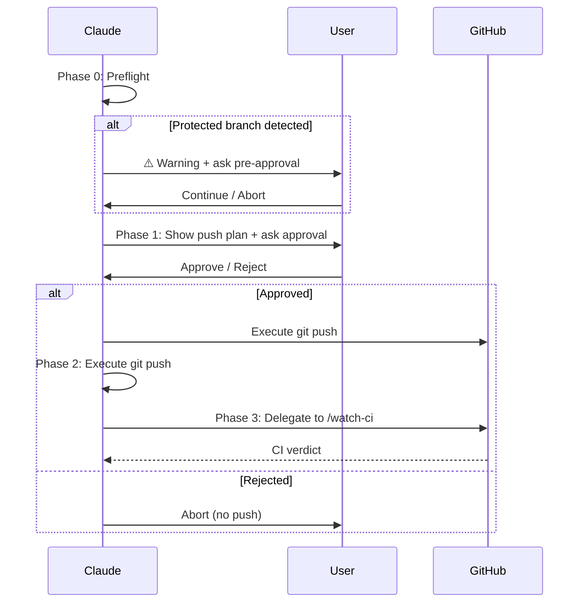

# Push & CI Monitor

Push to remote with user approval, then monitor CI run until completion.

## Authorization

```
⚠️ This skill is one of two authorized paths for Claude to execute `git push`.
⚠️ The other is /epic-merge (force-push --force-with-lease for stacked PR chains, per-iteration AskUserQuestion gate).
⚠️ All other skills and rules MUST output push commands only (not execute).
⚠️ Push REQUIRES explicit user approval via AskUserQuestion — no exceptions.
```

| Rule | This Skill | `/epic-merge` | All Other Skills |
|------|-----------|---------------|------------------|
| `git push` | Execute (after user approval) | Forbidden (uses `--force-with-lease` only) | Forbidden (output only) |
| `git push --force` | Forbidden | Forbidden | Forbidden |
| `git push --force-with-lease` | Forbidden | Execute (after per-iteration AskUserQuestion) | Forbidden |
| Push to protected branches (main/master/develop/release/*) | Warn + pre-approval via AskUserQuestion (terminal hook is final gate) | N/A (only pushes to PR head branches) | Forbidden |

## Defense in Depth: Push Safety

| Layer | Mechanism | Scope | Reliability |
|-------|-----------|-------|-------------|
| **L1: git pre-push hook** | `pre-push-gate.sh` reads `/dev/tty` for terminal confirmation | Protected branches + non-fast-forward detection | Immune to Claude Code permission caching |
| **L2: AskUserQuestion** | In-session advisory prompt before push | All pushes | May be auto-approved by session caching (advisory only) |
| **L3: git-workflow rules** | Claude forbidden from raw `git push` | All contexts | Behavioral enforcement |

**Primary gate**: `pre-push-gate.sh` (install via `/install-scripts`). This script runs as a git pre-push hook and prompts the developer directly via `/dev/tty`, which is immune to Claude Code's permission caching. AskUserQuestion remains as an advisory UX layer but is **not the authorization gate** — the git hook is.

**Why AskUserQuestion alone is insufficient**: Session permission caching can auto-approve AskUserQuestion calls in long-running sessions, especially with `-c` continue mode. See GitHub Issue #15400.

## Workflow



### Phase 0: Preflight

Run all checks. Hard-abort on infrastructure failures; warn-and-confirm on protected branches.

```bash
# 1. Current branch
BRANCH=$(git rev-parse --abbrev-ref HEAD)

# 2. Protected branch detection
# If main, master, develop, or release/* → warn + AskUserQuestion pre-approval
# (do NOT hard-abort; let user decide)

# 3. Remote exists
git ls-remote --exit-code origin >/dev/null 2>&1

# 4. Working tree status
git status --short

# 5. Commits ahead of remote
git rev-list --count origin/$BRANCH..HEAD 2>/dev/null || echo "new branch"

# 6. Local HEAD SHA (for CI run matching later)
HEAD_SHA=$(git rev-parse HEAD)
```

| Check | Pass | Fail |
|-------|------|------|
| Branch is not protected | Continue | **Warn + AskUserQuestion** (see below) |
| Remote exists | Continue | Abort: "No remote 'origin' configured" |
| Has commits ahead | Continue | Abort: "Nothing to push (0 commits ahead)" |

**Protected branch pre-approval flow** (advisory — terminal hook remains final gate):

When branch is `main`, `master`, `develop`, or `release/*`:

1. Show warning with branch name and commit count
2. Use AskUserQuestion with options:
   - "Continue — push to `<branch>`" — proceed to Phase 1
   - "Abort" — stop immediately
3. If user aborts → stop. If user continues → proceed to Phase 1 (push approval asked separately). Note: the git pre-push hook will still require terminal confirmation via `/dev/tty` as the final authorization gate.

### Phase 1: Push Plan + User Approval

Present push summary and **ask user for explicit approval** using AskUserQuestion:

```markdown
## Push Plan

- Branch: `<branch>`
- Remote: `origin`
- Commits: <N> ahead
- HEAD: `<sha>`

Command to execute: `git push origin <branch>`
```

**Gate**: Use AskUserQuestion with options:
- "Approve push" — proceed to execute
- "Abort" — stop, do not push

**If user rejects → stop immediately. Do NOT retry or persuade.**

### Phase 2: Execute Push

After user approval:

**Command assembly** (deterministic):

```bash
# Build and execute push command (ONLY after explicit approval)
# ⚠️ Always unset ALLOW_PUSH_PROTECTED to prevent env inheritance bypassing the hook.
# Only set ALLOW_FORCE_WITH_LEASE when --force-with-lease is explicitly requested.
if [[ "$FORCE_WITH_LEASE" == "true" ]]; then
  if [[ "$SET_UPSTREAM" == "true" ]]; then
    ALLOW_PUSH_PROTECTED= ALLOW_FORCE_WITH_LEASE=1 git push --force-with-lease -u origin "$BRANCH"
  else
    ALLOW_PUSH_PROTECTED= ALLOW_FORCE_WITH_LEASE=1 git push --force-with-lease origin "$BRANCH"
  fi
else
  if [[ "$SET_UPSTREAM" == "true" ]]; then
    ALLOW_PUSH_PROTECTED= ALLOW_FORCE_WITH_LEASE= git push -u origin "$BRANCH"
  else
    ALLOW_PUSH_PROTECTED= ALLOW_FORCE_WITH_LEASE= git push origin "$BRANCH"
  fi
fi
# If push fails (non-zero exit) → stop immediately, report error, do NOT proceed to CI
```

**`--set-upstream` auto-detect**: If `git rev-parse --abbrev-ref --symbolic-full-name @{u}` fails (no upstream), add `-u` automatically.

### Phase 3: Monitor CI (delegation)

After successful push, invoke `/watch-ci` to monitor CI runs:

- Pass `--sha <HEAD_SHA>` and `--branch <BRANCH>` from Phase 0
- Pass `--timeout` from arguments (default 10)
- `/watch-ci` runs in Monitor streaming mode (default) — Claude receives progress notifications and reports verdict on completion
- `/watch-ci` handles run discovery, quick-check, monitoring, retry logic, and verdict reporting

This delegation keeps push authorization logic separate from read-only CI monitoring. See `@skills/watch-ci/SKILL.md` for CI monitoring details.

## Arguments

| Argument | Description | Default |
|----------|-------------|---------|
| `--timeout <min>` | CI watch timeout in minutes | 10 |
| `--force-with-lease` | Use `--force-with-lease` instead of regular push | off |
| `--set-upstream` | Add `-u` flag (first push of new branch) | auto-detect |

**`--force` is NOT supported.** Force push is always forbidden.

## Prohibited

```
- Executing git push WITHOUT prior user approval via AskUserQuestion
- Suggesting or executing git push --force (ever)
- Pushing to protected branches WITHOUT explicit user pre-approval via AskUserQuestion
- Setting ALLOW_PUSH_PROTECTED=1 (this skill must NEVER set this env var; it is reserved for manual developer use only)
- Auto-triggering this skill (disable-model-invocation: true)
- Skipping preflight checks
- Skipping `/watch-ci` delegation after successful push
```

## Verification

- [ ] Preflight passed (branch + remote + commits)
- [ ] User approved push via AskUserQuestion
- [ ] Push executed successfully
- [ ] CI monitoring delegated to `/watch-ci` with correct SHA + branch

## Examples

```
Input: /push-ci
Phase 0: Preflight — branch feat/auth, 3 commits ahead, remote OK
Phase 1: Show plan → user approves
Phase 2: git push origin feat/auth
Phase 3: /watch-ci --sha <HEAD> --branch feat/auth (Monitor streaming — receive progress notifications)
```

```
Input: /push-ci --timeout 15
Phase 0-1: Same as above
Phase 2: git push
Phase 3: /watch-ci --sha <HEAD> --branch <branch> --timeout 15
```

```
Input: /push-ci --force-with-lease
Phase 0: Preflight (warns on protected branches)
Phase 1: Show plan with --force-with-lease → user approves
Phase 2: git push --force-with-lease origin feat/rebase-cleanup
Phase 3: CI monitoring
```

```
Input: /push-ci (on main branch)
Phase 0: Preflight — ⚠️ "main is a protected branch" → AskUserQuestion pre-approval
User: Continue → proceed
Phase 1: Show plan → user approves push
Phase 2: git push origin main
Phase 3: /watch-ci (Monitor streaming — receive progress notifications)
```
