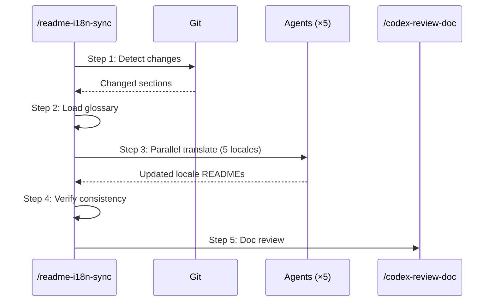

# README i18n Sync

Detect README.md changes, translate only the changed sections into 5 locale READMEs, and verify consistency.

## Trigger

- Keywords: readme sync, translate readme, i18n sync, readme-i18n, sync readmes, update locale readmes
- After editing README.md (hero counts, install table, skill reference, etc.)
- After `/bump-version` updates feature counts

## When NOT to Use

- Translating arbitrary conversation text (use `/zh-tw`)
- Creating a new locale README from scratch (manual)
- Non-README document translation (manual)

## Input

`/readme-i18n-sync [--full] [--locale <lang>]`

| Argument | Description | Default |
|----------|-------------|---------|
| `--full` | Retranslate entire README, not just diff | off |
| `--locale <lang>` | Sync only one locale (e.g., `zh-TW`) | all 5 locales |

## Locale Registry

| File | Language | Sync Level |
|------|----------|-----------|
| `README.md` | English | Canonical source |
| `README.zh-TW.md` | 繁體中文 | Official (maintainer-reviewed) |
| `README.zh-CN.md` | 简体中文 | Machine-first |
| `README.ja.md` | 日本語 | Machine-first |
| `README.ko.md` | 한국어 | Machine-first |
| `README.es.md` | Español | Machine-first |

## Workflow



### Step 1: Detect Changes

```bash
git diff HEAD -- README.md
```

If no diff (README.md unchanged since last commit), check for unstaged changes:

```bash
git diff -- README.md
```

If still no diff → report "README.md has no changes to sync" and stop.

Extract changed section names by matching diff hunks to `## Heading` markers. For changes above the first `##` heading (hero line, badges, language switcher), classify as "header" section.

**`--full` mode**: Skip diff detection, treat entire README.md as changed.

### Step 2: Load Glossary

Read `references/glossary.md` for term consistency. These terms must NOT be translated — they are product vocabulary that stays consistent across all locales.

### Step 3: Parallel Translation

Launch one Agent per locale (up to 5 in parallel). Each agent receives:

1. The changed section(s) from English README.md
2. The current locale README file (as translation context for style consistency)
3. The glossary terms

**Agent prompt template** (per locale):

```
Update {LOCALE_FILE} to match changes in README.md.

## Changed Sections
{CHANGED_SECTIONS}

## Current English Content (changed sections only)
{ENGLISH_CONTENT}

## Translation Rules
1. Translate ONLY the changed sections — preserve all other content unchanged
2. Keep markdown structure: tables, code blocks, links, badges, Mermaid diagrams
3. Keep technical terms per glossary: {GLOSSARY_TERMS}
4. Keep all slash-command names as-is (e.g., `/codex-review-fast`)
5. Keep all file paths, code identifiers, and URLs as-is
6. Use locale-appropriate conventions:
   - zh-TW: 台灣繁體中文、台灣慣用詞彙
   - zh-CN: 简体中文、大陆惯用词汇
   - ja: 日本語の自然な表現
   - ko: 한국어 자연스러운 표현
   - es: Español natural

## Important
- Read the FULL current locale file first for style reference
- Apply changes via Edit tool (not Write) to preserve unchanged sections
- After editing, verify the total line count is within ±5 lines of README.md
```

### Step 4: Verify Consistency

After all agents complete, run verification:

```bash
# 1. Line count consistency (±5 lines tolerance)
wc -l README*.md

# 2. No residual old content in changed sections
# (specific grep patterns based on what changed)

# 3. Glossary terms preserved
grep -c "specific-term" README*.md
```

Report any inconsistencies for manual review.

### Step 5: Doc Review

Invoke `/codex-review-doc` on the English README.md (canonical source). Locale files are covered by the structural verification in Step 4.

## Output

```markdown
## README i18n Sync

| Locale | Sections Updated | Lines | Status |
|--------|-----------------|-------|--------|
| zh-TW | hero, install | 426 | ✅ |
| zh-CN | hero, install | 426 | ✅ |
| ja | hero, install | 426 | ✅ |
| ko | hero, install | 426 | ✅ |
| es | hero, install | 426 | ✅ |

## Verification
- Line count consistency: ✅
- Glossary compliance: ✅
- Doc review: ✅ Mergeable
```

## Prohibited

- Retranslating unchanged sections (unless `--full`)
- Translating slash-command names, file paths, or code identifiers
- Modifying README.md (canonical source is read-only for this skill)
- Skipping zh-TW review (maintainer's primary language)

## References

| File | Purpose | When to Read |
|------|---------|-------------|
| `references/glossary.md` | Term consistency across locales | Always (Step 2) |

## Examples

```
Input: /readme-i18n-sync
Action: Detect README.md diff → translate changed sections to 5 locales → verify → review

Input: /readme-i18n-sync --locale zh-TW
Action: Sync only zh-TW README with English changes

Input: /readme-i18n-sync --full
Action: Retranslate all sections in all locale READMEs from English source
```
