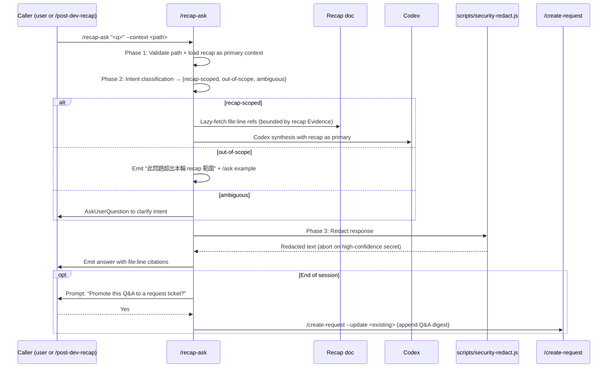

# `/recap-ask` — Recap-Bounded Q&A

## Trigger

- Keywords: recap-ask, ask about recap, 追問 recap, follow-up on recap, 本輪問答

## When NOT to Use

| Scenario | Alternative |
|----------|------------|
| Generate a new recap doc from scope | `/recap-doc` |
| Full flow (detect + doc + Q&A) | `/post-dev-recap` wrapper |
| General project Q&A, no recap in hand | `/ask` |
| Deep multi-source investigation | `/deep-research` |
| Systematic code tracing across modules | `/code-explore` |
| First-principles reasoning about a doc | `/fp-brief` |

## Command Signature

```
/recap-ask <question> --context <recap-doc-path> [--continue <threadId>] [--lazy-fetch]
```

| Flag | Default | Description |
|------|---------|-------------|
| `<question>` | required | Free-text user question |
| `--context` | required | Absolute or repo-relative path to a `briefing-recap-<YYYY-MM-DD>.md` file |
| `--continue` | null | Reuse an existing Codex threadId for follow-up turns |
| `--lazy-fetch` | true | Allow Read on files listed in the recap §7 Evidence during synthesis. When `false`, Codex answers from recap text only (no code-verification reads); citations still reference `<path>:<line>` from §7 but are not re-opened |

## Workflow



### Phase 1 — Context Load

1. Validate `--context` path: resolve relative paths against repo root (`git rev-parse --show-toplevel`).
2. Enforce path boundary (NFR-8) on `--context`: resolved real path **must** satisfy `startsWith(repo_root + "/")` **or** live under `<tmp>` (same allowlist as `/recap-doc` Path Security — users who moved the recap out of `sd0x-dev-flow-recap/` must still land within tmp). Reject `..` segments and external symlinks (use `fs.realpathSync` on the first existing ancestor).
3. Read the recap file in full; this is the **primary context**. Extract the §7 Evidence file-index as the lazy-fetch allowlist.
4. **Validate every Evidence entry before adding to the allowlist**: apply the same boundary check to each `<path>:<line>` in §7 — the canonical (realpath-resolved) target **must** satisfy `startsWith(repo_root + "/")` **or** lie inside `<tmp>` (i.e. repo-or-`<tmp>`, identical to step 2), with `..` segments and external symlinks rejected. Entries that fail validation are silently dropped from the allowlist (a recap cannot smuggle out-of-repo paths into Phase 3 reads).
5. If the recap is older than 7 days, warn the user — recaps are ephemeral by default and the source code may have drifted. The 7-day threshold is a heuristic; callers may override in future versions.

### Phase 2 — Intent Classification

Classify the question into one of three classes before synthesis. See `references/qa-prompt.md` for full prompt + decision rules.

| Class | Signal | Action |
|-------|--------|--------|
| `recap-scoped` | Question refers to files / decisions / terms that appear in the recap | Proceed to synthesis. Lazy-fetch referenced files via the §7 allowlist only. |
| `out-of-scope` | Question clearly targets code or docs **not** covered by the recap | Emit the fixed redirect block (see below) — no Codex synthesis. |
| `ambiguous` | Partial overlap, unclear whether recap covers it | Trigger `AskUserQuestion` with 2-3 framed options to disambiguate. |

**Out-of-scope redirect block** (verbatim template — keep concise):

> 此問題超出本輪 recap 範圍。建議改用 `/ask "<原始問題>"`，它會從整個專案重新收集上下文。

Follow-up turns on the same thread (`--continue <threadId>`) **re-run classification** per new question — the prior turn's class does not carry over. The Codex reply-turn prompt in `references/qa-prompt.md` enforces this.

### Phase 3 — Synthesis + Redact + Emit

1. For `recap-scoped`: dispatch to Codex via `mcp__codex__codex` (first turn) or `mcp__codex__codex-reply` (subsequent turns). Prompt must follow `@rules/codex-invocation.md` — independently research, no leading conclusions. See `references/qa-prompt.md`.
2. Lazy-fetch is gated: Codex may Read only files listed in the recap §7 Evidence. Out-of-allowlist reads are refused; fall back to emitting a citation-only answer.
3. Run the complete response through `scripts/security-redact.js` → `redact(text)`. On `AbortError` (high-confidence secret) emit the fingerprint and refuse to respond.
4. Emit the redacted answer with inline `file:line` citations. Every claim about code must cite a recap-evidenced location.

### Phase 4 — Promote (end of session)

When the user signals session end (e.g. `/recap-ask --end` or an explicit "結束" / "done"):

1. Prompt via `AskUserQuestion`: "Promote this Q&A thread to the existing request ticket so the context survives for future sessions?"
2. On `Yes`: resolve the parent request doc from the recap's `feature_context.docs_path`. Invoke `/create-request --update <request-path>` with a Q&A digest appended under a new `## Follow-up Q&A (<date>)` heading.
3. On `No`: emit the thread id so the user can resume later via `--continue`.

## Performance

Target: **NFR-3 — Q&A first-token p95 ≤ 10s** (excluding external LLM network latency, measured from question receipt to first emitted token). Phase 1 context load should be cached across turns within the same thread.

## Path Security

| Rule | Implementation |
|------|----------------|
| Context path boundary | `fs.realpathSync` on first existing ancestor; reject if the resolved ancestor is neither inside the repo root (`git rev-parse --show-toplevel`) nor inside `<tmp>` (same allowlist as `/recap-doc`) |
| Lazy-fetch allowlist | Only files appearing in the recap's §7 Evidence index; no arbitrary Read during synthesis |
| Symlink guard | Reject any ancestor whose real path escapes both roots |
| Secret redaction (NFR-7) | Every outbound response run through `scripts/security-redact.js` — abort on high, mask on medium |
| Input trust | Treat `--context` as untrusted; no shell interpolation |

## Output Format

Each Q&A turn emits:

```
### Q: <user question>

**Intent**: recap-scoped | out-of-scope | ambiguous

**Answer**:
<synthesized text with inline `file:line` citations>

**Sources**:
- `<path>:<line>` — <what this ref demonstrates>
- ...

**Thread**: <codex threadId>   <!-- enables --continue -->
```

On session end, append:

```
### Promote?

Promote this Q&A thread to `<parent-request-path>` so the context survives future sessions? (y/N)
```

## Verification

- [ ] `--context` path validated against repo-or-tmp allowlist before any read (NFR-8)
- [ ] Recap doc loaded in full; §7 Evidence extracted as the lazy-fetch allowlist
- [ ] Intent classification emits exactly one of `recap-scoped` / `out-of-scope` / `ambiguous`
- [ ] Out-of-scope path emits the fixed redirect block — no Codex call
- [ ] `security-redact.js` run on every outbound response (NFR-7)
- [ ] Codex prompt follows `@rules/codex-invocation.md` (independent research mandate)
- [ ] First-token p95 ≤ 10s from receipt (NFR-3)
- [ ] Promote prompt at session end; `/create-request --update` call on Yes (AS-11)

## References

- `references/qa-prompt.md` — Codex prompt + intent classification rules (obeys `@rules/codex-invocation.md`)
- `@skills/ask/SKILL.md` L76-92 — Phase 2 context-gathering pattern (upstream reuse anchor, NFR-5)
- `@skills/recap-doc/SKILL.md` — Upstream producer of recap doc (Evidence §7 defines the lazy-fetch allowlist)
- `scripts/security-redact.js` — Pre-emit secret redaction (T1)
- `scripts/detect-scope.js` — ScopeReport v1 (consumed indirectly via the recap's feature_context)
- `@rules/codex-invocation.md` — Codex must independently research; no leading conclusions
- `@rules/auto-loop.md` — Fix → re-review → pass loop

## Examples

```
Input: /recap-ask "Why did we gate the watcher on --interval?" --context /tmp/sd0x-dev-flow-recap/briefing-recap-2026-04-17.md
Action: Load recap → classify recap-scoped → Codex reply citing recap §3 Design Decisions entries → redact → emit answer with file:line refs

Input: /recap-ask "How does the router module work?" --context docs/features/post-dev-recap/briefing-recap-2026-04-17.md
Action: Load recap → router not in §2/§7 → classify out-of-scope → emit redirect block pointing to /ask — no Codex call

Input: /recap-ask "Does this affect auth?" --context ...
Action: Load recap → ambiguous (auth mentioned in §5 Blind Spots but not explained) → AskUserQuestion: "Which auth path — the scope-file write permission, or the downstream Codex auth?"
```
