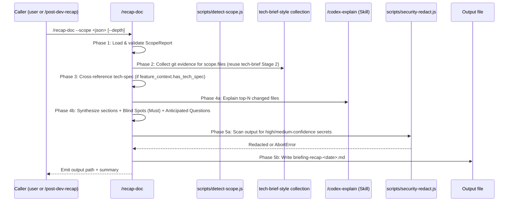

# `/recap-doc` — Recap Document Generator

## Trigger

- Keywords: recap-doc, generate recap, 產出導覽文件, walkthrough doc, 本輪導覽

## When NOT to Use

| Scenario | Alternative |
|----------|------------|
| Interactive Q&A over an existing recap | `/recap-ask` |
| Full flow (detect + doc + Q&A) | `/post-dev-recap` wrapper |
| Technical share-out for other developers | `/tech-brief` |
| Single function explanation | `/codex-explain` |
| First-principles reasoning of an existing doc | `/fp-brief` |

## Command Signature

```
/recap-doc --scope <json-path-or-inline> [--focus <str>] [--depth brief|normal|deep] [--output <path>]
```

| Flag | Default | Description |
|------|---------|-------------|
| `--scope` | required | Path to ScopeReport JSON or inline JSON string (from `scripts/detect-scope.js`) |
| `--focus` | `""` | Natural-language keyword to bias section emphasis (e.g. `"auth middleware"`) |
| `--depth` | `normal` | Output depth — affects top-N, section verbosity, and optional sections |
| `--output` | auto | Output file path (see Save Behavior) |

## Workflow



### Phase 1 — Scope Load

1. Parse `--scope` argument: accept file path, `-` for stdin, or inline JSON (detected by leading `{`).
2. Validate ScopeReport v1 required fields: `version === 1`, `source`, `files[]`, `feature_context`, `fallback_trace`.
3. If `source === null` or `files.length === 0` → exit non-zero with message directing user to rerun `scripts/detect-scope.js`.

### Phase 2 — Evidence Collection (reuse tech-brief Stage 2)

See `references/source-guide.md` for the full strategy. Summary:

- Run `git log --oneline -20 -- <path>` per scope file (capped at `top-N` by depth)
- Run `git diff --stat <base-ref>..HEAD -- <path>` for magnitude
- Read top-N changed files (100 lines each, source files only; exclude docs/test)

Top-N by depth: **brief=5, normal=10, deep=15**.

### Phase 3 — Spec Cross-reference

When `scope.feature_context.has_tech_spec === true`:

1. Read `<docs_path>/2-tech-spec.md`
2. Extract section headings + Work Breakdown items
3. Prepare drift-check input: list each tech-spec work item + implementation evidence (changed files overlap)

### Phase 4 — AI Synthesis

See `references/prompt-template.md` for the full prompt. Key behaviors:

1. **Per-file explanations (Phase 4a)**: for each top-N file, invoke `/codex-explain` (Skill tool call) with `--lines` scoped to changed hunks. **Reuse, not reimplement** — this satisfies NFR-5.
2. **Section synthesis (Phase 4b)**: compose §1 Overview through §7 Evidence using the output template (see `references/output-template.md`).
3. **Blind Spots (FR-9, Must — any depth)**: even if no obvious blind spots are found, emit the §5 heading with the fallback wording `「本輪未偵測到明顯盲點」+ 推論依據`.
4. **Anticipated Questions (FR-11)**: present ≥ 3 questions at `normal`/`deep`; omit at `brief`.

### Phase 5 — Redaction + Write

1. Load `scripts/security-redact.js` and invoke `redact(text)` on the complete markdown output.
2. If `AbortError` is thrown → do **not** write; emit stderr with fingerprint and exit non-zero.
3. If redacted successfully → validate output path via `fs.realpathSync` on the first existing ancestor (must resolve inside repo root **or** `<tmp>`; no `..` / external symlink).
4. Write file with trailing newline.

## Depth Levels

See the full matrix in `references/output-template.md`. Summary:

| Level | Top-N | §5 Blind Spots | §6 Anticipated Q | Code snippets |
|-------|-------|----------------|-------------------|---------------|
| brief | 5 | Top-3 only | Omitted | No |
| normal | 10 | Full list | ≥ 3 | No |
| deep | 15 | Full list | ≥ 3 | Inline |

## Save Behavior

Recap output is **ephemeral by default** — written to the OS temp directory so the user's project tree stays clean. Callers that want the recap checked in must opt in with `--output`.

| Condition | Output Path |
|-----------|-------------|
| Default (no `--output`) | `<tmp>/sd0x-dev-flow-recap/briefing-recap-<YYYY-MM-DD>.md` |
| `--output <path>` provided | Explicit path; the canonical (realpath-resolved) target must lie inside either the repo root or `<tmp>`. Paths that escape both roots are rejected (see `## Path Security`). |

Where `<tmp>` resolves in this order:

1. `$TMPDIR` environment variable (honoured on macOS by default).
2. Node's `os.tmpdir()` (portable fallback — in code this is `require('os').tmpdir()`).
3. `/tmp` as the final POSIX fallback.

The directory `<tmp>/sd0x-dev-flow-recap/` is created if missing. If the target file already exists the same day, append a numeric suffix: `briefing-recap-2026-04-17-r2.md`.

**Permanent recap**: when the user wants the recap stored with the feature docs (e.g. shareable post-mortem), invoke with `--output docs/features/<key>/briefing-recap-<YYYY-MM-DD>.md` explicitly.

## Path Security

| Rule | Implementation |
|------|----------------|
| Default-dir boundary | Default path is always under `<tmp>/sd0x-dev-flow-recap/` (`<tmp>` resolved via `$TMPDIR` → `os.tmpdir()` → `/tmp`, see `## Save Behavior`); the skill never writes under the repo without an explicit `--output` |
| Explicit-path allowlist | `--output <path>`: accept any absolute or repo-relative path **whose canonical (realpath-resolved) target lies inside the repo root or `<tmp>`**; reject `..` segments that escape the resolved parent and external symlinks whose target lies outside both roots |
| Symlink check | Resolve the output path with `fs.realpathSync` on the first existing ancestor; reject if the resolved ancestor is neither inside the repo root (`git rev-parse --show-toplevel`) nor inside `<tmp>` |
| Secret redaction | `scripts/security-redact.js` — abort on high-confidence, mask medium |
| Input trust | ScopeReport JSON paths are validated before any fs read |

## Performance

Target: **NFR-2 — `/recap-doc` output generation ≤ 30s** (excluding external LLM latency, measured from scope-load start to file-write complete). The Phase 4a per-file explanations should be dispatched in parallel batches to stay within budget.

## Output Structure

See `references/output-template.md` for the canonical markdown template. High-level structure:

```
# Recap: <feature-key or "session">
> **Scope source**: ...
> **Detected at**: ...
> **Focus**: ...
> **Confidence**: ...

## 1. Overview
## 2. Changed Files (table with file:line references)
## 3. Design Decisions
## 4. Spec vs Implementation Drift    (if has_tech_spec)
## 5. Blind Spots                     (FR-9 Must — any depth)
## 6. Anticipated Questions           (normal/deep only)
## 7. Evidence                         (commit SHAs, file:line index)
```

## Verification

- [ ] ScopeReport v1 validated (version + required fields) before any synthesis
- [ ] Top-N files aligned with depth (brief=5, normal=10, deep=15)
- [ ] §5 Blind Spots heading present regardless of depth; fallback wording when no items
- [ ] §6 Anticipated Questions ≥ 3 at normal/deep; omitted at brief
- [ ] `/codex-explain` invoked per top-N file (NFR-5 reuse — not reimplemented)
- [ ] `security-redact.js` invoked before write (NFR-7)
- [ ] Output path resolves (via `fs.realpathSync`) inside repo root **or** `<tmp>`; no `..`; no external symlink
- [ ] Total pipeline ≤ 30s from scope-load to write (NFR-2)

## References

- `references/output-template.md` — Recap doc structure + depth matrix
- `references/source-guide.md` — Phase 2 evidence collection (reuse tech-brief pattern)
- `references/prompt-template.md` — LLM synthesis prompt (obeys `@rules/codex-invocation.md`)
- `@skills/tech-brief/references/source-guide.md` — upstream pattern (read-only reference)
- `@skills/codex-explain/SKILL.md` — Phase 4a reuse target
- `scripts/detect-scope.js` — ScopeReport v1 producer (T1)
- `scripts/security-redact.js` — Pre-write redaction (T1)
- `scripts/config/doc-taxonomy.json` L94-99 — `briefing-` ancillary pattern

## Examples

```
Input: /recap-doc --scope /tmp/scope.json --depth normal
Action: Load scope → collect git evidence for top-10 files → /codex-explain per file → synthesize sections including Blind Spots + 3+ Anticipated Questions → security-redact → write to <tmp>/sd0x-dev-flow-recap/briefing-recap-2026-04-17.md (ephemeral default; user opts in to commit via --output)

Input: /recap-doc --scope '{"version":1,"source":"uncommitted",...}' --focus "auth" --depth brief
Action: Parse inline JSON → filter to auth-related files → top-5 only → §5 Blind Spots top-3 only → omit §6 → write to <tmp>/sd0x-dev-flow-recap/briefing-recap-<YYYY-MM-DD>.md

Input: /recap-doc --scope scope.json --depth deep --output docs/features/<key>/briefing-recap-2026-04-17.md
Action: Load scope → top-15 with inline code snippets → full §5/§6 → redact → realpath-resolve target (must be inside repo root OR <tmp>) → write. Paths that escape both roots are rejected.
```
