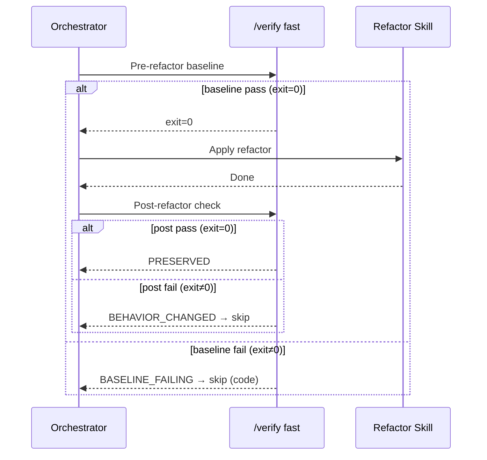

# Behavioral Equivalence Gate

## Purpose

Compare `/verify fast` exit codes before and after refactoring to detect regressions at the lint + unit test layer. This gate covers lint rules and unit tests only — integration/e2e regressions are not detected by this gate. For full verification, use `/verify full` manually after the refactor loop completes.

Doc targets bypass this gate entirely — docs have no executable tests.

## Protocol

## Sentinel Definitions

| Pre Exit | Post Exit | Sentinel | Action |
|----------|-----------|----------|--------|
| 0 | 0 | `PRESERVED` | Continue to code review |
| 0 | non-0 | `BEHAVIOR_CHANGED` | Skip target, log `[REFACTOR_SKIPPED]` |
| non-0 | — | `BASELINE_FAILING` | Skip target (code only) |
| all skipped | all skipped | `NO_TESTS` | Warn + continue (advisory) |

## Gate Rules by Target Type

| Target Type | Behavioral Gate | Review Command |
|------------|----------------|----------------|
| code | Required — must pass PRESERVED | `/codex-review-fast` |
| doc | Bypass — docs have no executable tests | `/codex-review-doc` |

## `BASELINE_FAILING` Handling

- **Code targets**: Baseline already failing means behavioral preservation cannot be verified. Skip target and log: `[REFACTOR_SKIPPED] {target}: baseline failing, cannot verify preservation`
- **Doc targets**: Not applicable — docs bypass the behavioral gate entirely.

## `NO_TESTS` Detection

`/verify` uses `skip-if-missing: true` for all steps. When all verification steps attempted by `/verify fast` are skipped (no lint config, no test runner found), the exit code is 0 but no step results are emitted.

Detection: `/verify fast` exit code = 0 AND output contains no pass/fail step results.

Treatment: Advisory warning — proceed with refactor but log `⚠️ NO_TESTS: behavioral preservation not verified`.

## Failure Investigation

When gate is `BEHAVIOR_CHANGED`, optionally use `/test-deep` for failure triage. This is a diagnostic step, not part of the gate itself.
