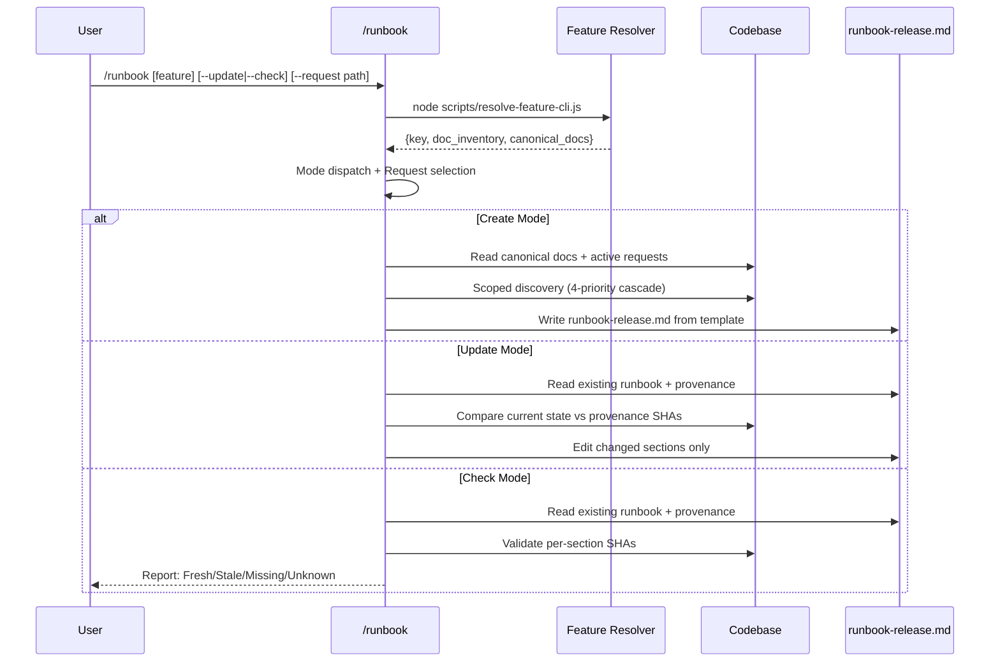

# Runbook Generation Skill

## Trigger

- Keywords: runbook, release runbook, deployment handbook, release handbook, operational guide, pre-release checklist, rollback plan

## When NOT to Use

| Scenario | Alternative |
|----------|------------|
| Incident response runbook | v2 (not yet implemented) |
| Code review | `/codex-review-fast` |
| Architecture design | `/architecture` |
| Tech spec writing | `/tech-spec` |
| Request tracking | `/create-request` |

## Usage

```bash
/runbook                              # Auto-detect feature, create or update
/runbook <feature-keyword>            # Specify feature
/runbook --update                     # Force update mode
/runbook --check                      # Read-only staleness validation
/runbook --request <path|title>       # Specify target request (multi-request features)
```

## Workflow



## Phase 0: Context Resolution

Resolve feature using the 5-level cascade:

```bash
# If positional feature arg provided, pass as --feature
if [ -n "$FEATURE_ARG" ]; then
  FEATURE_JSON=$(node scripts/resolve-feature-cli.js --feature "$FEATURE_ARG" 2>/dev/null || echo '{}')
else
  FEATURE_JSON=$(node scripts/resolve-feature-cli.js 2>/dev/null || echo '{}')
fi
```

| Source | Mapping |
|--------|---------|
| `/runbook auth` | `FEATURE_ARG=auth` → `--feature auth` (two separate argv tokens) |
| `/runbook` (no arg) | No `--feature`, resolver uses branch/diff/fallback |
| `/runbook --check` | No `--feature`, parse flags only |

| Step | Action |
|------|--------|
| 1 | Parse `$ARGUMENTS` for feature key or `--check`/`--update`/`--request` flags |
| 2 | Run feature resolver, get `key`, `doc_inventory`, `canonical_docs` |
| 3 | Check for `runbook-release.md` specifically in feature directory (not any `runbook-*.md`) |
| 4 | Determine mode: create (`runbook-release.md` absent) / update (`runbook-release.md` exists) / check (`--check` flag) |

> **Note**: Mode dispatch keys off the specific file `runbook-release.md`, not any runbook-typed doc in `doc_inventory`. A feature may have `runbook-deploy.md` (a different topic) without triggering update mode for the release runbook.

### Request Selection

| Condition | Behavior |
|-----------|----------|
| `--request` specified | Use specified request |
| Single active request | Auto-select |
| Multiple active requests | AskUserQuestion: list requests, let user choose |
| No active requests | Use most recent request (warn) |

## Phase 1: Content Discovery (Create/Update modes)

Use **scoped discovery cascade** — narrow to wide, with confidence degradation:

| Priority | Scope | Confidence |
|----------|-------|------------|
| 1 | Request `Related Files` paths | High |
| 2 | Canonical docs (tech-spec, architecture) | High |
| 3 | Feature-local paths (`docs/features/{feature}/`) | Medium |
| 4 | Repo-wide grep | Low (tag results) |

See `references/discovery-heuristics.md` for per-section mapping.

### Security — Redaction Rules

When mining configs/workflows/logs into committed markdown:

| Prohibited | Replacement |
|-----------|-------------|
| API keys, tokens, secrets | `${ENV_VAR_NAME}` placeholder |
| Webhook URLs with credentials | `<webhook-url>` symbolic reference |
| Internal-only endpoints | `<internal-endpoint>` placeholder |
| Database connection strings | `${DATABASE_URL}` placeholder |

## Phase 2: Generate / Update

### Create Mode

1. Read canonical docs via `canonical_docs` map (tech_spec, architecture, requirements)
2. Read active request(s) for AC, scope, related files
3. Run scoped discovery for each template section
4. Fill template from `references/template.md`
5. Embed `<!-- runbook-provenance -->` manifest with source SHAs
6. Write to `docs/features/{feature}/runbook-release.md`

### Update Mode

1. Read existing `runbook-release.md` and parse `<!-- runbook-provenance -->` block
2. Compare each `sources[].sha` against `git hash-object <file>`
3. Identify stale sections (any source SHA mismatch)
4. Re-run discovery for stale sections only
5. Edit stale sections via Edit tool (preserve fresh sections)
6. Update provenance manifest with new SHAs

## Phase 3: Check Mode (`--check`)

Read-only validation — does **not** modify the runbook file.

1. Read existing `runbook-release.md` and parse provenance manifest
2. For each section, compare `sources[].sha` against current `git hash-object`
3. Classify: Fresh / Stale / Missing / Unknown (see `references/check-output.md`)
4. Output report with per-section status and SHA diffs
5. Emit verdict: Ready / Stale / Incomplete

## Output

| Mode | Output | Location |
|------|--------|----------|
| Create | New runbook | `docs/features/{feature}/runbook-release.md` |
| Update | Updated sections | Same file, incremental edit |
| Check | Console report | stdout only (no file modification) |

## Verification

- [ ] Feature resolved via `resolve-feature-cli.js`
- [ ] Runbook detected in `doc_inventory` (ancillary/runbook type)
- [ ] Template has all 9 sections (see `references/template.md`)
- [ ] Provenance manifest embedded with multi-source SHA tracking
- [ ] Discovery uses scoped cascade (not repo-wide grep as first option)
- [ ] Redaction rules applied (no secrets in committed markdown)
- [ ] `--check` mode is read-only (no file writes)

## Auto-Loop Integration

This skill produces `.md` output. Per `@rules/auto-loop.md`:

| Event | Action |
|-------|--------|
| Create/Update writes `.md` | `/codex-review-doc` auto-triggered |
| Check mode (no writes) | No review needed |

## References

| File | Purpose |
|------|---------|
| `references/template.md` | 9-section runbook template with provenance block |
| `references/discovery-heuristics.md` | Scoped discovery cascade and per-section mapping |
| `references/check-output.md` | `--check` mode output template and verdict logic |

## Examples

```
Input: /runbook
Action: Auto-detect feature → create runbook-release.md → /codex-review-doc

Input: /runbook auth --check
Action: Read auth/runbook-release.md → validate provenance SHAs → output report

Input: /runbook --update --request docs/features/auth/requests/2026-04-01-login-fix.md
Action: Read existing runbook → diff stale sections → update → /codex-review-doc
```
