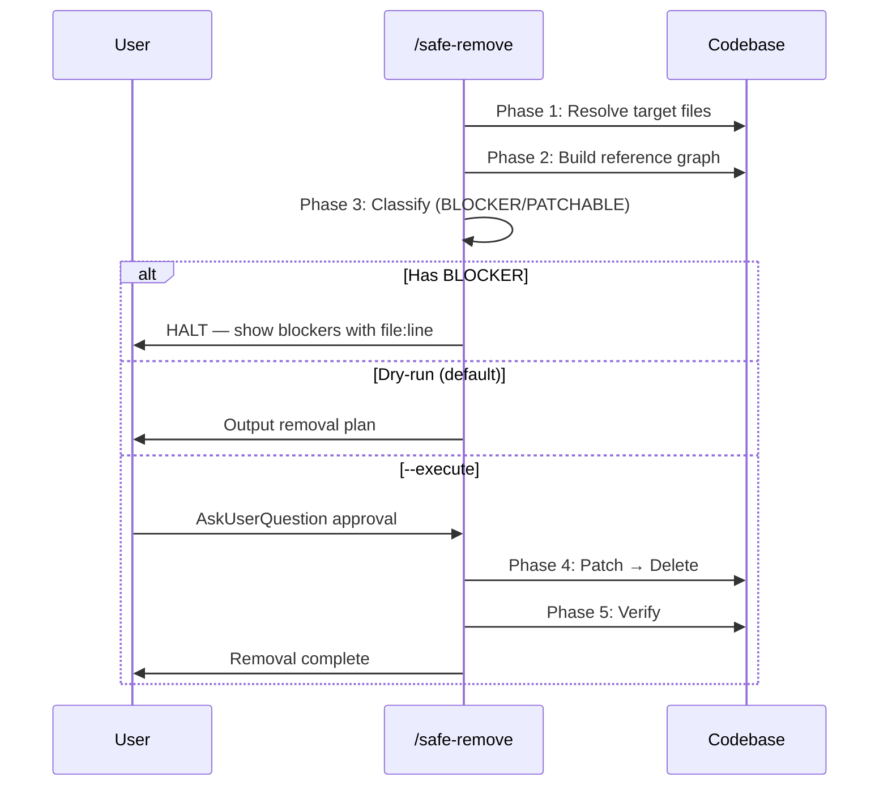

# Safe Remove

Safely remove plugin assets by discovering dependencies, classifying impact, and executing removal with verification.

## Input

`/safe-remove <type> <name> [--execute] [--dry-run]`

| Argument | Description | Default |
|----------|-------------|---------|
| `<type>` | Asset type: `skill`, `agent`, `rule`, `script`, `hook` | Required |
| `<name>` | Asset name (e.g., `create-skill`, `strict-reviewer`) | Required |
| `--execute` | Apply removal (with AskUserQuestion confirmation) | off |
| `--dry-run` | Output plan only (default behavior) | on |

> If both `--dry-run` and `--execute` are provided, `--dry-run` wins (safe default).

## Workflow



### Phase 1: Resolve Target

Validate `<type>` and locate canonical files for the asset.

| Type | Primary Files | Secondary Files |
|------|--------------|-----------------|
| `skill` | `skills/<name>/` (entire directory) | — |
| `agent` | `agents/<name>.md` | — |
| `rule` | `rules/<name>.md` | `.claude/rules/<name>.md` (mirror) |
| `script` | `scripts/<name>.*` | — |
| `hook` | Entry in `hooks/hooks.json` | Hook script file |

If target not found, output error: `Target not found: <type> <name>` and stop.

### Phase 2: Build Reference Graph

Scan the entire codebase for references to the target. Use type-specific patterns from `references/removal-policy.md`.

```bash
# Core scan — find all references
grep -rn "^skills:.*<name>" agents/ --include="*.md"
grep -rn "/<name>" CLAUDE.md .claude/CLAUDE.md CLAUDE.template.md
grep -rn "/<name>" README*.md
grep -rn "/<name>\|<name>" rules/ skills/ --include="*.md"
grep -rn "<name>" hooks/hooks.json
grep -rn "<name>" test/ --include="*.test.js"
```

### Phase 3: Classify Impacts

Apply 2-tier classification per `references/removal-policy.md`:

| Tier | Definition | Action |
|------|-----------|--------|
| **BLOCKER** | Structured runtime binding — removal breaks execution | HALT with file:line details |
| **PATCHABLE** | Prose/documentation reference — safe to auto-edit | Include in patch plan |

### Phase 4: Apply (--execute only)

**Requires AskUserQuestion confirmation before any changes.**

Execution order (patches first, deletes last):

1. **Patch** PATCHABLE references:
   - Remove table rows from CLAUDE.md, `.claude/CLAUDE.md`, CLAUDE.template.md
   - Remove/update entries in README.md + locale variants (count + detail row)
   - Update prose mentions in other skills/rules
2. **Delete** target files:
   - For `skill` type: remove entire `skills/<name>/` directory + `test/skills/<name>*.test.js`
   - For `script` type: remove `scripts/<name>.*` + `test/scripts/<name>.test.js`
   - For `hook` type: remove hook script + JSON entry + `test/hooks/<name>.test.js`
   - For other types: remove primary + secondary files per Phase 1 table
   - Remove empty directories after deletion

> Note: `.claude/CLAUDE.md` must be patched directly — do not rely on hook auto-sync for content removal.

### Phase 5: Verify

Run type-specific verification from `references/removal-policy.md`:

```bash
# Verify no residual references (excluding archived docs)
grep -rn "^skills:.*<name>" agents/ --include="*.md"
grep -rn "/<name>" CLAUDE.md .claude/CLAUDE.md CLAUDE.template.md README*.md skills/ --include="*.md" | grep -v "archived/"
```

If residual references found, report them. If clean, output `Verification passed`.

## Output Format

### Dry-run Plan

```markdown
## Safe Remove Plan: <type> <name>

### Target Files (to delete)
| File | Status |
|------|--------|
| skills/<name>/SKILL.md | DELETE |
| test/skills/<name>*.test.js | DELETE (if exists) |

### BLOCKER References (must resolve first)
| File:Line | Pattern | Why |
|-----------|---------|-----|
| agents/foo.md:3 | skills: <name> | Agent skills field |

### PATCHABLE References (auto-fix)
| File:Line | Current | Patch |
|-----------|---------|-------|
| CLAUDE.md:90 | \| /name \| desc \| | REMOVE ROW |
| README.md:308 | \| /name \| desc \| | REMOVE ROW |

### Verdict
- BLOCKER count: N → ⛔ HALT (resolve blockers first)
- BLOCKER count: 0, PATCHABLE count: M → ✅ Ready to execute
```

## Prohibited

- Auto-triggering (always explicit invocation only)
- Deleting without `--execute` flag + user confirmation
- Removing assets referenced in auto-loop rules without user acknowledgment
- Force-deleting when BLOCKERs exist
- Modifying files outside the removal scope (no side-effect changes)

## References

| File | Purpose | When to Read |
|------|---------|-------------|
| `references/removal-policy.md` | BLOCKER/PATCHABLE classification rules + per-asset-type matrix | Always (Phase 2-5) |

## Examples

```
/safe-remove skill create-skill
→ Dry-run plan showing skill dir + tests to delete + 12 PATCHABLE references

/safe-remove skill create-skill --execute
→ AskUserQuestion → patch 12 refs → delete skill dir + test/skills → verify clean

/safe-remove agent unused-agent
→ Dry-run: 1 file to delete, check for BLOCKER in agents skills: field
```
