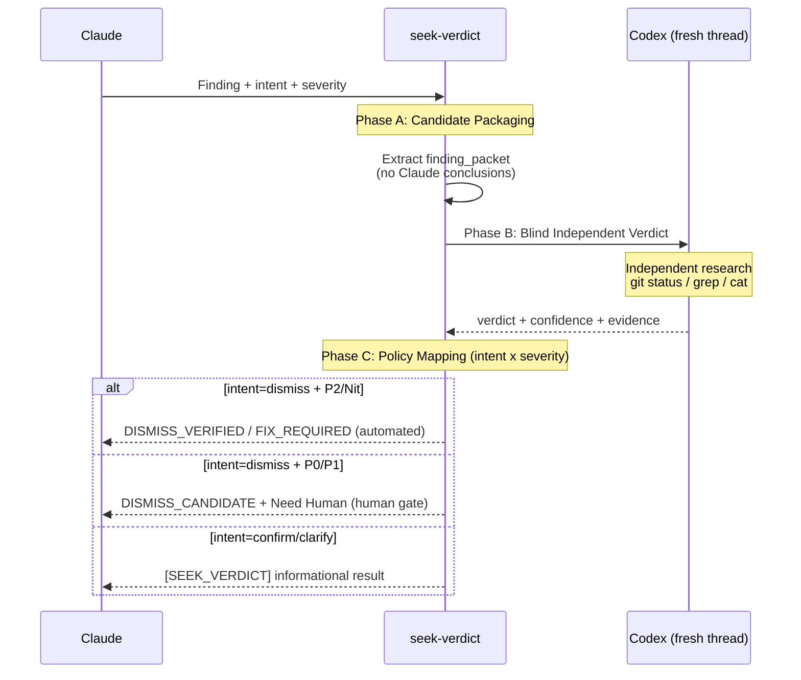

# seek-verdict: Independent Second-Opinion Verification

## When NOT to Use

- General code review (use `/codex-review-fast`)
- Architecture debates (use `/codex-brainstorm`)
- Nit findings with no dismiss intent (use `[NIT_DEFERRED]`)

## Intent x Severity

| Intent | Purpose | Eligible Severities | Output Token |
|--------|---------|-------------------|-------------|
| `dismiss` | Is this a false positive? | All (P0/P1/P2/Nit) | `[DISMISS_VERDICT]` |
| `confirm` | Does this issue actually exist? | All | `[SEEK_VERDICT]` |
| `clarify` | What's the actual impact? | All | `[SEEK_VERDICT]` |

**Default intent**: `dismiss` (backward compatible with v1).

### Dismiss Authorization

| Severity | Authorization | Gate |
|----------|-------------|------|
| P0 | `DISMISS_CANDIDATE` | Human confirmation required |
| P1 | `DISMISS_CANDIDATE` | Human confirmation required |
| P2 | `DISMISS_VERIFIED` | Automated |
| Nit | `DISMISS_VERIFIED` | Automated |

P0/P1 dismiss produces a candidate, not a final authorization. See [Policy Mapping](references/policy-mapping.md) for human gate protocol.

## 3-Phase Protocol



### Phase A: Candidate Packaging

Extract finding artifact from review output:

| Field | Source |
|-------|--------|
| `finding_key` | `file + canonical_issue_text` |
| `severity` | `<P0 \| P1 \| P2 \| Nit>` |
| `intent` | `<dismiss \| confirm \| clarify>` |
| `original_finding_text` | Codex review original (secrets redacted) |
| `origin_thread_id` | Review session threadId |
| `current_head_sha` | `git rev-parse HEAD` |
| `relevant_diff` | `git diff HEAD -- <file>` |

**Critical**: Record Claude's hypothesis locally. **Never send it to Codex.**

### Phase B: Blind Independent Verdict

Use the prompt template in [Verdict Prompt](references/verdict-prompt.md).

| Requirement | Detail |
|-------------|--------|
| Thread | **Fresh** `mcp__codex__codex` (never reuse review thread) |
| Sandbox | `read-only` |
| Approval policy | `never` |
| Anti-anchoring | No Claude conclusions in prompt |

### Phase C: Policy Mapping

Apply thresholds from [Policy Mapping](references/policy-mapping.md).

**Dismiss intent**: graduated thresholds by severity (P0: 0.95/4, P1: 0.90/3, P2: 0.80/2, Nit: 0.70/1).

**Confirm intent**: ACTIONABLE->CONFIRMED, NON_ACTIONABLE->DISPUTED, low confidence->UNCERTAIN.

**Clarify intent**: HIGH_IMPACT / LOW_IMPACT / UNCERTAIN.

Output audit trail per [Policy Mapping](references/policy-mapping.md).

## Rebuttal

If Codex returns `FIX_REQUIRED` and Claude has objective counter-evidence:

- **1 round max** via `mcp__codex__codex-reply` (same verdict thread)
- Only objective artifacts (tests, specs, language semantics)
- After rebuttal: still FIX_REQUIRED -> fix; ambiguous -> `NEED_HUMAN`

## Anti-Abuse Guard

See [Policy Mapping](references/policy-mapping.md) for full rules.

- **Dismiss**: 3 consecutive `DISMISS_VERIFIED` -> `[DISMISS_PATTERN_WARN]` + heightened thresholds
- **Confirm/Clarify**: per-finding cap (1 confirm + 1 clarify per finding per commit)
- Session end or branch switch resets all counters

## Output

**Dismiss intent**:

```
[DISMISS_VERDICT] key=<file|canonical_issue> | severity=<P0-Nit> | verdict=<DISMISS_VERIFIED|DISMISS_CANDIDATE|FIX_REQUIRED|NEED_HUMAN> | confidence=<0..1> | codex_thread=<id> | evidence=<brief> | timestamp=<ISO8601> | intent=dismiss | authorization=<automated|human-required|human-confirmed>
```

**Confirm/Clarify intent**:

```
[SEEK_VERDICT] key=<file|canonical_issue> | severity=<P0-Nit> | intent=<confirm|clarify> | verdict=<CONFIRMED|DISPUTED|HIGH_IMPACT|LOW_IMPACT|UNCERTAIN> | confidence=<0..1> | codex_thread=<id> | evidence=<brief> | timestamp=<ISO8601>
```

## Verification

- [ ] Intent is valid (`dismiss` / `confirm` / `clarify`)
- [ ] Codex prompt contains no Claude conclusions (anti-anchoring)
- [ ] Fresh Codex thread used (not review session thread)
- [ ] Correct audit trail token output (`[DISMISS_VERDICT]` or `[SEEK_VERDICT]`)
- [ ] P0/P1 dismiss produces `DISMISS_CANDIDATE` + human gate (never auto-dismiss)
- [ ] Anti-abuse streak tracked (dismiss) / per-finding cap enforced (confirm/clarify)

## References

| File | Purpose |
|------|---------|
| [Verdict Prompt](references/verdict-prompt.md) | Codex blind verification prompt template |
| [Policy Mapping](references/policy-mapping.md) | Intent x severity thresholds, audit format, anti-abuse |
