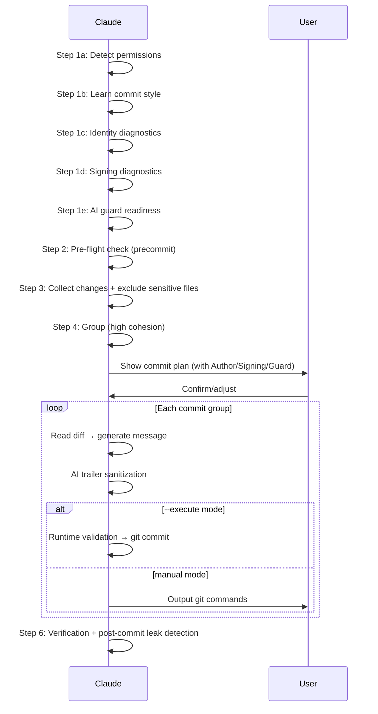

# Smart Commit

Analyze uncommitted changes → group by cohesion → generate commit messages → output git commands (or execute directly with `--execute`).

## Workflow



### Step 1: Detect Permissions + Learn Style

**1a. Permission Detection**

Read CLAUDE.md and `.claude/rules/git-workflow.md` to determine mode:

| Mode | Condition | Behavior |
|------|-----------|----------|
| manual | No `--execute` flag (default) | Output commands only |
| execute | `--execute` flag passed | Execute directly (with user approval via AskUserQuestion) |

Default to **manual mode**. Direct execution requires explicit `--execute` flag regardless of project git restrictions.

**`--execute` mode**: When `--execute` is passed, use `AskUserQuestion` to show the full commit plan and get explicit user approval before executing. This is a skill-level exception to git-workflow rules (same pattern as `/push-ci`).

**1b. Learn Commit Style**

```bash
git log --oneline -15
```

Infer format, type vocabulary, subject conventions (capitalization/tense/ticket ID), and language from recent commits.

**1c. Identity Diagnostics**

**Shared diagnostic (preferred path)**:

```bash
bash scripts/run-skill.sh git-profile git-profile.sh doctor --json
```

If the script succeeds, parse the JSON output:
- `status: "ok"` → silent continue, use `effective_identity` and `signing` fields
- `status: "warn"` → display warnings from `issues[]`, continue
- `status: "halt"` → display halt issues, stop with guidance

If the script fails (not found, parse error, non-zero exit), **fall back** to the inline diagnostics below. Infrastructure failure = warn-only; never halt on fallback path itself.

**Inline fallback**:

```bash
# Read effective identity + origin
git config --show-origin --show-scope --get-all user.name
git config --show-origin --show-scope --get-all user.email
# Check environment variable overrides
printf "GIT_AUTHOR_NAME=%s\nGIT_AUTHOR_EMAIL=%s\nGIT_COMMITTER_NAME=%s\nGIT_COMMITTER_EMAIL=%s\n" \
  "${GIT_AUTHOR_NAME:-}" "${GIT_AUTHOR_EMAIL:-}" \
  "${GIT_COMMITTER_NAME:-}" "${GIT_COMMITTER_EMAIL:-}"
```

Decision logic:

| Condition | Behavior |
|-----------|----------|
| `user.name` and `user.email` resolve to single values | Silent continue, record identity for commit plan |
| `git config --get user.name` returns nothing | **HALT** — output `git config --local user.name "..."` setup guidance |
| `git config --get user.email` returns nothing | **HALT** — output `git config --local user.email "..."` setup guidance |
| `GIT_AUTHOR_*` or `GIT_COMMITTER_*` env vars set | Warn: env vars will override config; commit plan shows `(env override)` |
| `--get-all` returns multiple different values | **AskUserQuestion**: list candidate profiles, user selects once |
| Conflict + `CI=true` env var | **HALT** (fail-closed) — output fix guidance, do not silently inherit |

Design principles:
- **Diagnostic, not override**: Do not use `git -c user.name=...` to override. Respect `includeIf` settings.
- **Interrupt only on anomaly**: Normal identity resolution produces no prompt.
- **Conflict ≠ multiple sources**: `includeIf` producing multiple config sources that resolve to the same value = normal.

**1d. Signing Diagnostics**

```bash
git config --show-origin --get commit.gpgsign 2>/dev/null || echo "unset"
git config --show-origin --get user.signingkey 2>/dev/null || echo "unset"
git config --show-origin --get gpg.format 2>/dev/null || echo "gpg"
```

Decision logic:

| Condition | Behavior |
|-----------|----------|
| `commit.gpgsign=true` + key exists | Display `Signing: enabled (<gpg.format>)` |
| `commit.gpgsign=true` + key missing | ⚠️ Warning: signing enabled but key not configured |
| `commit.gpgsign` unset | Display `Signing: not configured (inherit)` |
| `--execute` mode signing failure | **Immediate stop** + fix guidance |

Post-commit visibility (`--execute` mode):

```bash
git log -1 --format='%G?' # N=unsigned, G=good, U=good-untrusted, etc.
```

**Signing override flags** (`--sign` / `--no-sign`):

| Flag | Effect | Git flag |
|------|--------|----------|
| `--sign` | Force signing for this batch | `-S` on each `git commit` |
| `--no-sign` | Disable signing for this batch | `--no-gpg-sign` on each `git commit` |
| Both | **Error** — mutually exclusive | Halt with error message |
| Neither | Inherit from `commit.gpgsign` config | (default behavior) |

When `--sign` or `--no-sign` is used, **AskUserQuestion** to confirm the override and warn about potential branch protection / CI policy conflicts.

**1e. AI Guard Readiness**

```bash
# Detect effective hook path (handles relative paths and worktrees)
HOOK_FILE=$(git rev-parse --git-path hooks/commit-msg 2>/dev/null)
# If core.hooksPath is set, use it instead
CUSTOM_HOOKS=$(git config --get core.hooksPath 2>/dev/null)
if [ -n "$CUSTOM_HOOKS" ]; then
  # Resolve relative paths against repo root
  case "$CUSTOM_HOOKS" in
    /*) ;; # absolute — use as-is
    *)  CUSTOM_HOOKS="$(git rev-parse --show-toplevel 2>/dev/null)/${CUSTOM_HOOKS}" ;;
  esac
  HOOK_FILE="${CUSTOM_HOOKS}/commit-msg"
fi
# Check commit-msg hook
if [ -f "$HOOK_FILE" ] && [ ! -x "$HOOK_FILE" ]; then
  echo "guard:not-executable"
elif [ -x "$HOOK_FILE" ]; then
  echo "guard:installed"
else
  echo "guard:missing"
fi
```

Decision logic:

| Condition | Behavior |
|-----------|----------|
| Hook installed + executable | Display `AI guard: active` |
| Hook not installed | ⚠️ Warning (non-blocking): suggest install (`/install-scripts commit-msg-guard` then `cp .claude/scripts/commit-msg-guard.sh <hooks-path>/commit-msg && chmod +x <hooks-path>/commit-msg`) |
| Hook exists but not executable | ⚠️ Warning: suggest `chmod +x <hook-path>` |

**Important**: Hook installation is NOT a blocker for `--execute` mode. Runtime validation (Step 5c) provides an independent safety layer.

### Step 2: Pre-flight Check

Check precommit status based on change type. Structural `.md` files (`skills/`) have test coverage (e.g., `skills-schema.test.js`) that can catch reference errors CI would find.

| Change Type | Required Check | Rationale |
|-------------|---------------|-----------|
| Code files (`.ts/.js/.py/.go/.rs` etc.) | `/precommit` or `/precommit-fast` passed | Code correctness + lint |
| Structural `.md` (`skills/**`) | `/precommit-fast` passed | Schema/ref tests cover SKILL.md structure |
| Other `.md` (README, docs/) | `/codex-review-doc` passed (per CLAUDE.md) | No structural tests; doc review sufficient |
| Comments / trivial whitespace | Skip allowed | No test coverage expected |

| Status | Action |
|--------|--------|
| Required check passed **in current session after last edit** | Continue |
| Not run, stale, or uncertain | **Halt** — ask user to run the required check first |

**Freshness**: A "passed" result is only valid if it ran after the most recent file edits in this session. Stale results from earlier in the session (before new edits) do not count.

**Policy note**: This pre-flight is intentionally stricter than the base auto-loop rule (`@rules/auto-loop.md`), which only requires `/codex-review-doc` for `.md` changes. `/smart-commit` is the last gate before commit — structural `.md` files under `skills/` have test coverage (e.g., `skills-schema.test.js`) that can catch reference errors the doc review alone cannot detect. This extra check prevents CI failures post-push.

**Fast vs full test suite warning**: `/precommit-fast` runs a subset of tests (`test:fast`), while CI runs the full suite (`test:ci`). When changes include deletions (skills, scripts), orphaned test files may only fail in CI. If the pre-flight detects that only `/precommit-fast` was run (not `/precommit`), output: `⚠️ Only fast tests ran. If you deleted files, consider /precommit (full suite) to catch orphaned imports before commit.`

### Step 3: Collect Changes

```bash
git status --short
git diff --stat
git diff --cached --stat
```

**Classify changes**:

| Type | Description |
|------|-------------|
| staged | Already `git add`-ed |
| modified | Tracked but unstaged |
| untracked | New files (decide whether to include) |
| deleted | Deleted files |

**Exclusion rules** (warn user, do not include):

```
.env* | *.pem | *.key | *.p12 | id_rsa* | .aws/credentials
*.secret | credentials.json | .npmrc | token.txt
node_modules/ | dist/ | .cache/ | files covered by .gitignore
```

**Partial-staged detection**: If a file has both staged and unstaged changes (`MM` in `git status`), warn user and ask them to resolve first.

**`--scope` filtering**: When `--scope <path>` is specified, only include changes under that path. Apply after collecting all changes:

```bash
git status --short -- "${SCOPE_PATH}"
```

Exclude changes outside the scope path. If no changes remain after filtering → report "No changes under `<path>`" and stop.

If no changes → report "No uncommitted changes" and stop.

**Session-aware filtering** (default, disable with `--all`):

After collecting changes and applying exclusion/scope rules above, filter by session commit scope:

1. Read `.claude_review_state.json` field `session_commit_scope`
2. Validate `session_commit_scope.session_id` matches the state file's root `session_id` (internal consistency — the root value is kept current by the session-init hook, so a mismatch means the scope is stale from an earlier session)
3. If `--all` flag passed, or scope is unavailable/invalid → skip filtering (legacy behavior)
4. Otherwise, classify remaining files:

| Condition | Result | Display |
|-----------|--------|---------|
| Already staged (passed safety checks) | **Include** | Normal |
| Unstaged/untracked + in `touched_files` + NOT in `baseline_dirty_files` | **Include** | Normal |
| Unstaged/untracked + in `touched_files` + in `baseline_dirty_files` | **Include** | ⚠️ Warning badge |
| Unstaged/untracked + NOT in `touched_files` | **Exclude** | Show in "Excluded" section |

If all unstaged files are excluded and nothing is staged → report "No session changes to commit. Use `--all` to include pre-existing changes." and stop.

### Step 4: Group (High Cohesion)

Each group should form a semantically complete commit.

**Grouping strategy** (priority order):

1. **Already staged changes**: Respect user intent — separate group (no `git add`, just `git commit`)
2. **Same feature/module**: Group by path prefix + filename semantics
   - Same directory changes (e.g. `src/service/xxx/`)
   - Flat files by name prefix
   - Controller + Service + Test = complete feature
3. **Same type**: Pure tests → `test:`, pure docs → `docs:`, pure config → `chore:`
4. **Related changes**: `src/xxx.ts` + `test/unit/xxx.test.ts` in same group
5. **Remaining scattered files**: Merge into misc commit or ask user

**Group limit**: No more than 15 files per commit.

**Ticket ID**: If `{TICKET_PATTERN}` is configured, extract ticket ID from branch name:

```bash
git rev-parse --abbrev-ref HEAD
```

Show grouping plan and ask user to confirm. Include identity, signing, and AI guard metadata from Step 1c/1d/1e:

```
## Commit Plan

**Selection mode**: session-aware (default)
**Author**: Jane Doe <jane@company.com> (local config)
**Signing**: enabled (GPG, key: ABCD1234)
**AI guard**: active (commit-msg hook installed)

| # | Type | Files | Summary |
|---|------|-------|---------|
| 1 | fix  | 3     | Fix circuit breaker logic |
| 2 | test | 2     | Add RPC client unit tests |
| 3 | docs | 4     | Update performance audit docs |

### Excluded — pre-existing uncommitted (not touched this session)
| File | Status | Reason |
|------|--------|--------|
| src/legacy.ts | M | Not touched in this session |
| config/dev.json | M | Not touched in this session |

⚠️ `src/config.ts` was already dirty before this session and was edited during this session. Pre-existing changes will be included.

> To include all uncommitted changes: rerun with `--all`

Adjust grouping?
```

### Step 5: Generate Commits (Loop)

**5a. Read diff**

```bash
git diff -- <files>          # unstaged
git diff --cached -- <files> # staged
```

**5b. Generate commit message** (following Step 1b inferred style)

- Subject focuses on "what was done", not "which files changed"
- If project convention includes scope → `<type>(<scope>): <subject>`
- If project convention includes ticket ID → append `[TICKET-ID]`
- **`--type` override**: When `--type <type>` is specified, use that type for all commit groups instead of inferring from changes. Takes precedence over inferred type.

**AI trailer sanitization** (mandatory, before outputting any commit command):

Scan the generated message for forbidden patterns and **strip them silently** unless `--ai-co-author` was explicitly passed:

| Forbidden Pattern | Regex (ERE with `\b`, `grep -Ei`) |
|-------------------|------|
| Co-Authored-By AI | `Co-Authored-By:.*(Claude\|Anthropic\|GPT\|OpenAI\|Copilot\|noreply@anthropic)` |
| Generated-by tag | `Generated (by\|with).*(Claude\|\bAI\b\|GPT\|OpenAI\|Copilot)` |
| Emoji robot tag | `🤖.*(Claude\|\bAI\b\|GPT\|OpenAI)` |

> **Note**: `\|` in the table above is Markdown table escaping. Actual ERE uses unescaped `|`. Only `AI` is `\b`-bounded — it keeps bare `AI` from matching inside ordinary words ("maintainer", "domain") under `-i`. `GPT` and `OpenAI` are intentionally left unbounded so they still match inside `ChatGPT` / `GPT-4` (no English word contains "gpt").
> **Canonical regex source**: `scripts/commit-msg-guard.sh` (ERE, `grep -Ei`)

If any pattern matches and `--ai-co-author` was **not** passed → remove the matching line(s) from the message before output/execute.

**`--ai-co-author` narrow whitelist** (enforced by runtime validation in Step 5c): When `--ai-co-author` is passed, only the exact line `Co-Authored-By: Claude <noreply@anthropic.com>` is permitted. All other AI patterns (`Generated by`, `🤖`, variant Co-Authored-By formats) remain blocked even with `--ai-co-author`. Note: the commit-msg hook (`ALLOW_AI_COAUTHOR=1`) bypasses all hook checks — the narrow whitelist is enforced solely by the runtime `validate_msg()` function, not by the hook.

**5c. Output or execute commands**

**Manual mode** — output copy-pasteable commands:

Already staged group (no `git add` needed):

````markdown
### Commit 1/3: fix: Fix circuit breaker timeout logic

```bash
git commit -m "$(cat <<'EOF'
fix: Fix circuit breaker timeout logic

EOF
)"
```
````

Unstaged group (needs `git add` first):

````markdown
### Commit 2/3: test: Add RPC client unit tests

```bash
git add test/unit/provider/clients/basic-json-rpc-client.test.ts \
       test/unit/utils/concurrence-as-one.test.ts
git commit -m "$(cat <<'EOF'
test: Add RPC client unit tests

EOF
)"
```
````

**Execute mode** (`--execute`) — run commands directly:

1. Use `AskUserQuestion` to show the full commit plan (all groups) and get approval once
2. For each approved commit group, execute `git add` (if needed)
3. **Runtime validation** — before each `git commit`, validate the sanitized message via temp file + `validate_msg()`. See [execute-mode.md](references/execute-mode.md) for full implementation.
4. After each commit, verify with `git log --oneline -1` to confirm success
5. If any commit fails or runtime validation fails, stop and report the error (do not continue to next group)

With `--ai-co-author` flag, append trailer and set `ALLOW_AI_COAUTHOR=1` (required to pass commit-msg hook):

````markdown
```bash
ALLOW_AI_COAUTHOR=1 git commit -m "$(cat <<'EOF'
fix: Fix circuit breaker timeout logic

Co-Authored-By: Claude <noreply@anthropic.com>
EOF
)"
```
````

**5d. Continue to next group**

Manual mode: Output all groups' git commands at once, prompt user to execute in order.
Execute mode: Proceed to next group automatically after successful commit.

### Step 6: Verification

**Execute mode**:

```bash
git status --short
```

- Still has unhandled changes (committable files in included set) → return to Step 4
- Only excluded files remain (sensitive files, or session-excluded pre-existing files) → stop with warning summary listing excluded files
- All clear → output summary table

After each commit, run **post-commit AI trailer detection** (hard stop on leak): scan `git log -1 --format='%B'` for forbidden patterns. When `--ai-co-author` is active, strip the exact allowed line (`Co-Authored-By: Claude <noreply@anthropic.com>`) before scanning — same logic as `validate_msg()`. If any remaining match → **immediately stop** all remaining groups + output amend guidance. See [execute-mode.md § Post-commit Detection](references/execute-mode.md) for implementation. **Do NOT auto-amend** — amending is a destructive git operation reserved for the developer.

**Manual mode**:

In manual mode, Step 6 outputs a post-execution checklist (Claude has NOT executed any commands):

```
## Post-Execution Checklist
After running the commands above:
1. git status --short  (verify all changes committed)
2. git log -3 --format='%H%n%B%n----'  (verify commit messages have no AI trailers)
```

Do NOT run `git status` convergence loops or `git log -1` trailer detection in manual mode — the commands have not been executed yet.

## AI Co-Author Attribution

| Mode | Condition | Commit Message |
|------|-----------|----------------|
| **Default** | No `--ai-co-author` flag | No `Co-Authored-By` trailer |
| **Opt-in** | `--ai-co-author` passed | Append `Co-Authored-By: Claude <noreply@anthropic.com>` |

AI attribution is **off by default**. The developer owns the commit. Only add the trailer when explicitly requested via `--ai-co-author`.

## Prohibited

- **No AI signatures by default**: Never add `Co-Authored-By`, `Generated by`, or any AI attribution trailer unless `--ai-co-author` is explicitly passed
- **No guessing**: If uncertain about file grouping, ask user
- **No merging unrelated changes**: Better an extra commit than sacrificing cohesion
- **No omissions**: Must `git status` verify after completion
- **No secrets**: Sensitive files must be warned about, never included
- **No unauthorized execution**: Without `--execute` flag, **never** directly execute git add/commit
- **No silent execution**: In `--execute` mode, must use `AskUserQuestion` for approval before executing commits
- **No silent inclusion of pre-existing changes**: Without `--all`, do not silently include unstaged files that were not touched in this session

## Bundled References

| File | Purpose | When |
|------|---------|------|
| [execute-mode.md](references/execute-mode.md) | Runtime validation (`validate_msg()`) + post-commit AI trailer detection | `--execute` mode |

> **Note**: Bash code in `references/execute-mode.md` is a **behavioral specification**. Claude translates it to allowed tool calls (`Bash(git:*)` for `git commit -F`, etc.) — it is not a standalone script requiring additional shell permissions.

## Examples

```
Input: Help me commit these changes
Action: Detect manual mode → pre-flight check → analyze 20 changes → group into 4 → output 4 sets of git commands
```

```
Input: /smart-commit
Action: Detect mode → pre-flight check → analyze 5 changes → all same feature → generate 1 commit
```

```
Input: /smart-commit --execute
Action: Override to execute mode → pre-flight check → analyze changes → group → AskUserQuestion approval → git add + git commit each group → git status verify
```

```
Input: /smart-commit --execute --ai-co-author
Action: Execute mode + AI co-author → group → approve → git add + git commit (with Co-Authored-By trailer) → verify
```
