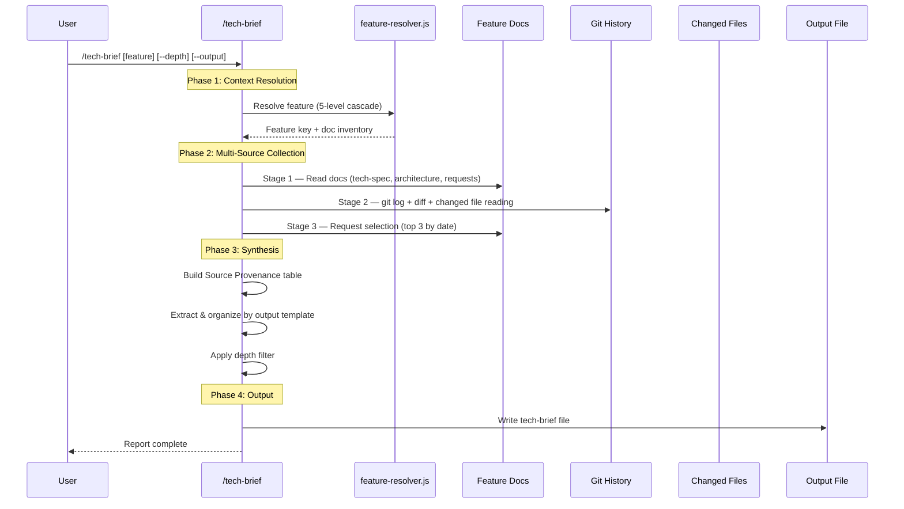

# Technical Briefing Skill

## Trigger

- Keywords: tech brief, technical briefing, share with team, tech-brief, dev sharing, share findings, technical memo

## When NOT to Use

| Scenario | Alternative |
|----------|------------|
| PM/CTO executive summary (strip technical details) | `/project-brief` |
| First-principles reasoning chain (why decisions were made) | `/fp-brief` |
| Design-phase technical specification (before implementation) | `/tech-spec` |
| Code explanation at function/file level | `/codex-explain` |
| Simple document summary | Ask Claude directly |

## Command Signature

```
/tech-brief [<feature-key>|<docs-path>] [--depth brief|normal|deep] [--output <path>] [--no-save]
```

| Flag | Default | Description |
|------|---------|-------------|
| `<feature-key>` | Auto-detect | Feature key or docs path |
| `--depth` | `normal` | Output depth (brief/normal/deep) |
| `--output` | `docs/features/<key>/5-tech-brief.md` | Custom output path |
| `--no-save` | false | Print to stdout only |

## Workflow



### Phase 1: Context Resolution

1. Parse `$ARGUMENTS` for feature-key, path, or flags
2. Resolve feature using `node scripts/resolve-feature-cli.js [--feature <key>]`
3. Load `doc_inventory` and `canonical_docs` from resolver output
4. Validate paths (see Path Security)

#### Input Resolution Table

| Input Type | Example | Feature Resolution | Default Output Path |
|-----------|---------|-------------------|-------------------|
| Feature key | `/tech-brief fp-brief` | `--feature fp-brief` | `docs/features/fp-brief/5-tech-brief.md` |
| Feature dir | `/tech-brief docs/features/fp-brief/` | Extract key from path | `docs/features/fp-brief/5-tech-brief.md` |
| Feature doc | `/tech-brief docs/features/fp-brief/2-tech-spec.md` | Extract key from parent | `docs/features/fp-brief/5-tech-brief.md` |
| Non-feature | `/tech-brief /tmp/notes.md` | No feature context | Require `--output` |
| No argument | `/tech-brief` | Auto-detect (5-level cascade) | Based on resolved feature |

### Phase 2: Multi-Source Collection

Three-stage collection. See `references/source-guide.md` for detailed strategy.

**Stage 1 — Document Collection**: Read feature docs via `canonical_docs` (tech-spec, architecture, feasibility) and `doc_inventory` (implementation). All optional.

**Stage 2 — Code & Git Evidence**: `git log -20`, `git diff --stat`, read top 5 changed source files (100 lines each) for `file:line` references.

**Stage 3 — Request Selection**: Glob all request docs (no status filter — completed features are the primary use case), max 3 by date desc. Extract `## References` for threadIds and PR links.

### Phase 3: Synthesis

1. Build Source Provenance table (Section | Source Files | Confidence)
2. For each output section, extract content from mapped sources (see `references/output-template.md`)
3. Apply depth filter (section inclusion and detail level per depth matrix)
4. Apply Evidence Insufficient Rule: `[Source unavailable — no <type> found for this feature]`

### Phase 4: Output

See Save Behavior for output path resolution.

## Path Security

1. **Path normalization**: Resolve `..` and symlinks, verify repo boundary
2. **Traversal rejection**: Input containing `..` is rejected
3. **Output path**: `--output` allows repo-external paths (e.g. `/tmp/`), emit warning "writing outside repo"
4. **Secret redaction**: Before reading source docs, scan for high-confidence secret patterns (API keys, private keys) — high confidence: abort; medium confidence: mask `[REDACTED]`

## Depth Levels

| Level | Max Length | Description |
|-------|-----------|-------------|
| brief | ~500 words | Key points only — suitable for Slack sharing |
| normal | ~1500 words | Full coverage with source citations |
| deep | ~3000 words | Full coverage + code snippets + alternative comparison |

These are upper bounds, not targets. Source-thin features will produce shorter output.

## Output

See `references/output-template.md` for full template and depth matrix.

```markdown
# Tech Brief: <Feature Title>

> Feature: <key> | Depth: <level> | Generated: <timestamp>
> Sources: <list of docs read>

## Source Provenance
| Section | Source Files | Confidence |

## 1. Background & Problem
## 2. Design Decisions & Trade-offs
## 3. Implementation Highlights
## 4. Limitations & Known Issues
## 5. Discussion & References
## 6. Next Steps
```

### Save Behavior

| Condition | Output Path |
|-----------|------------|
| Default (feature resolved) | `docs/features/<key>/5-tech-brief.md` |
| `--output <path>` | Specified path (warn if outside repo) |
| `--no-save` | stdout only, no file written |
| No feature + no `--output` | Gate: Need Human |

Preferred canonical name: `5-tech-brief.md`. If `5-` prefix is occupied, use next available number.

## Verification

- [ ] Feature context resolved (5-level cascade or explicit)
- [ ] Path validation executed (no traversal, repo boundary)
- [ ] Secret redaction scan completed
- [ ] Source Provenance table present in output
- [ ] Each section cites source (or shows Missing Source marker)
- [ ] Output length within depth-level upper bound
- [ ] Evidence Insufficient markers used where source is thin

## References

- Output template: `references/output-template.md`
- Source collection guide: `references/source-guide.md`
- Feature context resolution: `@skills/tech-spec/references/feature-context-resolution.md`

## Examples

```
Input: /tech-brief seek-verdict
Action: Resolve feature → read tech-spec + request → git log → write 5-tech-brief.md

Input: /tech-brief --depth brief --output /tmp/sharing.md
Action: Auto-detect feature → collect sources → brief output → write /tmp/sharing.md

Input: /tech-brief docs/features/auto-loop-evolution/ --depth deep
Action: Extract key → read all docs + requests (top 3) → deep output with code snippets

Input: /tech-brief --no-save
Action: Auto-detect → collect → print to stdout (no file)
```
