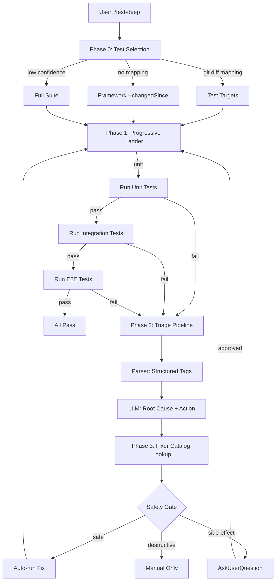

# Test Deep — Context-Aware Test Orchestration

## Supplementary Agent

When test failures occur, dispatch background triage:

Agent({
  description: "Analyze test failure root cause and suggest fixes",
  subagent_type: "verify-app",
  prompt: `Analyze the following test failure:
<failure output>
Identify root cause and suggest minimal fix.`
})

## Trigger

- Keywords: context-aware testing, smart test, test orchestration, test triage, test failure analysis, test deep, run relevant tests

## When NOT to Use

| Scenario | Alternative |
|----------|------------|
| Writing new tests | `/post-dev-test` |
| Reviewing test coverage | `/codex-test-review` |
| Generating unit tests | `/codex-test-gen` |
| Full manual test run | `/verify` |
| Code review | `/codex-review-fast` |

## Prohibited Actions

```
❌ git add | git commit | git push — per @rules/git-workflow.md
```

This skill runs tests and may apply safe fixers, but does **not** commit. To commit, the user must invoke `/smart-commit --execute` separately.

## Workflow



## Phase 0: Test Selection

Map code changes to test targets. See `references/test-selection.md` for full strategy.

**Strategy priority**:

| Priority | Method | When |
|----------|--------|------|
| 1 | Git diff filename mapping | Default — map changed files to test files via Glob |
| 2 | Framework native | Jest `--changedSince`, Vitest `--changed` |
| 3 | Full suite fallback | Config change, no mapping, `--all` flag |

**Steps**:
1. Collect changed files: union of unstaged + staged + untracked (`--branch` uses merge-base)
2. Apply filename mapping rules to generate candidate test paths
3. Glob-confirm each candidate exists
4. Classify confirmed tests by layer (unit / integration / e2e)

**Full suite escalation triggers**: config file changed, CI/CD file changed, package dependency changed, no test files mapped, `--all` flag.

## Phase 1: Progressive Ladder

Execute tests layer-by-layer with fail-fast.

| Layer | Directory Pattern | Timeout | Fail Behavior |
|-------|------------------|---------|---------------|
| Unit | `test/unit/**`, `test/scripts/lib/**`, unclassified | 60s | Fail-fast → triage |
| Integration | `test/integration/**` | 300s | Fail-fast → triage |
| E2E | `test/e2e/**` | 600s | Enter triage |

**Fail-fast rule**: Unit fail → skip integration + e2e. Integration fail → skip e2e.

**Override**: `--no-fail-fast` disables this behavior (run all layers regardless).

**Layer detection**: Classify test files by directory prefix. Files not matching any integration/e2e pattern → treat as unit.

**Execution**: Run tests using project's configured test command (from `package.json` scripts or `CLAUDE.md`). Capture stdout/stderr and exit code.

## Phase 2: Failure Triage Pipeline

When failures occur, analyze and classify. See `references/triage-pipeline.md` for full spec.

### Step 1: Output Parser

Extract structured tags from test output (no classification — just structure):

| Tag | Description |
|-----|-------------|
| `exit_code` | Process exit code |
| `error_signatures[]` | Regex-matched error patterns |
| `failing_tests[]` | Failed test names |
| `failing_files[]` | Failed test file paths |
| `env_hints[]` | Environment clues (testnet, localhost, etc.) |
| `stack_depth` | Stack trace line count |

### Step 2: LLM Root Cause Analysis

Feed parser tags + compressed output to LLM for classification:

| Classification | Definition | Typical Action |
|---------------|------------|----------------|
| `code_bug` | Logic error in code | Fix code |
| `infra` | Infrastructure issue (port, dependency) | Restart / reinstall |
| `environment` | External precondition unmet | Fixer catalog action |
| `flaky` | Non-deterministic failure | Retry + quarantine tag |

**Mandatory secret redaction** before LLM analysis — per `@rules/logging.md`:
- API keys, private keys, tokens, passwords, mnemonics, URLs with credentials
- See `references/triage-pipeline.md` for redaction patterns

### Step 3: Safety-Gated Action

Route `suggested_fixer` through safety gate:

| Tier | Auto-run? | Confirmation | Examples |
|------|-----------|-------------|---------|
| `safe` | Yes | None | retry, clear_cache |
| `side-effect` | No | AskUserQuestion | reinstall_deps, restart_server |
| `destructive` | Blocked | Manual only | Reset state, drop tables |

**Default-deny**: Unknown fixer → `side-effect` tier (require confirmation).

## Phase 3: Fixer Execution

Lookup fixer from catalog, check tier, execute or prompt. See `references/fixer-catalog.md` for full catalog.

**Core fixers** (plugin-shipped):

| Fixer | Tier | Description |
|-------|------|-------------|
| `retry` | safe | Re-run failing tests |
| `clear_cache` | safe | Clear build/test cache |
| `reinstall_deps` | side-effect | Remove node_modules + reinstall |
| `restart_server` | side-effect | Kill + restart dev server |
| `port_cleanup` | side-effect | Kill process on conflicting port |

**Host extensions**: Project-specific fixers in `.claude/test-deep/fixers.md`. Schema validation at load — missing required fields or invalid tier → rejected with warning.

**Fixer loop**: After safe/approved fixer runs, re-enter progressive ladder for failed tests only. Max 1 fixer retry per failure to prevent infinite loops.

## Session Artifacts

Write per-run artifacts for comparison and debugging.

**Location**: `.claude/cache/test-deep/<runId>/`

**Run ID format**: `<timestamp>-<shortSHA>-<pid>`

| File | Content |
|------|---------|
| `metadata.json` | Run config: selected tests, ladder config, changed files |
| `results.json` | Per-layer results: pass/fail, duration, exit codes |
| `triage.json` | Parser tags, LLM classification, fixer chosen, outcome |
| `output.log` | Compressed test output (secret-redacted) |

**TTL**: Keep last 5 runs. Prune older on new run start.

**`latest` symlink**: Points to most recent run directory.

## Arguments

| Flag | Default | Description |
|------|---------|-------------|
| `--all` | false | Force full test suite |
| `--layer <unit\|integration\|e2e>` | all | Run only specified layer |
| `--no-fail-fast` | false | Run all layers regardless of failures |
| `--no-fix` | false | Triage only, skip fixer execution |
| `--focus <path>` | — | Limit test selection to path |
| `--branch` | false | Use merge-base diff instead of working tree |

## Output

```markdown
## Test Deep Report

### Test Selection
- Changed files: N
- Mapped test files: N (N unit, N integration, N e2e)
- Selection method: git diff mapping | framework native | full suite

### Results

| Layer | Tests | Passed | Failed | Skipped | Duration |
|-------|-------|--------|--------|---------|----------|

### Failure Triage

| # | Test | Classification | Root Cause | Fixer | Tier |
|---|------|---------------|------------|-------|------|

### Actions Taken
- [N] fixer_id: outcome

### Gate
✅ All Pass | ⛔ N failures pending resolution
```

## Verification Checklist

- [ ] Test selection maps changed files to test targets
- [ ] Progressive ladder respects fail-fast
- [ ] Triage pipeline produces structured classification
- [ ] Safety gate enforces tier-based execution
- [ ] Secret redaction applied before LLM analysis
- [ ] Session artifacts written to cache
- [ ] No `git add` / `git commit` / `git push` executed

## References

- `references/test-selection.md` — Git diff mapping strategy + full suite escalation
- `references/triage-pipeline.md` — Parser tags + LLM prompt + safety gate
- `references/fixer-catalog.md` — Core fixers + host extensions + safety tiers
- `@rules/logging.md` — Secret redaction policy
- `@rules/docs-writing.md` — Output format conventions
