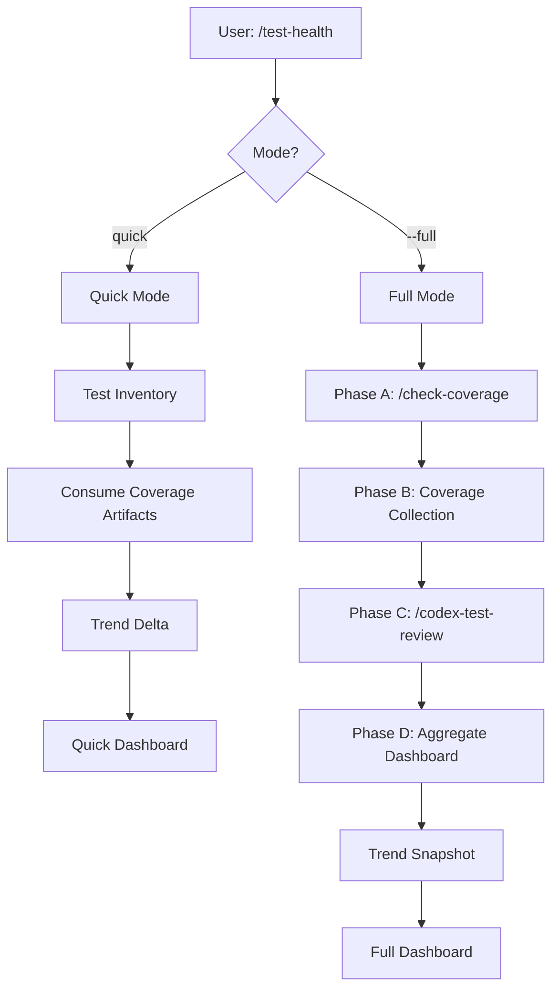

# Test Health — Holistic Coverage Measurement

## Trigger

- Keywords: test health, coverage measurement, test metrics, coverage trend, test inventory, holistic test audit

## When NOT to Use

| Scenario | Alternative |
|----------|------------|
| Run tests | `/verify` |
| Review test sufficiency only | `/codex-test-review` |
| Generate unit tests | `/codex-test-gen` |
| Feature-doc coverage only | `/check-coverage` |
| Context-aware test execution + triage | `/test-deep` |

## Workflow



## Modes

| Mode | Trigger | Content | Duration |
|------|---------|---------|----------|
| `quick` (default) | `/test-health` | Test inventory + consume artifacts + trend delta | <15s |
| `full` | `/test-health --full` | Phase A→B→C→D (feature coverage + instrumentation + qualitative + aggregation) | 2-5min |

## Quick Mode Workflow

1. **Test Inventory**: Count test files by layer using Glob (see `references/test-count-parsers.md` for layer classification). If `--scope <path>` specified, limit Glob to that directory. If verify-runner cache exists (`.claude/cache/verify/`), read historical logs for test counts.
2. **Coverage Artifacts**: Scan for existing coverage artifacts (see `references/artifact-formats.md`). If `--scope` specified, scan within scope only. Never execute project commands in quick mode.
3. **Trend Delta**: Read previous snapshot, compute delta (see `references/trend-schema.md`). Skip if `--no-trend` flag is set.
4. **Output**: Quick Dashboard.

## Full Mode Workflow

### Phase A: Feature Coverage

Resolve docs path using `scripts/resolve-feature.sh` (same cascade as other skills). If `has_tech_spec=true`, dispatch `/check-coverage <docs_path>` via Skill tool. If feature not resolved or no tech spec, skip Phase A with advisory: `"Phase A skipped: no feature docs detected"`.

### Phase B: Test Inventory + Coverage Collection

1. Count test files by layer (same as quick mode)
2. If `--collect` flag: execute project coverage command (`test:coverage` or `coverage` from `package.json`)
3. Otherwise: consume existing coverage artifacts (same as quick mode)
4. Parse test runner stdout for test counts (see `references/test-count-parsers.md`)

### Phase C: Qualitative Review

Dispatch `/codex-test-review` via Skill tool for 5-dimension quality assessment.

### Phase D: Aggregate + Trend

1. Aggregate all dimensions into full dashboard
2. Write trend snapshot (see `references/trend-schema.md`)
3. Output Full Dashboard

## Coverage Collection Strategy (Consume-First)

| Priority | Method | Trigger | Output |
|----------|--------|---------|--------|
| 1 | Consume existing artifact | Default (quick + full) | `source_type: instrumented_artifact` |
| 2 | Run project coverage command | `--collect` flag only (opt-in) | `source_type: collected_now` |
| 3 | Heuristic proxy (test/source file ratio) | No artifact and no `--collect` | `source_type: heuristic` |

**Prohibited**: Never auto-install coverage tools (c8, nyc, istanbul, pytest-cov, tarpaulin, jacoco).

## Output: Quick Dashboard

```markdown
## Test Health (Quick)

### Test Inventory
| Layer | Files | Tests | Source |
|-------|-------|-------|--------|
| Unit  | 25    | 47    | cached_stdout |
| Integration | 1 | 12  | cached_stdout |
| E2E   | 0     | —     | file_count |

### Code Coverage
| Metric | Value | Tool | Freshness |
|--------|-------|------|-----------|
| Lines  | 82.3% | c8   | current   |
| Branches | 76.0% | c8 | current   |

### Trend (vs previous)
| Metric | Previous | Current | Delta |
|--------|----------|---------|-------|
| Line coverage | 80.2% | 82.3% | +2.1% |
| Test count | 57 | 59 | +2 |

### Quick Verdicts
| Dimension | Status |
|-----------|--------|
| Has tests for changed files | OK |
| Coverage artifact exists | OK |
| Trend direction | Improving |
```

## Output: Full Dashboard

```markdown
## Test Health Report (Full)

### Phase A: Feature Coverage
(from /check-coverage): 12/15 documented features have tests (80%)

### Phase B: Code Coverage + Inventory
| Layer | Files | Tests | Passed | Failed | Duration |
|-------|-------|-------|--------|--------|----------|
| Unit  | 25    | 47    | 45     | 2      | 12s      |
| Integration | 1 | 12  | 12     | 0      | 45s      |
| E2E   | 0     | 0     | —      | —      | —        |

| Metric | Value | Source | Tool | Freshness |
|--------|-------|--------|------|-----------|
| Lines  | 82.3% | instrumented_artifact | c8 | current HEAD |
| Branches | 76.0% | instrumented_artifact | c8 | current HEAD |

### Phase C: Quality Findings
(from /codex-test-review):
| Dimension | Rating |
|-----------|--------|
| Happy path | 4/5 |
| Error handling | 3/5 |
| Edge cases | 3/5 |
| Mock quality | 4/5 |

### Phase D: Aggregate Dashboard

#### Trend (vs last 5 runs)
| Run | Date | Line Cov | Tests | Delta |
|-----|------|----------|-------|-------|
| a1b2c3d | 04-01 | 82.3% | 59 | +2.1% / +2 |
| f4e5d6c | 03-31 | 80.2% | 57 | -0.5% / +0 |

#### Verdicts
| Dimension | Status | Detail |
|-----------|--------|--------|
| Test inventory | WARN | No E2E tests |
| Code coverage | OK | 82.3% lines (instrumented) |
| Feature coverage | OK | 80% features covered |
| Quality | WARN | 1 P2 finding |
| Trend | OK | Improving over last 3 runs |
| Changed-file coverage | OK | All changed files have tests |
```

## Anti-Coverage-Theater Guardrails

| Rule | Description |
|------|-------------|
| No composite score in v1 | Multi-dimensional dashboard, no single blended number |
| Changed-file focus | Prioritize `git diff` files for coverage check |
| Source transparency | Every metric tagged: `instrumented` / `heuristic` / `missing` |
| Qualitative coupling | Full mode always runs Phase C even if quantitative metrics are green |
| Tool change detection | `tool_id` change resets trend line |
| Stale detection | Artifact older than HEAD marked `stale` |

## Gate Policy

| Policy | Behavior |
|--------|----------|
| Advisory (default) | Output dashboard + verdicts, do not block |
| Strict (v2, opt-in) | Changed files with zero tests block |

v1 implements advisory mode only.

## Orchestrator Integration

| Skill | Interaction | Relationship |
|-------|------------|-------------|
| `/check-coverage` | Phase A: feature-doc coverage | Sub-step |
| `/codex-test-review` | Phase C: qualitative review | Sub-step |
| `/verify` | Phase B: reference output or trigger `test:coverage` | Optional sub-step |
| `/test-deep` | Independent (execution + triage) | Peer |
| `/pre-pr-audit` | Quick mode as non-blocking signal | Consumer |

## Cross-Ecosystem Support

| Ecosystem | Detection | Coverage Artifact | Test Count Parser |
|-----------|-----------|-------------------|-------------------|
| Node.js | `package.json` | `coverage/` dir (LCOV/Istanbul/Jest) | node:test / jest / vitest |
| Python | `pyproject.toml` / `setup.py` | `coverage.xml` | pytest |
| Go | `go.mod` | `cover.out` | `go test -json` |
| Rust | `Cargo.toml` | `tarpaulin-report.json` / `cobertura.xml` | cargo test |
| Java | `build.gradle` / `pom.xml` | `build/reports/jacoco/` | gradle/maven |
| Unknown | — | Scan for `lcov.info` / `cobertura.xml` | File count fallback |

Graceful degradation: no artifact + no coverage command = heuristic proxy + `source_type: heuristic`.

## Verification

- [ ] Quick mode completes in <15s without executing project commands
- [ ] Full mode orchestrates Phase A→B→C→D in sequence
- [ ] Coverage artifact consumed correctly (or graceful fallback)
- [ ] Trend snapshot written to `.claude/cache/test-health/`
- [ ] Dashboard output includes all dimensions with source transparency

## References

| File | Purpose |
|------|---------|
| `references/artifact-formats.md` | Coverage artifact formats + scan + freshness |
| `references/trend-schema.md` | Trend storage schema + lock + comparison rules |
| `references/test-count-parsers.md` | Framework output parsers + layer classification |
