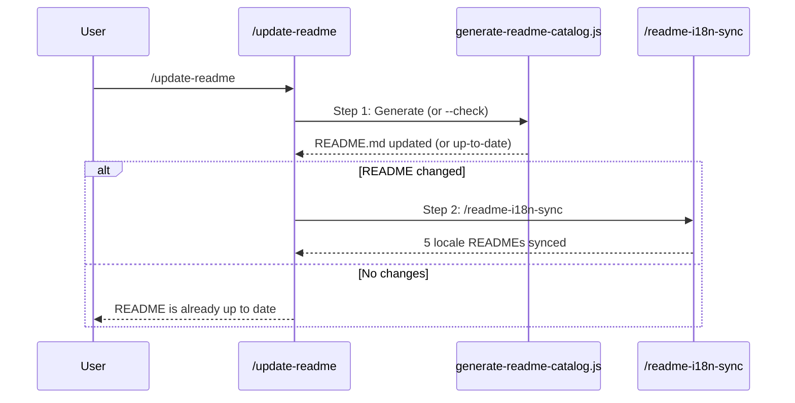

# Update README Skill Catalog

Regenerate the README Skill Reference section from `docs/skill-catalog.yml` + SKILL.md frontmatter, then propagate changes to all locale READMEs.

## Trigger

- Keywords: update readme, sync readme, readme catalog, skill count, regenerate catalog, add skill to readme, readme out of date

## When NOT to Use

| Scenario | Alternative |
|----------|------------|
| Editing README content outside skill catalog (e.g., architecture section) | Edit manually, then `/readme-i18n-sync` |
| Reviewing README quality | `/codex-review-doc` |
| Creating a new skill | `/skill-creator` (then come back here to update README) |

## Workflow



## Usage

```bash
/update-readme              # Regenerate + sync locales
/update-readme --check      # Verify README is up to date (read-only)
```

## Step 1: Generate Catalog

```bash
node scripts/generate-readme-catalog.js
```

The generator:
1. Reads `docs/skill-catalog.yml` (category, featured, use_when, public)
2. Reads each `skills/*/SKILL.md` frontmatter for descriptions
3. Replaces 5 comment-marker blocks in README.md:
   - `HERO-COUNT` — skill count in hero line
   - `INSTALL-COVERAGE` — install table rows
   - `WHATS-INCLUDED-COUNT` — what's included table
   - `ESSENTIAL-SKILLS` — featured skills with "Use when"
   - `FULL-CATALOG` — full categorized skill tables

**Flags**:
- No flag: update README.md in place
- `--check`: exit 1 if README would change (for CI or pre-commit verification)
- `--dry-run`: print summary without writing

## Step 2: Sync Locale READMEs

Only if Step 1 produced changes:

```
/readme-i18n-sync
```

This detects the diff in README.md and translates changed sections into 5 locale files (zh-TW, zh-CN, ja, ko, es).

## Adding a New Skill to README

When a new skill is created:

1. Add an entry to `docs/skill-catalog.yml`:

   ```yaml
   - command: /new-skill
     category: development    # development|review|verification|planning|docs-tooling
     featured: false           # true = appears in Essential Skills table
     public: true
   ```

2. Run `/update-readme`

If the skill should be featured, also add `use_when:` and set `featured: true`.

## Verification

- [ ] `node scripts/generate-readme-catalog.js --check` exits 0
- [ ] No `\d+ skills` strings outside comment markers in README
- [ ] Hero count matches `<summary>All N skills</summary>` count
- [ ] All `skills/` directories have entries in `skill-catalog.yml`
