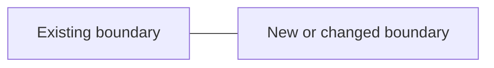

# Technical Specification Template

# [Feature Name] Technical Specification

> **Requirements**: relative requirements link when present

## 1. Overview

### 1.1 Problem and goals
### 1.2 Scope and non-goals
### 1.3 Requirement traceability

| Requirement | Priority | Design response | Validation |
|---|---|---|---|

## 2. Current-System Analysis

### 2.1 Relevant modules and consumers
### 2.2 Existing control and data flow
### 2.3 Constraints and reusable patterns

## 3. Selected Design

### 3.1 Architecture or Sequence Diagram

### 3.2 Architecture and boundaries
### 3.3 Data model and migration
### 3.4 Interfaces, events, and compatibility
### 3.5 Core flow and failure handling
### 3.6 Security, observability, and operations

## 4. Alternatives and Decisions

| Option | Strengths | Costs/risks | Decision |
|---|---|---|---|

## 5. Risks and Dependencies

| Risk/dependency | Impact | Likelihood | Mitigation | Validation signal |
|---|---|---|---|---|

## 6. Work Breakdown

| ID | Dependency | File/module scope | Deliverable | Verification |
|---|---|---|---|---|

## 7. Testing Strategy

### 7.1 Unit and contract tests
### 7.2 Integration and end-to-end tests
### 7.3 Migration and failure-path tests
### 7.4 Operational verification

## 8. Rollout and Rollback

## 9. Open Questions

## 10. Deep-Mode Evidence (deep mode only)

### 10.1 Proposal validation

| Assumption or claim | Repository evidence | Result | Design impact |
|---|---|---|---|

### 10.2 Implementation-pattern research

| Pattern | Existing module | Reusable constraint or seam |
|---|---|---|

### 10.3 Independent challenge and immediate validation

| Challenge | Evidence needed | Resolution or next validation action |
|---|---|---|

Omit inapplicable subsections explicitly rather than filling them with invented detail. Work-breakdown rows describe implementation boundaries, not progress or ownership.
